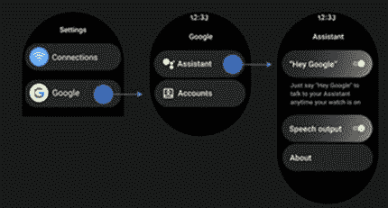

# 三星广告强调 Galaxy Watch 4 上的谷歌助手

> 原文：<https://www.xda-developers.com/samsung-ad-google-assistant-galaxy-watch-4/>

今年 2 月，三星推出了 Galaxy Watch 4 和 Galaxy Watch 4 Classic 的重大软件更新。在更新的官方公告中，该公司透露，它将在未来的更新中为 Wear OS 智能手表推出 YouTube 音乐应用程序的流媒体支持。此外，该公司证实，其智能手表也将在“未来几个月”获得谷歌助手的支持 但该公司尚未发布对 Galaxy Watch 4 和 Galaxy Watch 4 Classic 的谷歌助手支持。然而，这种情况可能很快就会改变，因为在过去几天里，我们已经看到了关于 Galaxy Watch 4 系列谷歌助手支持的多个预告。

上周，三星为 Galaxy Watch 4 和 Watch 4 Classic 的威瑞森版本推出了新的软件更新。威瑞森[分享的更新变更日志的初始版本参考了谷歌助手支持](https://www.xda-developers.com/google-assistant-support-coming-soon-galaxy-watch-4/)，它甚至包括展示用户如何能够启用“嘿，谷歌”热门词汇和其他设置的截图。这让我们相信三星终于推出了智能手表的助手支持，但威瑞森后来从变更日志中删除了所有提到谷歌助手的内容，谷歌表示助手支持是*“不会推出到 Galaxy Watch 4，我们没有更新时间表。*

 <picture></picture> 

Google Assistant settings screenshot from Verizon's changelog

现在，三星通过其位于西班牙的 YouTube 频道(通过 *Reddit* )为 Galaxy Watch 4 发布了一则新广告，展示了一个人在 Galaxy Watch 4 上使用谷歌助手语音命令。这再次引发了谷歌助手支持 Galaxy Watch 4 可能很快推出的传言。

有趣的是，三星在其他几个地区发布了同样的广告，这表明该公司可能会在全球范围内推出谷歌助手支持。然而，正如谷歌 指出的，其他一些广告的上传日期是 3 月 10 日，所以我们不确定三星是否已经准备好推出更新。

目前，我们还没有得到三星关于谷歌助手推出的官方确认。因此，我们不能肯定地说，如果你会得到在未来几天的功能。我们会密切关注更新，一旦发布，我们会尽快通知您。同时，你可以点击上面嵌入的 YouTube 视频查看三星的广告。

* * *

**Via** : [Reddit](https://www.reddit.com/r/GalaxyWatch/comments/ub3glr/looks_like_samsung_accidentally_released_this/) ， [9to5Google](https://9to5google.com/2022/04/25/samsung-briefly-showcases-google-assistant-on-galaxy-watch-4-in-ad-gallery/)