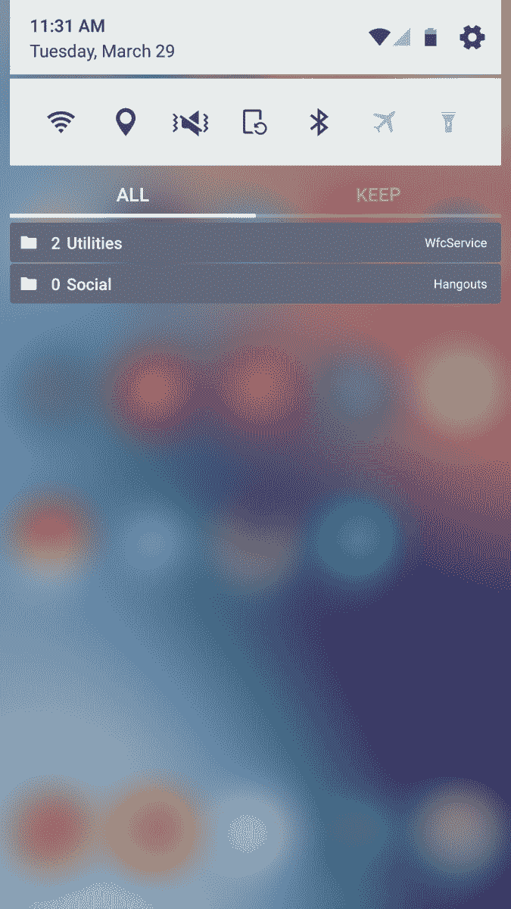
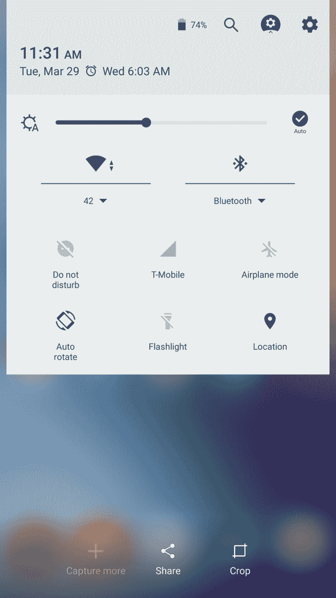
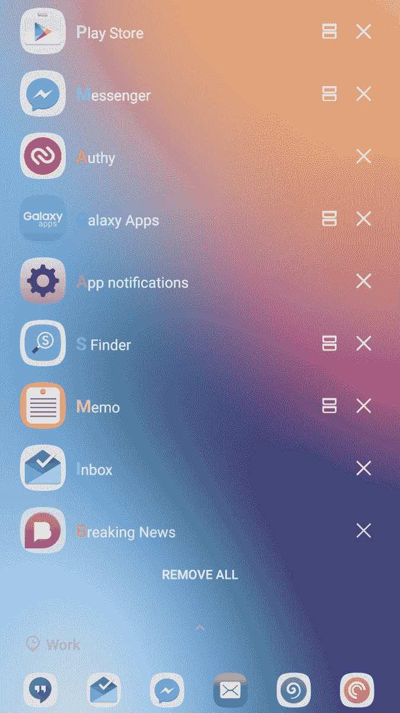

# 三星的高级 UI 完全重新设计了 TouchWiz

> 原文：<https://www.xda-developers.com/samsung-advanced-ui-new-touchwiz-is-a-ui-giant-leap-forward-two-steps-back/>

三星似乎想让我们挠头，想知道它经常在做什么，今天也不例外。昨晚晚些时候，Galaxy S7 subreddit 上的一个发现让我尝试了 Galaxy S7 和 S7 edge 的一个新应用。它并不十分“新”,因为它实际上是一个已经安装的应用程序的更新——但细节除外——它是如何工作的，它做什么？

有问题的应用程序名为三星的“Good Lock ”,仅在 Galaxy 应用商店有售。一旦你更新了应用程序，系统会提示你重启(有充分的理由),一旦你回到 Android *,一切*都会略有不同，有些是变得更好，有些……嗯，有些只是让我们挠头想知道为什么。有 3 个主要方面的变化-锁定屏幕，通知窗格，和最近的应用程序菜单-所以让我们来探索它们。

**锁屏**相当简单，更多的是各种版本 Android 的大杂烩。它有棒棒糖风格的通知，类似于 HTC 和 TouchWiz 的底部应用程序列表，以及有限的小部件支持，如 KitKat。它是非常可定制的，有许多时钟部件可供选择(时钟是默认的，你不能让另一个部件成为主要部件)，颜色可以改变，应用程序可以切换，整个部分可以打开和关闭。如果你更喜欢无时钟锁屏，也可以不支持通知。奇怪的是，墙纸不能被改变成你想要的任何东西，你只能选择你的主墙纸或基于你的颜色设置的彩色墙纸。向下滑动时钟小部件会打开小部件视图，您可以在其中添加或删除小部件(我使用了压缩 DPI，这导致了天气小部件的剪辑)。指纹解锁速度非常快，TouchWiz 终于可以在锁屏上双击打开通知了。**终于。**

第二个变化是**通知面板**。任何使用过 Nexus 设备的人都会有宾至如归的感觉，但前提是你喜欢可怕的彩色调色板。我是认真的，很难得到一个正常的颜色吗？

 你选择一种原色，其他颜色会根据它自动选择。一切看起来都不正常，所有的选择都有某种不良影响。但除了吹毛求疵之外，他们似乎在这里比在其他任何地方都更多地引入了 AOSP:状态栏图标切换到 AOSP 变体，快速切换选择面板非常 AOSP，当长按一个切换按钮时，动画，以及总体外观和感觉只是股票 Android，这是一个受欢迎的变化。像旋转设置按钮和点击闹钟图标的功能都完全像在 Nexus 或摩托罗拉设备上一样(除了系统 UI 调谐器)。

通知也得到了彻底的改革。有两个通用过滤器“全部”和“保留”。这似乎是三星应对通知过载的方法。需要获得某样东西，但不能立即操作，只需向右滑动，它就会出现在“保留”中，图标会从状态栏中消失，但仍可操作并易于查看。还有一个新的功能是将你的通知分类到自己命名的“组”中。

 要展开或打开一个群组，只需点击标题，它就会展开其中包含的任何内容。最后一个重大变化是暂停通知的功能。一旦通知被暂停，它将消失，并在时间到期后再次出现。如果你像我一样喜欢暂停收件箱通知的功能，这是朝着正确方向迈出的一大步。所有这些都是解决通知过载的新方法，我非常喜欢使用它们。考虑到它将带来的通知改革，看到类似这样的东西在 Android N 中实现将是一个受欢迎的补充。

最后(也是最糟糕的)改变是对**最近应用**视图的改变。除了很恐怖，真的没什么好说的。这是一个完全破碎的实现，否则几乎完美的接口。列表视图很难看，你看不到上一个应用程序状态的图像，动画也在最上面。我不知道三星把这个留在应用程序中时在想什么，我也不知道他们会朝什么方向发展。“最近通话”菜单的底部是您在锁屏上列出的相同应用程序列表。

> 最好的功能是能够长按一个最近的应用程序，并让它直接在弹出视图中打开，这个功能早就应该实现了。否则，请移除此三星。

 另一个值得注意的事情是，它是重金定位的。我是“我的位置”edge 功能的忠实粉丝，该功能将在 edge 面板上显示推荐的应用程序，并根据位置或 WiFi 连接更改系统设置，看起来他们的目标是在系统级别实现它。颜色、设置和锁屏都可以根据您的位置进行调整。这怎么可能有用呢？假设你在教堂，不希望你的编辑向你的锁屏发送垃圾邮件(这种情况会发生)，很简单，只需设置一个例程，当你在那里时，自动启用隐藏你锁屏的通知部分。位置感知功能(喜欢或讨厌它们)只需简单的设置就可以根据您的位置调整您的体验，这只是让我们的手机更好地主动为我们服务的下一步。看到三星希望在系统层面实现这一点，我非常高兴。

那么，有多少应该半信半疑呢？嗯，所有的。这个三星真的没怎么说，但这是一个公开的应用。它还处于相当早期的阶段，还存在一些缺陷。但对三星来说是一个很有意思的方向。

一方面，他们离 AOSP 越来越近了，我们可以从状态栏和快速切换中看到，他们正试图改进它。另一方面，虽然我们有最近的应用程序菜单，但它没有遵循任何物质指南，在可用性方面是一个巨大的退步。

就我个人而言，如果你有兴趣并且有时间尝试一下，我强烈推荐你。你可能会喜欢一些功能，如提高速度，AOSP 状态栏图标或锁屏上的快速应用程序启动器。或者，如果你不能忍受新的最近菜单，你可能应该离得远远的，直到它被改变。虽然对我来说，新的通知分组支持和双击通知的能力是值得的，它将继续安装。将来如果有任何显著的变化，我一定会告诉你。

更新——任何 TouchWiz 的常客都会在下面图库的第一张图片上认出这个巨大的变化。锁屏相册壁纸！此外，这似乎在大多数运行三星棉花糖构建的设备上都有效。YMMV。

与此同时，使用评论让我们知道你认为三星在这个新的用户界面上做了什么！