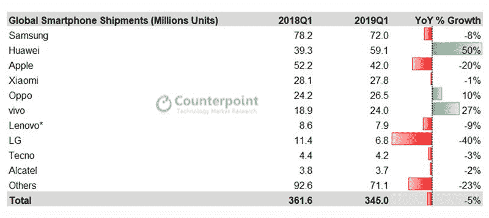
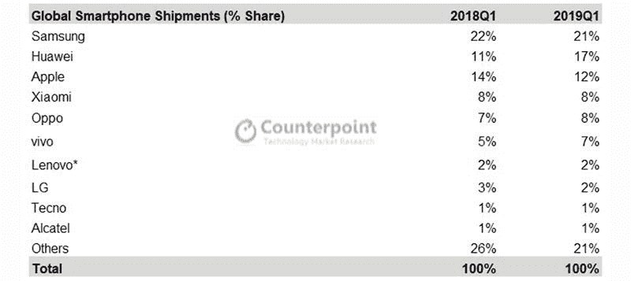
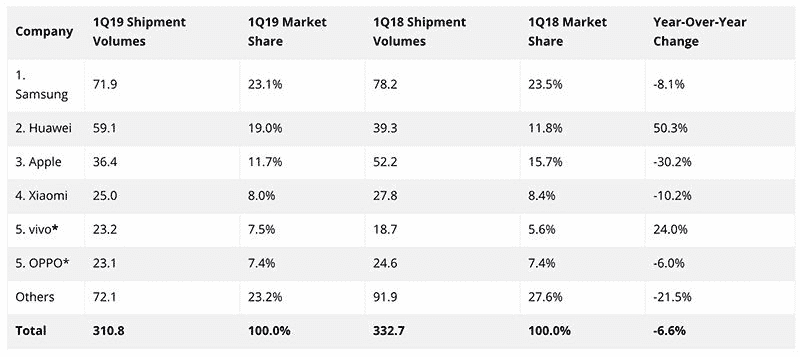

# 三星和苹果的智能手机销量在 Q1 下降，而华为的销量增长了 50%

> 原文：<https://www.xda-developers.com/samsung-apple-decline-huawei/>

2019 年第一季度，我们经历了智能手机市场上一些最两极分化的趋势，包括[光学](https://www.xda-developers.com/huawei-p30-pro-first-impressions-design-camera/) [变焦](https://www.xda-developers.com/oppo-reno-10x-zoom-hands-on-video/)[超声波指纹扫描仪](https://www.xda-developers.com/samsung-galaxy-s10-s10-and-s10e-launch-with-the-snapdragon-855-ultrasonic-in-display-fingerprint-scanners-reverse-wireless-charging-and-a-whole-lot-more/)[多达五个后置摄像头](https://www.xda-developers.com/nokia-9-pureview-certified-fcc/)[不同手段](https://www.xda-developers.com/oppo-reno-swivel-pop-up-camera/) [容纳自拍摄像头](https://www.xda-developers.com/samsung-galaxy-a80-rotating-camera/)等。但即使是这种广泛的创新也无法阻止全球市场连续第六个季度暴跌。三星保持了其主导地位，但其市场份额略有下降，而苹果将第二的位置让给了华为，与去年相比，华为显示出了巨大的增长。

来自市场研究公司 *Counterpoint Research* 和 *IDC* 的两份独立报告相互验证了华为在 2019 年第一季度令人印象深刻的增长的发现。根据这两份报告，尽管华为的智能手机在美国不可用，但它的全球智能手机增长了 50%，这有助于它将苹果从全球第二的位置上拉下来。就市场份额而言，华为在 Q1 的市场份额从 2018 年的 11%增长到上一季度的 17%。这重复了华为[在欧洲](https://www.xda-developers.com/chinese-oems-huawei-xiaomi-european-market-share-2018/)取得的巨大成功，并且根据 *IDC* 的说法，这是因为其所有价位的健康产品组合的*积极势头*。由于这种增长，华为可能会在今年继续保持第二的位置。

 <picture></picture> 

Worldwide smartphone shipment data by Counterpoint Research

根据 *Counterpoint* 的数据，2019 年三星在 Q1 的出货量比去年减少了 600 万部。尽管与去年的 S9 duo 相比，Galaxy S10 系列的[销量](https://www.counterpointresearch.com/samsung-galaxy-s10-sales-16-higher-last-years-galaxy-s9-series-first-week-us/)更大。这家韩国巨头在收益电话会议上报告说，它[获得了可观的利润](https://www.xda-developers.com/lg-v50-thinq-samsung-galaxy-s10-5g-profit/)，但由于入门级和中端市场的激烈竞争[，整体收入有所下降。然而，它的市场份额仅下降了 1%。](https://www.xda-developers.com/samsung-galaxy-m10-m20-m30-india-10-other-regions/)

 <picture></picture> 

Worldwide smartphone market share data by Counterpoint Research

另一方面，苹果公司上个季度的 iPhones 销量同比下降了 20%。虽然 Counterpoint 报告的 iPhone 销售趋势与 T2 IDC 报告的趋势一致，但后者报告的 iPhone 总出货量下降了 30%。这一下降主要是由于 iPhone 用户的升级周期更长。根据 *Counterpoint* 的数据，苹果的市场份额从 14%下降到 12%;根据 *IDC* 的数据，苹果的市场份额从 16%下降到 12%。

 <picture></picture> 

Worldwide smartphone shipment and market share data as per IDC

两份报告都认为，与去年相比，Vivo 是另一个实现了约 25%可观增长的品牌。然而，对于 OPPO 来说，有矛盾的发现，Counterpoint 声称中国品牌增长了 10%，而 T2 IDC 报告下降了 6%。

最后， *IDC* 回应了 *Counterpoint* 之前的调查结果，指出尽管全球经济放缓，印度是唯一增长的市场。在印度，小米继续引领市场，尤其是因为它进军了该国的非城市地区。

* * *

[**来源 1:对位研究**](https://www.counterpointresearch.com/huaweis-global-smartphone-market-share-reaches-highest-ever-level-q1-2019/) [**来源 2: IDC**](https://www.idc.com/getdoc.jsp?containerId=prUS45042319)