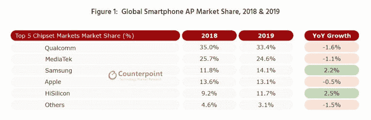
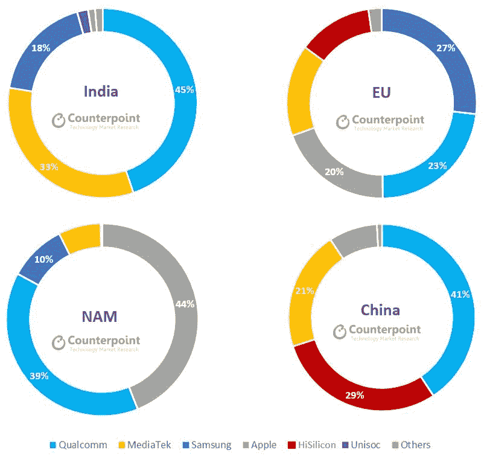

# 2019 年，三星成为全球第三大智能手机 SoC 供应商

> 原文：<https://www.xda-developers.com/samsung-became-the-third-largest-smartphone-soc-vendor-globally-in-2019/>

在过去十年的大部分时间里，高通一直是智能手机 SoC 供应商市场的主导者。联发科长期以来一直扮演着在智能手机市场提供更廉价 SOC 的角色。另一方面，三星(Samsung)和华为(Huawei)的海思(HiSilicon)制造定制 SOC，旨在用于自己的智能手机。例如，三星系统 LSI 的 Exynos SoCs 仅用于三星移动的手机，而海思的麒麟芯片用于华为和 Honor 手机。2019 年，随着三星系统 LSI [开始向摩托罗拉和 Vivo 等其他厂商销售 Exynos 芯片](https://www.xda-developers.com/motorola-one-vision-hands-on-review/)，这一等式发生了变化。根据 Counterpoint Research 的一份报告，这帮助该公司在 2019 年成为全球第三大智能手机应用处理器(AP)供应商。

Counterpoint Research 发布了最新的季度手机报告。根据该报告，三星电子和海思是 2019 年顶级智能手机 SoC 供应商中唯一份额增长的供应商，而高通、联发科和苹果都出现了下降。

 <picture></picture> 

Source: Counterpoint Research

高通仍然是应用处理器的最大供应商，尽管全年下降了 1.6%。它仍然占 2019 年智能手机 AP 出货量的三分之一。其份额在除中东和非洲(MEA)以外的所有市场都超过了 30%,与其他市场相比，中东和非洲对高端手机的需求较低，缓和了对高通芯片的需求。例如，这是因为高通的芯片传统上比联发科的芯片更贵。

联发科在 2019 年的市场份额也略有下降，同时保持第二名的位置。它在中东、印度和东南亚等市场表现强劲，需求受到中低端手机的推动。该公司在全球智能手机 AP 销售中占据了四分之一的市场份额。

另一方面，由于美国的贸易禁令，华为在中国以外的许多市场份额下降。具有讽刺意味的是，该公司能够通过在中国国内市场“显著扩大存在和份额”来抵消这些问题。

 <picture></picture> 

Source: Counterpoint Research

三星在欧洲、印度和拉丁美洲表现尤为出色，其在北美等其他地区的市场份额也有所增加。Counterpoint Research 指出，这些 AP 供应商之间的竞争在 2019 年加剧，因为重点是在处理速度和价格之间取得平衡。在一个下滑的市场中，三星的份额同比增长了 2.2%。然而，该公司自去年以来将部分 A 系列智能手机制造外包给中国的 ODM，Counterpoint 表示，这将推动高通和联发科的部分份额增长。此外，5G 手机在美国和中国的日益普及，将增加三星在这些地区的旗舰和高端手机对高通芯片的依赖。(目前，该公司依赖骁龙芯片生产北美/中国/日本/韩国/拉丁美洲版本的 [Galaxy S20](https://www.xda-developers.com/samsung-galaxy-s20-plus-review/) 系列，仅在 5G 配置中销售。 [Exynos 990](https://www.xda-developers.com/samsung-exynos-990-5g-modem-5123-7nm/) 全球变种进一步分为 5G 和 4G 变种。)

Counterpoint 进一步指出，三星正在横向扩展，目标是今年向中国品牌销售 5G SoCs，以帮助推动 2020 年 Exynos 芯片的产量。(例如， [Vivo X30 和 X30 Pro](https://www.xda-developers.com/vivo-x30-pro-5g-exynos-980-funtouchos-10/) 采用了该公司的上层 [Exynos 980](https://www.xda-developers.com/samsung-exynos-980-5g-modem/) SoC。)三星也越来越多地在自己的产品组合中采用 Exynos 芯片，这些产品组合是为除美国/日本/中国以外的全球地区自行设计和制造的。因此，该公司估计三星在智能手机应用处理器市场的整体份额将在 2020 年进一步增长。

5G 也将是这个故事的重要组成部分。Counterpoint 表示，支持低于 6GHz 网络的 5G 集成芯片将开始成为一项竞争优势。这种芯片的例子包括[高通骁龙 765](https://www.xda-developers.com/qualcomm-snapdragon-765-processor-specifications-features/) 、[联发科天玑 1000/L](https://www.xda-developers.com/mediatek-dimensity-1000-7nm-soc-integrated-5g/) 和[联发科天玑 800](https://www.xda-developers.com/mediatek-dimensity-800-5g-chip-mid-range-phones/) 。这些芯片通过减少对外部 5G 调制解调器的需求来降低功耗，并且它们在手机中占用的空间也更小。Counterpoint 估计，由集成 5G 芯片驱动的最便宜的 5G 手机将在 2020 年下半年降至 300 美元以下，因为来自海思、高通、联发科、三星甚至优创的供应商都在推动。然而，在高端市场，分立 5G 调制解调器解决方案将继续出现在即将推出的 5G iPhones 以及高通骁龙 865 + X55 调制解调器驱动的旗舰 Android 手机中。

* * *

**来源:[对位法研究](https://www.counterpointresearch.com/samsung-became-third-largest-smartphone-application-processor-vendor-globally-2019/)**