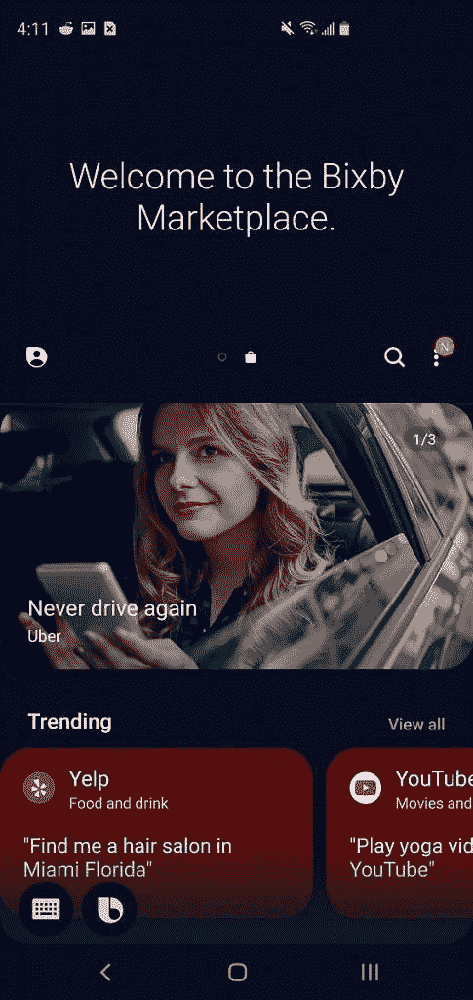

# 三星的 Bixby Marketplace 可以让任何开发者进行 Bixby 操作

> 原文：<https://www.xda-developers.com/samsung-bixby-marketplace-bixby-actions/>

# 三星的 Bixby Marketplace 可以让任何开发者进行 Bixby 操作

三星的 Bixby Marketplace 试图让助手变得更有用。Bixby Marketplace 允许开发者向 Bixby 添加他们自己的服务。

三星的 Bixby 是两年前宣布的，从那时起，它一直是 Galaxy 旗舰手机的主要助手。它已经成为最受诟病的数字助手之一，主要是因为三星试图将其强加于人。三星的 Bixby Marketplace 试图通过让它更有用来改变这一点。Marketplace 允许开发者在 Bixby 上构建和添加他们自己的服务。

Bixby Marketplace 的这一功能今天终于向所有人开放了。在 2018 年三星开发者大会上[宣布](https://www.xda-developers.com/samsung-bixby-api-third-party-services/)这是三星向更多开发者开放 Bixby 并允许更多应用支持它的方式。自 2018 年 11 月以来，开发工具一直处于封闭测试阶段。

 <picture></picture> 

Bixby Marketplace

在美国，任何兼容 Bixby 2.0 的设备都可以使用 marketplace。你需要做的就是通过三星 Galaxy Store 更新 Bixby。Bixby Marketplace 将在主屏幕上滑动，它允许你看到 Bixby 中所有支持的应用程序和服务。如果您看到 Bixby 中没有的，您可以选择它并将其添加到您的设备中。

自三星首次宣布 Bixby Marketplace 封闭测试版以来，已经过去了近 8 个月。开发人员一直可以测试和发布胶囊。然而，在发射日，总共有两个新胶囊。自三星 Galaxy Note 9 发布 Bixby 2.0 以来，其他所有服务，如优步、Yelp、1-800 Flowers 等，都已经存在。这是一项令人失望的新服务，三星在许多旗舰手机上专门推出了一个硬件按钮。

如果你是少数对 Bixby Marketplace 感兴趣的人之一，你可以今天从美国的 Galaxy Store 下载更新。三星尚未给出美国以外的发布时间表。如果你对 Bixby Marketplace 的开发感兴趣，你可以查看 Bixby 开发者中心了解更多信息。

* * *

**来源:[三星的 Bixby 开发者博客](https://bixby.developer.samsung.com/newsroom/en-us/27/06/2019/Announcing-The-New-Bixby-Marketplace)**