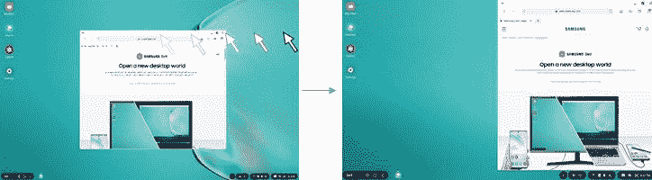
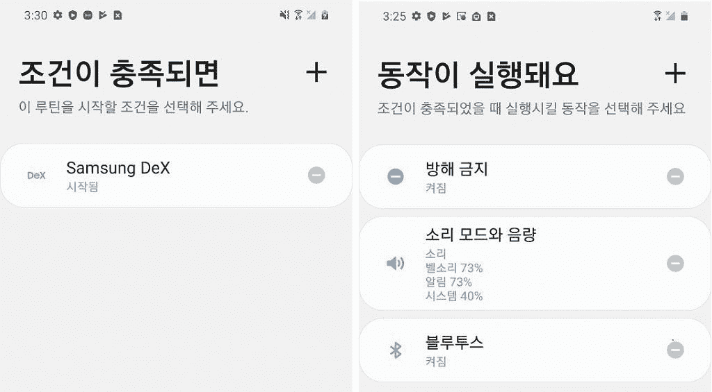

# Galaxy S20 上的一个 UI 2.1 通过新功能改进了三星 DeX

> 原文：<https://www.xda-developers.com/samsung-dex-one-ui-2-1-galaxy-s20-plus-ultra-new-features/>

三星 Galaxy S20 系列设备[最近在一轮激烈的传言和泄露后发布了](https://www.xda-developers.com/samsung-galaxy-s20-plus-review/)，具有骁龙 865/Exynos 990 处理器，5G 连接支持，令人惊叹的摄像头(在 S20 Ultra 的情况下，还有一个巨大的 108MP 摄像头)，高刷新率显示屏等等。它们是 Galaxy S10 系列的继任者，也是值得的继任者。S20 系列也是第一批发布 One UI 2.1 的设备，该产品基于 Android 10，比之前发布的 One UI 2.0 增加了一些功能和改进。

**XDA 论坛:[银河 S20](https://forum.xda-developers.com/galaxy-s20) || [银河 S20+](https://forum.xda-developers.com/galaxy-s20-plus) || [银河 S20 超](https://forum.xda-developers.com/galaxy-s20-ultra)**

然而，事实证明，该软件也对三星 DeX 进行了一些改进。正如@ [库马 _ 瞌睡虫](https://www.twitter.com/Kuma_Sleepy/status/1243196213937057793)在推特上发现的，三星已经在其韩国社区论坛上宣布[Galaxy S20 在三星桌面界面的一个 UI 中进行了一些软件改进。第一个新特性是通过拖动鼠标将窗口拉向左侧或右侧的能力(桌面操作系统的一个常见特性)。这在 Samsung DeX 中已经可以通过键盘组合(OS 键+左/右箭头)来完成，但现在可以使用鼠标来完成。](https://r1.community.samsung.com/t5/Samsung-DeX/%EA%B3%B5%EC%A7%80-Galaxy-S20-%EC%97%90%EC%84%9C-Samsung-DeX-%EC%9D%98-%EC%83%88%EB%A1%9C%EC%9A%B4-%EA%B8%B0%EB%8A%A5%EC%9D%84-%EC%82%AC%EC%9A%A9%ED%95%B4%EB%B3%B4%EC%84%B8%EC%9A%94/td-p/3929608)

 <picture></picture> 

Drag to snap window in Samsung DeX on One UI 2.1\. Source: Samsung

下一个新功能是使用 3 或 4 指触摸手势的能力。这些手势可以在设置> Samsung DeX 设置>鼠标/触摸板>触摸板手势中更改。最后，我们还更新了 Bixby 例程，以便在 Samsung DeX 开始或结束时触发操作。例如，您可以创建一个例程，将手机设置为免打扰模式，或者在启动 Samsung DeX 时打开蓝牙。

 <picture></picture> 

Bixby Routine involving Samsung DeX. Source: Samsung

一个基于 Android 10 的 UI 2.1 首次出现在三星 Galaxy S20 上，但它也开始推广到其他三星智能手机，如三星 Galaxy S10 和 Galaxy Note 10。然而，目前还不清楚这些新的三星 DeX 功能是否已经通过一个 UI 2.1 在 Galaxy S10/Note 10 上提供，或者这些功能是否是 Galaxy S20 的软件独有的。

**从 Amazon.in 购买—三星 Galaxy:[S20](https://www.amazon.in/Samsung-Galaxy-Storage-Additional-Exchange/dp/B08445DF23/?tag=xdaportalin-21)| |[S20+](https://www.amazon.in/Samsung-Galaxy-Storage-Additional-Exchange/dp/B084451YSS/?tag=xdaportalin-21)| |[S20 超](https://www.amazon.in/Samsung-Galaxy-Storage-Additional-Exchange/dp/B08444S68Q/?tag=xdaportalin-21)**