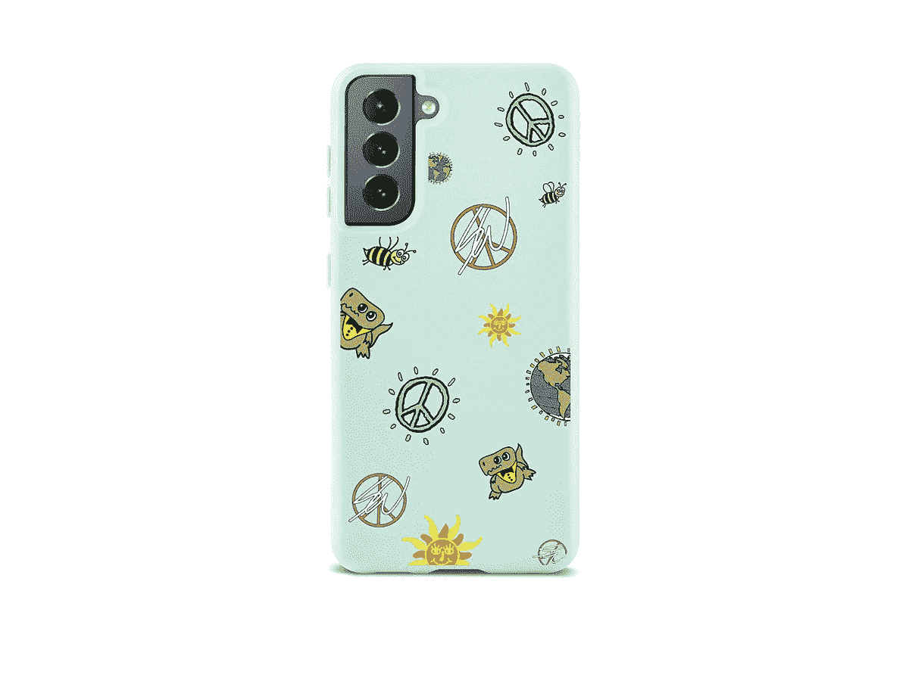
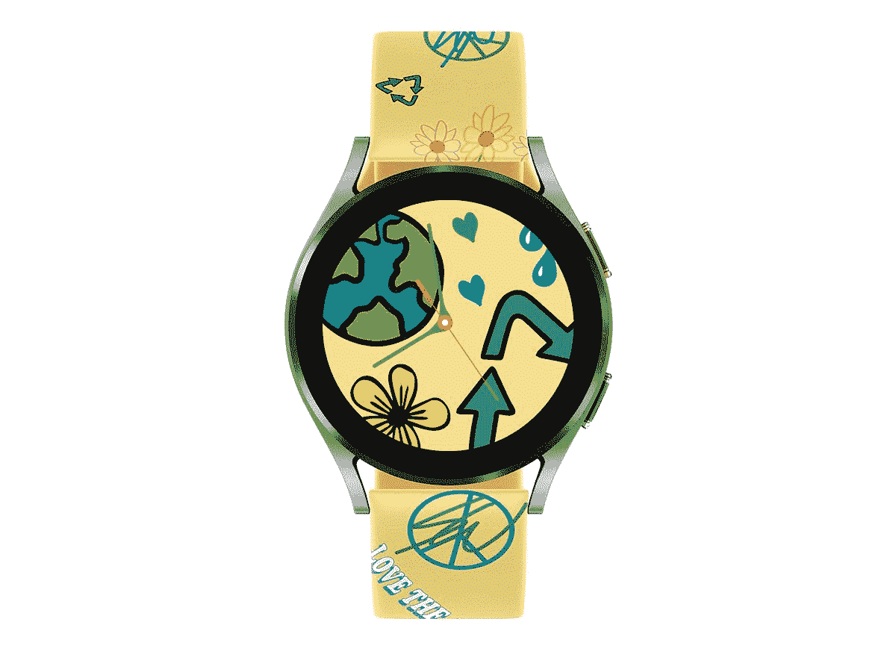

# 三星现在销售可生物降解的 Galaxy S21 保护套，手表 4 个表带

> 原文：<https://www.xda-developers.com/samsung-earth-day-cases-bands/>

地球日是每年 4 月 22 日的年度活动，旨在为保护地球环境争取支持。三星决定与设计师肖恩·沃瑟斯庞合作，用一系列新的(据称)环保手机壳和表带来纪念今年的活动。

三星发布了 Galaxy S21 的三款保护套(“兰花”、“黎明”和“雨”)和 Galaxy Watch 4 系列的三款配套表带，以及几款地球主题的表盘。新产品和新面孔是与设计师肖恩·沃瑟斯庞合作创作的，肖恩·以设计注重回收利用和地球主题的运动鞋而闻名。

三星表示，最新的 Galaxy S22 系列没有这种外壳，它们由“100%回收的 TPU 材料”制成，并被认为是可生物降解的——这意味着它们在被扔掉后可以被微生物吸收。表带由“无毒的环保 TPU 材料”制成，三星可以回收利用。所有的设计都是纯色的，带有基于保护环境和世界和平的标志图案，这是地球日的主要主题。

然而，不仅最新的 Galaxy S22 系列没有手机壳，它们只是普通 Galaxy S21 的一个选项。如果你有 S21 Plus 或 S21 Ultra，或任何其他三星手机，你就必须用其他外壳来凑合。最近[的智能手机外壳从](https://www.shopmoment.com/daily-essentials/phone-cases?filter-materials=eco-friendly)开始也是用可生物降解的材料制造的，这种材料可用于 iPhones、一些 Galaxy 手机和谷歌 Pixel 设备。

现在，这些保护套和表带可以在三星的网上商店买到。表壳售价 49.99 美元，Galaxy Watch 4 表带也是 49.99 美元。表带的末端是专门为 Watch 4 的表耳量身定制的，就像三星的官方表带一样，这意味着它不会适合其他智能手表(即使它们使用同样的 20 毫米带宽)。三星表示，这种保护套和表带是“限量版设计，不会永远存在。”

 <picture></picture> 

Galaxy S21 Sean Wotherspoon Case

##### 三星肖恩沃瑟斯庞 Galaxy S21 外壳

这种可生物降解的外壳有三种款式，但它只适合普通的 Galaxy S21。

 <picture></picture> 

Galaxy Watch 4 Sean Wotherspoon Band

##### 三星银河手表 4 肖恩沃瑟斯庞乐队

这款表带有三种颜色，适合 Galaxy Watch 4 的所有型号。

**来源:** [三星编辑部](https://news.samsung.com/us/samsung-partners-sean-wotherspoon-plant-based-designer-exclusive-sustainably-galaxy-s21-watch4-series-accessories-earth-day/)