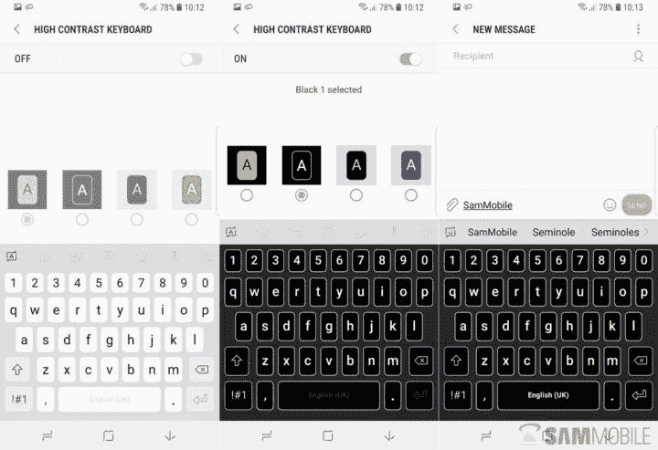
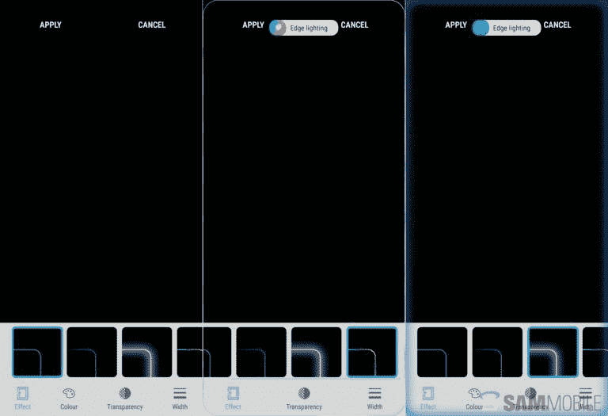
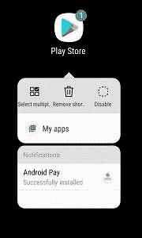

# 以下是三星体验 9.0 测试版的新功能

> 原文：<https://www.xda-developers.com/samsung-experience-9-0-beta-android-oreo-features/>

10 月下旬，我们写了在美国、英国和韩国的 [Galaxy S8](http://xda-developers.com/tag/galaxy-s8) 和 [Galaxy S8 Plus](http://xda-developers.com/tag/galaxy-s8-plus) 手机上推出的 [Android 8.0 奥利奥](http://xda-developers.com/tag/android-oreo)和[三星体验 9.0](http://xda-developers.com/tag/samsung-experience) 的测试版。自去年以来，三星一直使用 Samsung Plus 应用程序的测试版渠道来测试其专有的 Android 分支 [TouchWiz](http://xda-developers.com/tag/touchwiz) 的平台更新和变化，今年也不例外。虽然这一次没有太多面向用户的调整，但还是有一些变化。为了更容易地跟踪这些变化，我们整理了一份三星体验 9.0 测试版指南。

并不是说我们没有涵盖三星 Experience 9.0 的任何 Android 8.0 奥利奥特有的功能——只是三星的新增功能。如果你还没有，看看我们的安卓 8.0 和 T2 安卓 8.1 的测试版吧。

* * *

### 安卓奥利奥来了

三星体验 9.0 最明显的变化是从 [Android 7.1 牛轧糖](http://xda-developers.com/tag/android-nougat)升级到 Android 8.0 奥利奥。虽然两款手机都已经有了画中画模式等功能，但奥利奥带来了通知通道、通知点、通知打盹、全系统自动填充、[自适应图标](http://xda-developers.com/tag/adaptive-icons)、新表情符号、更智能的复制粘贴等改进。

但并不是奥利奥的所有功能都来到了 Galaxy S8 和 Galaxy S8 Plus。一个值得注意的遗漏是 [Project Treble](http://xda-developers.com/tag/project-treble) ，这是一个模块化的框架，简化了设备制造商的软件更新过程。在测试程序的一些参与者运行我们的 [ADB 教程](https://www.xda-developers.com/project-treble-android-oreo/)来检查 Treble 在新固件中的状态后，他们得到了一个“错误”的输出，这意味着 Treble 尚未启用。这并不意味着 Treble 最终不会进入三星 Experience 9.0，但它最终取决于三星。我们必须等等看。

*三星体验 9.0 测试版截图，基于安卓奥利奥。*

### 通过良好锁定查看最近列表

如果你曾经使用过 Galaxy S7 基于 Android 6.0 的 TouchWiz 固件，你可能会熟悉 [Good Lock](https://news.samsung.com/global/good-lock-customize-the-way-you-use-your-galaxy-smartphone) 。Good Lock 是三星 [Galaxy Apps store](https://shop-links.co/link/?exclusive=1&publisher_slug=xda&article_name=Here%27s+What%27s+New+in+Samsung+Experience+9.0+Beta%3A+Android+Oreo+and+Much+More&article_url=https%3A%2F%2Fwww.xda-developers.com%2Fsamsung-experience-9-0-beta-android-oreo-features%2F&u1=UUxdaUeUpU19144&url=https%3A%2F%2Fwww.samsung.com%2Fglobal%2Fgalaxy%2Fapps%2Fgalaxy-apps%2F) 上的一款应用，用户可以定制 TouchWiz 的外观。从锁定屏幕到状态栏和快速设置面板，用户界面元素的外观都可以调整。即使是最近的应用程序屏幕，如果没有[的支持](http://xda-developers.com/tag/root)，在 Android 设备上通常是不可使用的，也有一个可选的“轻”主题，用逐项列表取代了应用程序的卡片预览。

虽然大多数好锁都在三星基于牛轧糖的 Galaxy S8 和 S8 Plus 固件中消失了，但它在三星 Experience 9.0 中又在三星设备上卷土重来了。在最新的测试版中，如果你愿意，你可以用一个紧凑的列表视图替换多任务菜单的卡片视图。但是，如果列表视图不符合您的喜好，请不要担心，您可以随时切换回旧的卡片视图。

### 三星键盘接受大修

如果你是那种用 Gboard 或 SwiftKey 等第三方替代品替换手机库存键盘的人，我们不会责怪你——原始设备制造商(OEM)键盘通常缺乏功能和可定制性。也就是说，三星自己的键盘是目前最好的 OEM 键盘之一，随着 Android 8.0 Oreo 和三星 Experience 9.0 的推出，它变得更好。

 <picture></picture> 

Credits: [SamMobile](https://www.sammobile.com/2017/10/31/whats-new-with-android-8-0-oreo-part-1-keyboard-gets-several-improvements/)

三星键盘现在包括一个谷歌风格的工具栏，将流行的设置放在前面和中间。除此之外，它还有 GIF 创建快捷方式和四个“高对比度”选项，可以提高可视性。

### 新的通知边缘照明效果

One Galaxy S8 和 S8 Plus 的定义功能是边缘照明，它利用了手机的优势；弯曲的 AMOLED 屏幕可以在警报到来时引起您的注意。在三星体验 9.0 中，它比以往任何时候都更具通用性。

 <picture></picture> 

Credits: [SamMobile](https://www.sammobile.com/2017/11/02/whats-new-android-8-0-oreo-part-2-new-edge-lighting-effects/)

边缘照明现在有更多的照明效果。首先是一个比默认照明更微妙的发光选项。有一种闪烁效果可以播放随机的颜色序列，还有一种多色效果可以循环显示各种颜色。不喜欢新的特效？不用担心-经典的边缘照明仍然可用。

### 文件夹的颜色选择器

虽然 TouchWiz 的股票发射器不是最可定制的，但它有一些其他任何东西都无法比拟的功能。随着 Android Oreo 的更新，它获得了更多的主屏幕选项。

*演职员表:[GadgetHacks.com](https://android.gadgethacks.com/news/galaxy-s8-oreo-update-new-home-screen-features-coming-android-8-0-0181025/)*

三星 Experience 9.0 beta 增加了为启动器中的特定文件夹着色的设置——一个新的色轮选择器允许你选择几乎任何颜色作为文件夹背景。不过，值得记住的是，某些颜色受到某些第三方主题的限制。

### 锁屏定制丰富

Galaxy S8 的锁屏在众多功能中脱颖而出，比如一个时钟小工具，当新通知到达时，它会从垂直方向转变为水平方向。即将到来的奥利奥更新可以让你根据自己的喜好改变锁屏的某些方面。

*演职员表:[GadgetHacks.com](https://android.gadgethacks.com/news/galaxy-s8-oreo-update-lock-screen-clock-now-matches-wallpaper-color-0181068/)*

一个头条新闻是自适应着色，它改变了锁屏时钟的颜色，以匹配你的背景。还有一个选项可以改变时钟小部件的时间格式:它现在可以显示小时、分钟和秒，而不是只显示小时和分钟。

这还不是全部。在 Samsung Experience 9.0 更新中，您可以更改锁屏和始终显示时钟样式，并调整通知的透明度设置。

### 其他变化

 <picture></picture> 

Samsung Experience 9.0 adds Adaptive Icons, app shortcuts and notification dots for the TouchWiz Launcher.

这些是我们到目前为止发现的主要变化(除了奥利奥已经包含的所有东西)。不过，他们说小事情很重要，三星 Experience 9.0 有许多可以增强用户体验的小事情:

*   根据一些用户的说法，由于较小的系统级修改，整个系统感觉比牛轧糖流畅得多。
*   三星启动器上实现了 Android 应用程序快捷方式，以及通知点和自适应图标。该发射器也获得了稳定性的改善。
*   在锁定屏幕中输入 PIN 码后，您不再需要点击“确定”。
*   最近和后退按钮的隐藏导航条手势，在 Nougat 中对一些用户来说不能正常工作，现在升级到奥利奥后应该可以正常工作了。
*   现在，您可以通过按住边缘工具，然后在屏幕上拖动它来移动边缘工具。
*   Dual Messenger 允许你克隆一个应用程序，并用不同的账户登录，现在是 Galaxy S8 和 S8 Plus 的标准功能。
*   [Samsung DeX](http://xda-developers.com/tag/dex) 接受了轻微的重新设计，以及稳定性和功能性的改进。
*   自动重复和 2 倍速控制已被添加到股票视频播放器。
*   [Samsung Pay](http://xda-developers.com/tag/samsung-pay) 在速度和安全性方面有所改进。
*   一个粘性通知现在跟踪您在三星健康的步骤。
*   现在，您可以点击数字时钟小部件来打开时钟应用程序。此外，现在支持风景模式和定时器声音。

你认为我们错过了什么吗？请在评论区告诉我们！