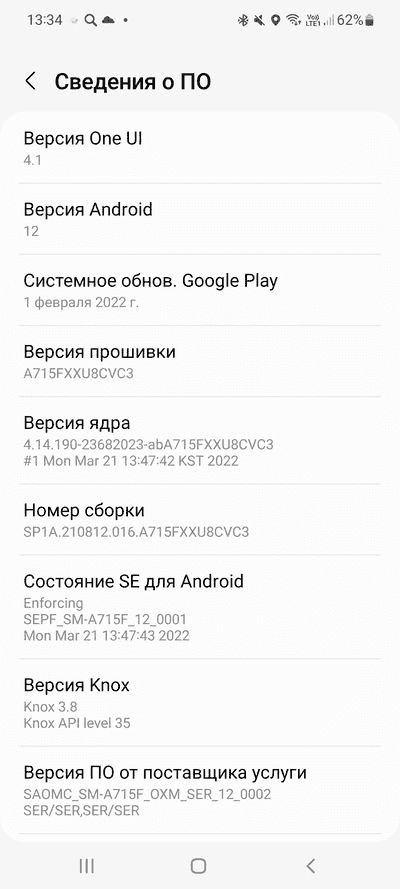

# Galaxy A32 5G 和 Galaxy A71 推出了一个搭载 Android 12 的 UI 4.1

> 原文：<https://www.xda-developers.com/samsung-galaxy-a32-5g-a71-4g-one-ui-4-1-android-12/>

三星为软件更新对 Android 设备的意义树立了新的标杆。从顶级旗舰产品到经济实惠的产品，韩国 OEM 一直在所有细分市场推广 One UI 4.1。本周早些时候，我们看到了 Galaxy M31 的 One UI 4.1 首次亮相[。现在，又有两款 Galaxy 手机加入了这个俱乐部。三星已经开始在特定市场的 Galaxy A32 5G 和 Galaxy A71 4G 中植入稳定的 Android 12 更新和一个 UI 4.1。](https://www.xda-developers.com/samsung-galaxy-m31-one-ui-4-1-android-12/)

## 银河 A32 5G

Galaxy A32 5G 的 One UI 4.1 更新目前正在以软件版本 **A326BXXU4BVC8** 的形式向泰国用户推出。新版本是为手机的 **SM-A326B** 变种设计的，它配备了 2022 年 3 月的 Android 安全补丁。Galaxy Jump(型号 **SM-A326K** )，即同一设备的韩国版本也通过软件版本 **A326KKSU3BVC7** 获得了带有一个 UI 4.1 的 Android 12 更新。

到目前为止，Android 12 的推出只针对 Galaxy A32 的 5G 版本，但我们看到新软件进入 LTE 型号只是时间问题。预计三星将在未来几周内在其他市场发布更新，但截至目前，该公司尚未发布任何官方信息。

**[三星 Galaxy A32 5G XDA 论坛](https://forum.xda-developers.com/f/samsung-galaxy-a32-5g.12145/)**

## 银河 A71 4G

 <picture></picture> 

Screenshots credit: 4PDA user *Leo1703*

Galaxy A71 4G(型号 **SM-A715F** )在几周前拿起了一个 UI 4.0 的 Android 12 更新。然而，首次推出仅限于香港。现在，三星终于开始在全球范围内推广稳定的 Android 12 版本，为这款手机提供一个 UI 4.1。该更新的内部版本号为**a 715 FX u8 CVC 3**，目前可在俄国、波兰和巴拿马获得。

**[三星 Galaxy A71 4G XDA 论坛](https://forum.xda-developers.com/c/samsung-galaxy-a71.9837/)**

如果你有 Galaxy A32 5G 或 Galaxy A71 4G，请留意 OTA 通知。与分阶段软件推广的通常情况一样，One UI 4.1 更新向所有人推广可能需要几天时间，因此如果您在设备上看不到任何更新提示，请不要担心。超级用户也可以直接从该公司的更新服务器下载新版本，并在他们的 Galaxy 设备上手动刷新。

* * *

**来源:**三星更新服务器( [1](https://doc.samsungmobile.com/SM-A326K/KTC/doc.html) 、 [2](https://fota-cloud-dn.ospserver.net/firmware/SER/SM-A715F/version.xml) )