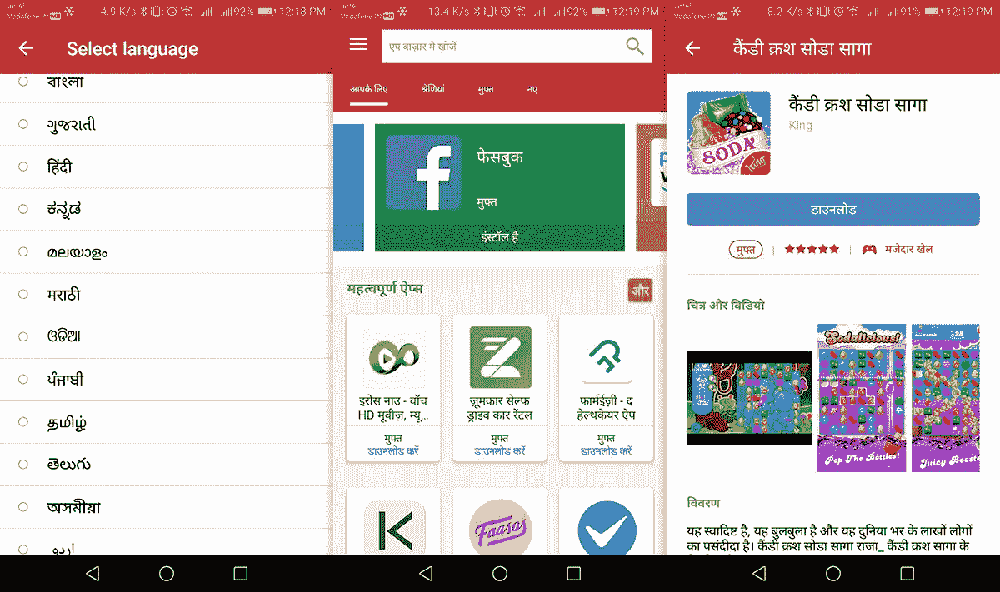
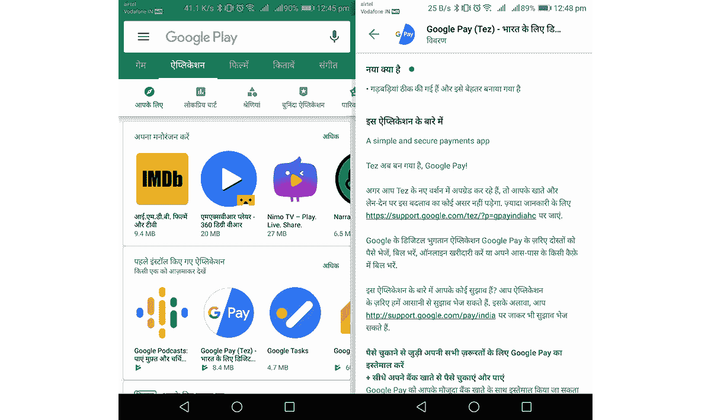

# 三星 Galaxy 应用商店现在为印度人支持 12 种印度语

> 原文：<https://www.xda-developers.com/samsung-galaxy-apps-indian-language/>

智能手机制造商在印度有大量的机会，谁会比三星更了解印度呢？去年，三星在印度的领先地位被最大的竞争对手小米夺走。随着三星通过包括 [Galaxy M](https://www.xda-developers.com/samsung-galaxy-m20-m10-india-launch/) 和 [Galaxy A](https://www.xda-developers.com/samsung-galaxy-a10-galaxy-a30-galaxy-a50-india-launch/) 系列在内的价格更加低廉的新设备来夺回其在竞争中的主导地位，它正在寻求吸引该国较小城镇的消费者。作为努力的一部分，三星宣布了一个特殊的“印度制造”版本的 Galaxy 应用程序商店，支持十几种印度语言，旨在帮助印度用户下载和体验更多的应用程序。

三星已经与 Indus App Bazaar 合作，允许其印度用户以母语而非英语浏览应用程序。Indus App Bazaar 是印度本土开发的移动操作系统 indus T1 的一部分，该系统基于 Android，旨在促进印度小城镇用户的参与。Indus App Bazaar 和 OS 都支持除英语之外的 12 种印度语，以方便印度用户下载应用程序。同样的情况也延伸到了 Galaxy 应用商店。

 <picture></picture> 

A glimpse of Indus App Store

除英语外，Galaxy 应用商店现在支持的语言包括阿萨姆语、孟加拉语、古吉拉特语、印地语、卡纳达语、马拉雅拉姆语、马拉地语、奥迪亚语、旁遮普语、泰米尔语、泰卢固语和乌尔都语。除了支持多种语言，三星 Galaxy 应用商店还从 IndusOS 商店借用了个性化结果，这些个性化应用推荐将发送给用户，即使没有注册。Galaxy 应用程序商店还将重点展示印度开发者的应用程序，以宣传他们在政府的“创业印度”计划下所做的努力。

 <picture></picture> 

Google Play Store in Hindi

然而，当谈到在谷歌 Play 商店本地支持印度语时，谷歌并没有落后太多。事实上，如果你将智能手机的默认语言设置为任何印度语，谷歌 Play 商店的内容也会改变。你可以看到谷歌 Play 商店，我的智能手机的默认语言设置为印地语。

此外，谷歌一直在努力为印度用户提供更大的支持，在谷歌助手中添加了多达 8 种地区语言。最近，谷歌还推出了一款名为 *Bolo* (印地语“说话”的意思)[的应用，通过使用类似提词器的界面，帮助印度儿童学习如何阅读印地语和英语](https://bolo.withgoogle.com/intl/en/)。