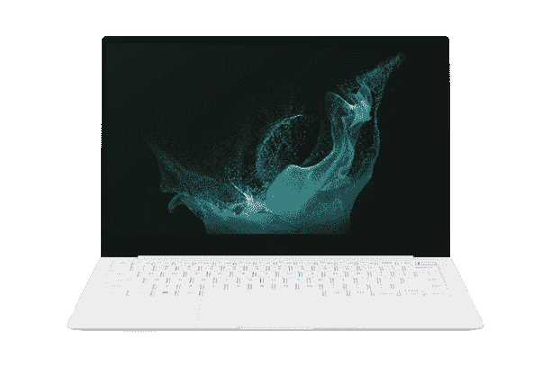

# 三星的 Galaxy Book 2 系列现在可以购买，商业模式将于 4 月 11 日推出

> 原文：<https://www.xda-developers.com/samsung-galaxy-book-2-series-now-available/>

三星宣布，三星 Galaxy Book 2 笔记本电脑的全系列产品从今天开始在美国上市。预购几周前就开始了，但现在已经全面开放了。此外，该公司宣布，Galaxy Book 2 业务将于 4 月 11 日开始发售。

所有的笔记本电脑都配备了英特尔的第 12 代酷睿处理器，尽管 [Galaxy Book 2 Pro](https://www.xda-developers.com/samsung-galaxy-book-2-pro/) 型号使用 28W P 系列 CPU，标准的 [Galaxy Book 2 360](https://www.xda-developers.com/samsung-galaxy-book-2/) 有 15W CPUs。它们有 13.3 英寸和 15.6 英寸两种尺寸，显示器都是 AMOLED，因此您可以获得真正的黑色、鲜艳的颜色和高对比度。当然，在 360 机型上，显示屏也支持触摸和 S Pen。

除了 AMOLED 显示屏，这些笔记本电脑最大的吸引力在于它们非常轻薄，尤其是 Pro 型号，其起始厚度仅为 11.2 毫米，重量为 1.92 磅。

三星 Galaxy Book 2 360 起价 899.99 美元，Galaxy Book 2 Pro 起价 1049.99 美元，Galaxy Book 2 Pro 360 起价 1249.99 美元。不过，你可以用旧设备折价换货，还可以立即获得 100 美元的三星信用额(Galaxy Book 2 360 为 50 美元)。

 <picture></picture> 

Samsung Galaxy Book 2 Pro

##### 三星 Galaxy Book 2

三星 Galaxy Book 2 系列配备了英特尔第 12 代处理器和令人惊叹的 AMOLED 显示屏。另外，这三种型号都非常轻。

Galaxy Book 2 业务实际上与产品线中的其他笔记本电脑明显不同。它有一个 14 英寸的全高清显示屏，它包括一个全高清网络摄像头，带有一个用于 Windows Hello 面部识别的红外传感器。此外，它支持高达 64GB 的插槽内存和 2TB 的固态硬盘存储。这款电脑不太注重轻薄，因此厚度不到 20 毫米，起始重量为 1.51 千克(3.33 磅)。

当然，它还包括支持博锐技术的英特尔处理器选项，以及一整套面向企业的安全特性。它使用基于硬件的信任根来验证 BIOS、篡改警告功能、BIOS 自动恢复和英特尔硬件保护技术。它还符合微软的 Secured-core PC 标准，因此您可以放心，它会尽可能地保护您的敏感数据。

如上所述，Galaxy Book 2 商务版将于 4 月 11 日在[三星的商务网站](https://shop-links.co/1770424778160253680?u1=d4746ef3-86e3-4cda-a151-043ac98383f2)上市。