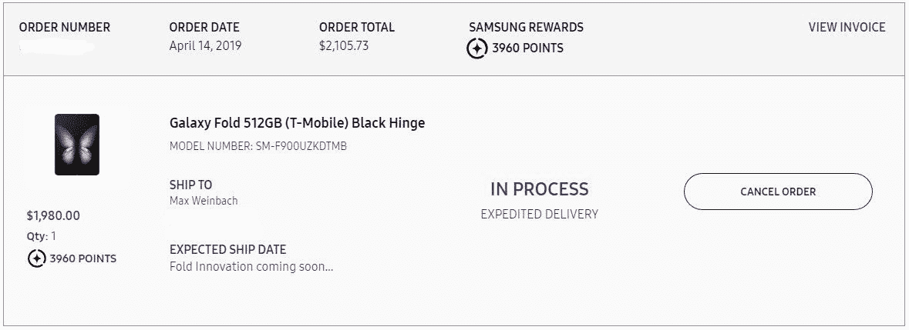

# 三星 Galaxy Fold 传奇给人的感觉像是一个糟糕的 Kickstarter

> 原文：<https://www.xda-developers.com/samsung-galaxy-fold-bad-kickstarter/>

三星于 2019 年 2 月 20 日发布了其首款可折叠智能手机三星 Galaxy Fold[，震惊了科技界。这一宣布发生在拥挤的三星 Unpacked 活动期间，该活动还展示了 Galaxy S10 系列。Galaxy Fold 抢了 Galaxy S10 的风头，但这并不令人惊讶，因为 Galaxy S10 更像是三星在追赶潮流，而 Galaxy Fold 被承诺是移动技术的未来:一部可以变成平板电脑的手机。不幸的是，自《银河折叠》预告以来，接下来几个月发生的戏剧性事件粉碎了很多炒作。虽然一份新的报告表明，Galaxy Fold 可能最终准备好推出，但我们这些实际上排队支付数千美元的客户却没有听到三星的任何消息。](https://www.xda-developers.com/samsung-galaxy-fold-specifications-pricing-availability/)

像许多失败的 Kickstarters 一样，Galaxy Fold 的发布延迟让该产品感觉好得不像真的。在资金紧张的情况下，人们被冷落在一边，等待三星承诺过多、交付不足的产品的更新。

**[三星银河折 XDA 论坛](https://forum.xda-developers.com/galaxy-fold)**

在拆包期间，我坐在纽约市的三星 837。每个人都敬畏地看着两层楼的展示，盯着即将公布的宏伟的新技术。它看起来酷毙了。你可以听到杂音，偶尔还会听到“我绝对会买下它。”直到他们宣布价格。当 1，980 美元的价格一出现在舞台上，你就能听到一个非常响亮的喘息声，因为大多数人都立即对该产品失去了兴趣。然后他们宣布了 4 月 26 日的发货日期，我们都想知道到那时它会准备好。

快进到 4 月 12 日:Galaxy Fold 的预注册开始的那一天。那些在过去 51 天里决定要预购产品的人只需*注册*即可预购。我做到了。然后在 4 月 14 日，预购*居然*开了。几天前登记的 9045 人争先恐后地投入 2000 美元。我又成了那些人中的一员。三星很快就用完了预购库存。Galaxy Fold 的宣传力度甚至超过了三星的预期。

 <picture></picture> 

FOLD INNOVATION COMING SOON

这让我们来到了 4 月 15 日，这一天，一群 YouTubers 和其他科技博客进入了 Galaxy Fold。本质上，每个人都喜欢折叠。作为一个潜在的拥有者，我看了几乎每一个视频，读了每一篇关于 Fold 的文章。这些 YouTubers 和记者对此很少有负面评论。

不幸的是，好评只持续了 2 天。4 月 17 日，多名记者报道称，他们的[星系褶皱断裂](https://www.xda-developers.com/samsung-galaxy-fold-issues-broken/)。同一天，共有 5 起报告病例出现在互联网上。这导致了包括我在内折叠预订者的恐慌。问题是:三星会怎么做？

三星对 Galaxy Fold 的命运保持沉默，直到它应该发货的 4 天前。4 月 22 日，三星[正式延迟](https://www.xda-developers.com/samsung-galaxy-fold-launch-delays/)Galaxy Fold。他们向所有预购设备的人发送了一封电子邮件，告诉他们 Galaxy Fold 将被推迟，他们将“在两周内更新(他们)更具体的发货信息。”

因此，我们等待了漫长的两周，就像所有等待 Kickstarter 更新的人一样。两周后的 5 月 6 日，我们收到了承诺的邮件。在这封比上一封更令人绝望的邮件中，三星表示他们还不知道问题出在哪里，但他们正在解决问题。他们没有给出任何“具体的运输信息”，正如他们两周前承诺的那样，也没有给出任何关于设备问题的信息。同时，他们决定提到，所有订单将在 5 月 31 日自动取消，除非你手动接受订单，并承认届时可能无法发货。三星说这是由于美国法律，所以我不会反对他们。

自 5 月 6 日那封邮件以来，三星一直保持沉默。偶尔会有三星高管的引用，但在我看来这些都不算数。唯一算数的电子邮件是三星发给所有预订设备的人的邮件。缺乏沟通对愿意为他们的产品花费数千美元的忠诚顾客来说是一种侮辱。

一个糟糕的 Kickstarter 通常被认为是一场运动，项目承诺一些未来的——几乎不可能的——技术，但从未交付。这个项目通常非常昂贵。像这样的项目有时会遇到不确定的“制造问题”,导致延期。创作者发布了一个更新，说它正在工作，并期待很快会有另一个更新。几个月后，没有新的更新。支持者通过电子邮件、评论和推特向创作者询问他们的产品怎么样了，但没有回应。听起来熟悉吗？

这与星系折叠的情况类似。它承诺了一款未来的可折叠显示屏，当时非常昂贵，遭遇了重大设计挫折，现在陷入了漫长的延迟。我们已经有将近两个月没有收到三星官方的消息了。整个情况感觉像是一个糟糕的 Kickstarter。

不过，Galaxy Fold 和任何糟糕的 Kickstarter 之间有一个巨大的区别。我们知道三星实际上正在解决这个问题，他们有资源修复它。三星首席执行官 DJ Koh 甚至为一些记者举办了圆桌会议，并证实他们正在测试大约 2000 种不同的原型。三星承认他们在设备准备好之前就推出了它。那是明显的。现在，来自*的[可靠传闻称三星甚至准备开始生产。](https://www.bloomberg.com/news/articles/2019-07-03/samsung-seeks-redemption-with-redesigned-galaxy-fold-smartphone)*

 *<picture></picture> 

Is this the legacy of the Galaxy Fold?

在过去的几个月里，各种来源的更新层出不穷，但三星一直在悄悄地忽略实际购买该设备的人。这就是我对三星如何处理 Galaxy Fold 情况的整个问题所在。他们对待真正有兴趣购买它的人和那些购买了它的人是最差的。他们告诉一小群记者，Galaxy Fold 正在开发中，但在更新他们的核心支持者方面却保持沉默。

三星，如果你的收件箱里有这篇社论，我有一些方法可以帮你解决这个问题。首先，请给所有保留预购订单的人发一封电子邮件。给我们一个关于你正在做什么来修复设备的状态更新。第二，定期向我们报告进展情况，以及在修复设备方面是否有任何突破。第三，为你给你最好的客户的糟糕沟通道歉。在与订购 Galaxy Fold 的其他几个人交谈后，这就是我们真正想要的。

在这种情况下，沟通是关键。缺乏沟通真的伤害了三星的品牌和像我一样狂热的三星粉丝的忠诚度。两个月没有一封电子邮件是你从糟糕的 Kickstarter 活动中所期望的，而不是像三星这样的大公司。*