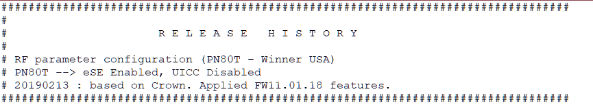

# 售价 1980 美元的三星 Galaxy Fold 可能会在威瑞森和斯普林特推出

> 原文：<https://www.xda-developers.com/samsung-galaxy-fold-verizon-sprint/>

三星在 Samsung Unpacked 发布了 [Samsung Galaxy Fold](https://www.xda-developers.com/samsung-galaxy-fold-specifications-pricing-availability/) ，揭开了可折叠手机大战的序幕。不幸的是，三星没有让任何人实际接触该设备，只给我们留下了该设备的一个[宣传动手](https://www.xda-developers.com/samsung-galaxy-fold-new-video/)。华为在世界移动通信大会上表现强劲，让[我们许多人](https://www.youtube.com/watch?v=Nl2EaFRRuyU)实际上使用了他们的[华为 Mate X](https://www.xda-developers.com/huawei-mate-x-5g-foldable-smartphone-specifications/) 。华为 Mate X 以其向外折叠的显示屏而不是三星 Galaxy Fold 的向内折叠显示屏赢得了很多人的支持。不过，与华为 Mate X 不同的是，三星 Galaxy Fold 实际上可以在美国购买。然而，三星的新闻稿称，Galaxy Fold 将于 2019 年在 Q2 的 AT & T 和 T-Mobile 上市，这意味着在 Sprint 或威瑞森上市尚未得到确认。由于早期的固件文件和三星的 FOTA 服务器，有证据表明 Galaxy Fold 可能会在威瑞森、Sprint 和美国的其他运营商上推出。

XDA 知名开发者 [deadman96385](https://forum.xda-developers.com/member.php?u=4222965) [分享了](https://forum.xda-developers.com/galaxy-fold/development/rom-sm-f900u-stock-combination-rom-t3905376)一款型号为 SM-F900U 的设备的“组合固件”。SM-F900U 是三星 Galaxy Fold 的型号名称。组合固件指的是三星设备，是一种旨在解除硬件锁定或调试硬件的专业固件。组合固件通常缺少很多你会在发布固件中找到的三星软件，所以大多数用户都不会用它们。不过，Galaxy Fold 的组合固件为我们提供了一些有用的信息，如可能的运营商变体、SoC 的确认等等。

### 运送者

在系统分区中，有位于/system/carrier 中的载体文件夹。这些文件夹以运营商代码命名，如“ATT”、“TMB”或“VZW”，三星在内部分别用来指代运营商美国电话电报公司、T-Mobile 和威瑞森无线。系统分区中的载体文件夹包含打算安装在特权系统应用程序目录中的应用程序(以及必需的 priv-app 权限声明文件),或者它们是空的。在/system 中，美国电话电报公司、T-Mobile 和威瑞森的文件夹包含运营商应用程序和权限文件，而其余的文件夹，包括 Sprint 的，都是空的。有问题的两个威瑞森应用是帮助 ViLTE、VoLTE 和 VoWiFi 的“高级通话”和帮助用户在平板电脑上设置威瑞森数据计划的“HuxExtension”。

我们将这些运营商代码与三星的 FOTA(无线固件)服务器进行了交叉引用，该服务器为我们提供了关于给定运营商代码的最新可用版本的信息。例如，如果您访问此 [URL](http://fota-cloud-dn.ospserver.net/firmware/BST/SM-F900U/version.test.xml) ，您会看到 Boost Mobile (BST)模型正在积极开发中，其最新版本号为 F900USQU0ASC1.DM/F900UOYN0ASC1/F900USQU0ASC1.。我将我在固件中找到的运营商代码、相应的运营商名称、最新版本号及其构建日期整理成了一个表格。如你所见，AT & T、Boost Mobile、Sprint、T-Mobile、Virgin Mobile、威瑞森无线和美国 unbranded 的三星 Galaxy Fold 型号正在积极开发中。我不确定 CHA 是什么，但是那个航母的开发似乎已经被放弃了。U.S. Cellular 的最后生产日期是 10 月，因此该型号也有可能被废弃。最后，有一个 GCF 运营商代码和一个开发中的软件版本，但我不确定是指哪家公司。

| **承运人代码** | **承运人名称** | **最后一次构建** | **建造日期** |
| ATT | 美国电话电报公司(American Telephone and Telegraph Company) | F900USQU0ASC1 .DM/F900UOYN0ASC1/F900USQU0ASC1 | 2019 年 3 月 1 日 |
| 牛生长激素 | 助推移动 | F900USQU0ASC1 .DM/F900UOYN0ASC1/F900USQU0ASC1 | 2019 年 3 月 1 日 |
| 赤湾集装箱码头 | 关于 Xfinity Mobile | F900USQU0ARJ5 .DM/F900UOYN0ARJ5/F900USQU0ARJ5 | 2018 年 10 月 1 日 |
| 茶 | ？？？ | F900USQU0ARJ5 .DM/F900UOYN0ARJ5/F900USQU0ARJ5 | 2018 年 10 月 1 日 |
| 最大公因子（greatestcommonfactor） | ？？？ | F900USQU0ASC1 .DM/F900UOYN0ASC1/F900USQU0ASC1 | 2019 年 3 月 1 日 |
| 心灵研究学会(Society for Psychical Research) | 冲刺 | F900USQU0ASC1 .DM/F900UOYN0ASC1/F900USQU0ASC1 | 2019 年 3 月 1 日 |
| TMB | T-Mobile | F900USQU0ASC1 .DM/F900UOYN0ASC1/F900USQU0ASC1 | 2019 年 3 月 1 日 |
| 超声波清洗(Ultra Sonic Cleaning) | 美国手机 | F900USQU0ARJ5 .DM/F900UOYN0ARJ5/F900USQU0ARJ5 | 2018 年 10 月 1 日 |
| VMU | 维珍移动 | F900USQU0ASC1 .DM/F900UOYN0ASC1/F900USQU0ASC1 | 2019 年 3 月 1 日 |
| VZW | 威瑞森无线 | F900USQU0ASC1 .DM/F900UOYN0ASC1/F900USQU0ASC1 | 2019 年 3 月 1 日 |
| 关于 XAA | 无物主的 | F900USQU0ASC1 .DM/F900UOYN0ASC1/F900USQU0ASC1 | 2019 年 3 月 1 日 |
| 关于 XAS | 冲刺 | F900USQU0ASC1 .DM/F900UOYN0ASC1/F900USQU0ASC1 | 2019 年 3 月 1 日 |

*感谢我们团队的 [Max Weinbach](https://www.xda-developers.com/author/mweinbach/) 对构建号进行解释，从而得出上表所示的构建日期。*

我们发现了威瑞森支持的进一步证据，并直接确认 SM-F900U 是位于/system/etc 的 autorun.iso 中的三星 Galaxy Fold。当您将设备插入 PC 时，此映像就会运行。我在我的电脑上安装了 ISO，发现了一个 ModelName.txt 文件，其中列出了“SM-F900U”和“Galaxy Fold”。ISO 上还有一个威瑞森软件升级助手软件，当它运行时，会试图安装“将帮助你的 Galaxy Fold (SM-F900U)与你的 PC 通信”的软件

### 高通骁龙 855 确认

三星的[新闻稿](https://news.samsung.com/us/samsung-unfolds-galaxy-fold-unpacked-2019/)和[Galaxy Fold 的产品页面](https://shop-links.co/link/?exclusive=1&publisher_slug=xda&article_name=The+%241%2C980+Samsung+Galaxy+Fold+may+launch+on+Verizon+and+Sprint&article_url=https%3A%2F%2Fwww.xda-developers.com%2Fsamsung-galaxy-fold-verizon-sprint%2F&u1=UUxdaUeUpU23947&url=https%3A%2F%2Fwww.samsung.com%2Fglobal%2Fgalaxy%2F&ourl=https%3A%2F%2Fwww.samsung.com%2Fglobal%2Fgalaxy%2Fgalaxy-fold%2F)称该设备由“7 纳米 64 位八核处理器”驱动，鉴于 [Exynos 9820](https://www.xda-developers.com/samsung-exynos-9820-samsung-galaxy-s10/) 是 8 纳米芯片，大多数商店可以理解地认为这是[高通骁龙 855](https://www.xda-developers.com/qualcomm-snapdragon-855-kryo-485-cpu-adreno-640-gpu-spectra-isp-cv/) 移动平台。然而，一些渠道，包括我们自己、 *AndroidAuthority* 、 *Engadget* 和其他一些人，对假设 Galaxy Fold 将有骁龙 855 持谨慎态度，因为三星没有明确提到它。Galaxy Fold 的组合固件证实，面向美国的 SM-F900U 型号采用了高通最新的处理器。系统和供应商分区中的 build.prop 都将该板列为“sm8150”或“msmnile”，这分别是骁龙 855 的内部型号名称和代码名称。

### 国家足球联盟

三星在 Galaxy Fold 上唯一提到的连接是为韩国发布的 5G 模型。我们不知道这款设备是否会支持 MST for Samsung Pay，但鉴于其 1980 美元的高昂价格，我们希望三星不会在任何内部部件上偷工减料。固件没有告诉我们太多，但/vendor/etc/nfc 中的 libnfc-nxp_RF.conf 暗示 Galaxy Fold 将会配备恩智浦的 PN80T NFC 芯片。

 <picture></picture> 

"Winner" is the code-name for the Samsung Galaxy Fold.

### 摄像机

三星 Galaxy Fold 有 6 个摄像头，以确保至少有一个摄像头指向你或远离你。/vendor/lib64/camera 目录包含可能属于 Samsung Galaxy Fold 的相机模块列表。我们之前在早些时候的拆解中发现了[未公开的索尼 IMX374](https://www.xda-developers.com/samsung-foldable-phone-sony-imx-374-sensor/) ，Galaxy Fold 的固件显示该设备上有两个。官方规格表上说有两个 10MP f/2.2 自拍相机，所以我假设索尼 IMX374 是 10MP 传感器。我找不到任何关于“SAK2L4SX”传感器的信息，但我能找到的最接近的是“SAK2L4”传感器，这是三星 Galaxy S10 上使用的 12MP 广角传感器。“ [S5K4HA](https://shop-links.co/link/?exclusive=1&publisher_slug=xda&article_name=The+%241%2C980+Samsung+Galaxy+Fold+may+launch+on+Verizon+and+Sprint&article_url=https%3A%2F%2Fwww.xda-developers.com%2Fsamsung-galaxy-fold-verizon-sprint%2F&u1=UUxdaUeUpU23947&url=https%3A%2F%2Fwww.samsung.com%2Fsemiconductor%2Fimage-sensor%2Fmobile-image-sensor%2FS5K4HA%2F) ”是正面使用的 8MP 传感器。“S5K3P9SN”最接近 [Galaxy S10 系列](https://www.xda-developers.com/samsung-galaxy-s10-s10-and-s10e-launch-with-the-snapdragon-855-ultrasonic-in-display-fingerprint-scanners-reverse-wireless-charging-and-a-whole-lot-more/)上的“S5K3P9”超广角传感器。最后，“ [S5K3M3](https://shop-links.co/link/?exclusive=1&publisher_slug=xda&article_name=The+%241%2C980+Samsung+Galaxy+Fold+may+launch+on+Verizon+and+Sprint&article_url=https%3A%2F%2Fwww.xda-developers.com%2Fsamsung-galaxy-fold-verizon-sprint%2F&u1=UUxdaUeUpU23947&url=https%3A%2F%2Fwww.samsung.com%2Fsemiconductor%2Fimage-sensor%2Fmobile-image-sensor%2FS5K3M3%2F) ”是一个 1300 万像素的长焦镜头，与 Galaxy S10 上使用的镜头相同。不过，我不确定为什么产品页面上的百万像素数量与 Galaxy S10 或 Galaxy Fold 的规格不符。

*感谢中国固件挖掘者在[微博](https://s.weibo.com/weibo?q=%E9%9F%B3%E9%A2%91%E8%8A%AF%E7%89%87&Refer=STopic_history)上找到 Galaxy S10 传感器名称！*

### 三星区块链密钥库

三星的一份新闻稿提到，“Galaxy S10 采用了国防级的三星 Knox，以及由硬件支持的安全存储，其中包含区块链支持的移动服务的私钥。”这里指的是[三星区块链密钥库](https://www.xda-developers.com/samsung-galaxy-s10-blockchain-keystore-cryptocurrency-wallets/)，现在在 [Galaxy Store](https://www.xda-developers.com/galaxy-apps-rebranded-galaxy-store/) 面向三星 Galaxy S10 用户提供。该应用程序将帮助存储您的加密货币钱包。我们还没有看到 Galaxy Fold 也将支持 crypto 的确认，但组合固件在/system/app 目录中预装了三星区块链密钥库。APK 被称为“BlockchainBasicKit”

## 三星 Galaxy Fold 论坛、规格和发布

如果你有兴趣花 2000 美元买一部手机，那就请便。如果有足够多的人真的有兴趣购买这款产品，我们为 Galaxy Fold 开设了一个论坛。

[**三星银河折叠论坛**](https://forum.xda-developers.com/galaxy-fold)

这里是我们目前所知的三星 Galaxy Fold 的所有规格。

| 

种类

 | 

规格

 |
| --- | --- |
| 显示 | **主显示屏:** 7.3 英寸 QXGA+动态 AMOLED (4.2:3) **封面显示屏:** 4.6 英寸高清+ Super AMOLED (21:9) |
| 摄像机 | **封面摄像头:** 10MP 自拍摄像头，f/2.2 **后置三摄像头:** 16MP 超宽摄像头，f/2.212MP 广角摄像头，双像素自动对焦，OIS，f/1.5/f/2.412MP 长焦摄像头，PDAF，OIS，f/2.4，2 倍光学变焦**前置双摄像头:** 10MP 自拍摄像头，f/2.28MP RGB 深度摄像头，f/1 |
| 社会学 | 高通骁龙 855 |
| 随机存取存储 | 12GB 内存(LPDDR4x) |
| 储存；储备 | 512GB UFS 3.0(无 microSD 卡插槽) |
| 电池 | 4380 毫安时 |
| 充电 | USB Type-C 端口:兼容高通快充 2.0.WPC 和 PMA 无线充电的三星自适应快充。(通过无线 PowerShare 反向无线充电。) |
| 软件 | 基于 Android 9 Pie 的 One UI。三星 DeX，Bixby 套路，三星 Knox，三星 Pay。 |
| 生物测定学 | 侧装式指纹扫描仪 |
| 声音的 | AKG 的立体声扬声器 |

《银河折叠》将于 4 月 26 日发售，尽管根据《T21》的消息，供应会受到限制。三星将在 4 月份发布前举行另一场新闻发布会，我们希望在会上了解更多关于这款设备的信息，并有可能拿到一部。