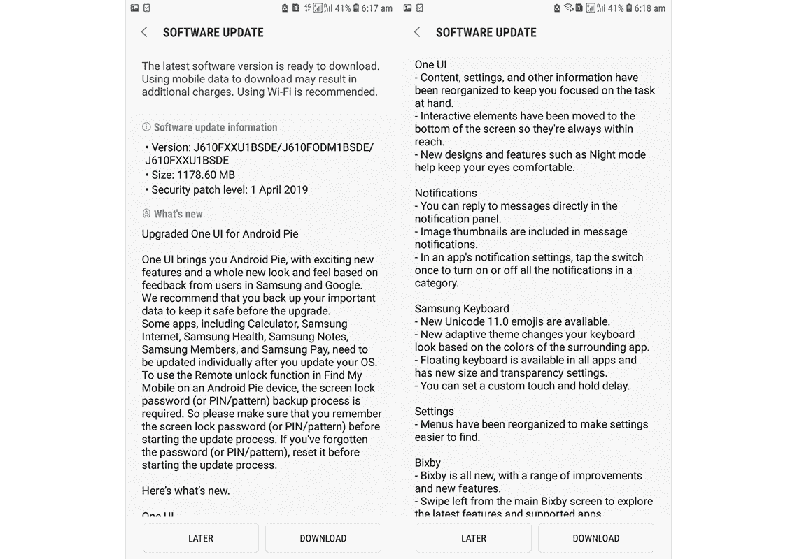

# 三星开始为 Galaxy J4/J4+和 Galaxy J6+推出安卓系统

> 原文：<https://www.xda-developers.com/samsung-galaxy-j4-j4-j6-android-pie-one-ui/>

# 三星开始为 Galaxy J4/J4+和 Galaxy J6+推出安卓系统

三星的 One UI 基于 Android Pie，适用于 Galaxy J6+、Galaxy J4 和 Galaxy J4+的特定地区，改进了外观和感觉、三星键盘等。

特征图像

传统上，在最新软件更新方面，三星一直是落后者之一。但是在过去的一年里，情况已经有了很大的改善，三星一直在推动基于 Android 9.0 的最新 UI 更新，不仅是[的旗舰产品](https://www.xda-developers.com/one-ui-android-pie-galaxy-s8-galaxy-note-8-all-major-us-carriers-unlocked/)，也包括一些中端设备。现在，又有三款三星廉价和中档智能手机正在让[尝到馅饼](https://www.xda-developers.com/samsung-galaxy-j8-android-pie-one-ui/)的滋味。随着 One UI 的更新，三星 Galaxy J4/J4+和 Galaxy J6 将在用户体验、通知、三星键盘、Bixby 以及整体性能方面得到改善。

在每部智能手机的情况下，更新重量约为 1200MB，考虑到与早期的三星体验 UI 相比，更新带来了全新的视觉体验，这是合理的。在主要的变化中，互动元素被移到了屏幕的下半部分，这样用户就不必在单手使用三星智能手机时挣扎。除了这次大变动，设置中的项目也进行了重组，以便更直观地使用。

 <picture></picture> 

Courtesy of SamMobile

此外，该更新提供了一种简单的方法，可以直接从通知窗口快速回复所有通知。来自传入通知的图像也以缩略图的形式可见。此外，三星键盘也有一些变化，现在可以从底部脱离，以浮动模式使用。此外，键盘还支持自适应主题，该主题根据键盘周围的 UI 元素修改键盘的颜色。

截至目前，基于 Android 9.0 Pie 的 One UI 更新可用于:

*   巴拿马的银河 J4，
*   泰国、越南和乌克兰的银河 J4+,以及
*   德国、印度和伊拉克的 Galaxy J6+。

当这些更新在其他地区也适用于上述设备时，我们会通知您。如果您的设备符合更新条件，请前往“设置”>“软件更新”。

* * *

[**来源:SamMobile**](https://www.sammobile.com/2019/04/27/galaxy-j4-plus-galaxy-j6-plus-android-pie-update)