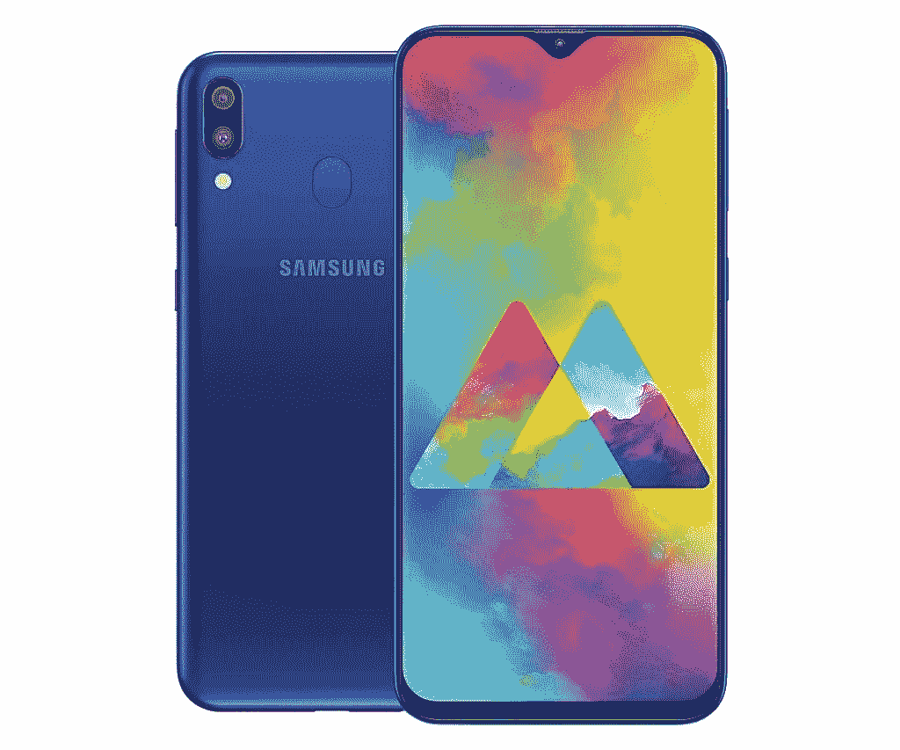
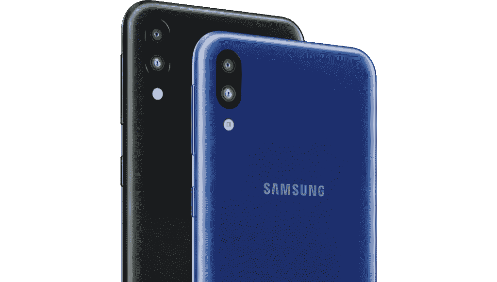

# 三星在印度发布新款 Galaxy M10 和 Galaxy M20

> 原文：<https://www.xda-developers.com/samsung-galaxy-m20-m10-india-launch/>

三星终于推出了新的 Galaxy M 系列，首先在印度推出了新的 Galaxy M10 和 Galaxy M20。这些新设备是第一批采用[三星新的 Infinity-V 显示屏](https://www.xda-developers.com/samsung-notch-infinity-display/)的[产品，目标是印度的“年轻的千禧一代”。](https://www.xda-developers.com/samsung-galaxy-m-series-launch-india-priced/)

 <picture></picture> 

Samsung Galaxy M20

## 规格-三星 Galaxy M10 和三星 Galaxy M20

| 

规格

 | 

三星 Galaxy M10

 | 

三星 Galaxy M20

 |
| --- | --- | --- |
| **显示** | 6.2 英寸高清+ (720 x 1520 像素)液晶显示屏；水滴凹口 | 6.3 英寸 FHD+ (1080 x 2340 像素)液晶显示屏；水滴凹口 |
| **SoC** | Exynos 787014nm8x 皮质-A53 | Exynos 790414nm2 个 Cortex-A73+6 个 Cortex-A53 |
| **内存&存储** | 2GB+16GB；3GB + 32GB | 3GB+32GB；4GB + 64GB |
| **MicroSD 可扩展性** | 通过专用插槽最高可达 512GB | 通过专用插槽最高可达 512GB |
| **USB** | 微型 USB | C 型 |
| **电池** | 3400 毫安时 | 5000 毫安时；使用随附的充电器，最高可快速充电至 15W |
| **指纹传感器** | 不 | 后面的 |
| **双 SIM 卡** | 有；双 4G VoLTE | 有；双 4G VoLTE |
| **后置摄像头** | 双:1300 万像素，f/1.9+500 万像素超宽镜头 | 双:1300 万像素，f/1.9+500 万像素超宽镜头 |
| **前置摄像头** | 5MP | 800 万像素 |
| **安卓版本** | 三星在安卓 8.1 奥利奥上体验 UX v9.5 | 三星在安卓 8.1 奥利奥上体验 UX v9.5 |
| **定价** | 2GB+16GB 版本的₹7,990(约 112 美元)；3GB + 32GB 版本的₹8,990(约 126 美元) | 3GB + 32GB 版本的₹10,990(～155 美元)；4GB + 64GB 版本的₹12,990(约 183 美元) |
| **可用性** | 2019 年 2 月 5 日来自亚马逊和 Samsung.com | 2019 年 2 月 5 日来自亚马逊和 Samsung.com |

新的三星 Galaxy M10 和三星 Galaxy M20 具有相同的整体设计，但在屏幕尺寸和其他关键内部部件上有所不同，以提供更广泛的价格覆盖范围。显而易见，M10 是兄弟姐妹中规格较低的版本，与小米的 Redmi 系列竞争，而 M20 在 M10 的基础上提供了更多功能，并与小米的 Redmi Note 系列竞争。

这些设备的亮点是巨大的身临其境的屏幕，这给设备带来了非常干净的外观，并使其在目标价格范围内脱颖而出。处理器，特别是三星 Exynos 7904，应该能够完成印度市场上预算/早期中端设备的所有预期。Galaxy M20 上的 5,000 mAh 大电池也会受到超级用户的青睐。

M10 和 M20 的另一个亮点是超宽的 5MP 二次后置摄像头，这将允许用户拍摄更广阔的照片，在单帧中可以容纳更多照片。这一特性在这个价位段并不常见，所以看看目标受众对这一增加的反应会很有意思。双后置摄像头设置还可以拍摄实时对焦人像照片。

Galaxy M10 和 Galaxy M20 有一点令人失望的是，这些设备开箱即用 Android 8.1 Oreo，在三星体验 UX v9.5 之下。这对三星来说是一个错过的机会，因为 Android 9 Pie 的发布本来可以成为一个非常好的营销点，特别是在这个细分市场。Galaxy M10 也没有配备指纹扫描仪。

 <picture></picture> 

Samsung Galaxy M10

这两款新设备都是根据印度政府的“印度制造”倡议在印度制造的。这些设备还通过了 Widevine L1 认证，可以通过一些流行的流媒体应用程序播放高清内容。

三星 Galaxy M10 和 Galaxy M20 将有海洋蓝和炭黑色两种颜色可供选择。Galaxy M10 的 **2GB+16GB** 版本将花费**₹7,990**(～112 美元)，而 **3GB + 32GB** 版本将花费**₹8,990**(～126 美元)。Galaxy M20 的价格为 **₹10,990** (约 155 美元)3GB + 32GB 型号和 **₹12,990** (约 183 美元)4GB + 64GB 型号。这些手机将从 2019 年 2 月 5 日起通过亚马逊和 Samsung.com 在线销售。Reliance Jio 4G 用户也将能够在手机上享受双倍数据优惠。

**你对新的三星 Galaxy M 系列智能手机有什么想法？请在下面的评论中告诉我们！**