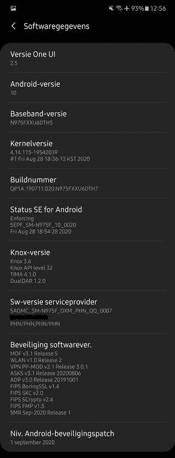

# 三星 Galaxy Note 10/Note 10+接收一次 UI 2.5 更新

> 原文：<https://www.xda-developers.com/samsung-galaxy-note-10-note-10-receive-one-ui-2-5-with-september-2020-security-patches/>

# 三星 Galaxy Note 10/Note 10+收到一个带有 2020 年 9 月安全补丁的 UI 2.5

三星 Galaxy Note 10 和 Note 10+现在获得了 2020 年 9 月 Android 安全补丁的 One UI 2.5 更新。请继续阅读！

[Galaxy Note 20](https://www.xda-developers.com/samsung-galaxy-note-20/) 系列、 [Galaxy Tab S7/S7+](https://www.xda-developers.com/samsung-galaxy-tab-s7/) 和 [Galaxy Z Fold 2](https://www.xda-developers.com/samsung-galaxy-z-fold-2/) 是三星首批运行最新版本的定制 Android 皮肤 One UI 2.5 的设备。从那时起，韩国 OEM 厂商已经为其几款高端手机带来了新的更新[，如 Galaxy S20 系列和第一代 Galaxy Z Flip](https://www.xda-developers.com/samsung-galaxy-s20-series-gets-one-ui-2-5-update-note-20-features/) 。在今天早些时候更新了 Galaxy S10 阵容和 Galaxy Note 10 Lite之后，三星现在也开始为 Galaxy Note 10 系列推出一个 UI 2.5。

**[Galaxy Note 10 论坛](https://forum.xda-developers.com/galaxy-note-10)| |[Galaxy Note 10+论坛](https://forum.xda-developers.com/galaxy-note-10+)**

LTE Galaxy Note 10(型号 **SM-N970F** )和 Note 10+(型号 **SM-N975F** )的 Exynos 9825 全球版本正在德国以软件版本**n 97 xfxx U6 dt 7**的形式接收新的更新。后者的 5G 版本(型号 **SM-N976B** )也加入了这个名单，尽管它的更新版本可以在 AUT 地区下载，这是三星在瑞士的代码。正如预期的那样，新固件带来了 2020 年 9 月的安全补丁。

 <picture></picture> 

Thanks to XDA Senior Member [henklbr](https://forum.xda-developers.com/member.php?u=1586120) for the screenshot!

 <picture></picture> 

Upgrade to the Note20 Series at Samsung

##### 三星 Galaxy Note 20

如果你的 Note10 需要升级，考虑在 Samsung.com 升级到最新的 Note20 系列

在新功能方面，One UI 2.5 应该增加无线 DeX 支持，对三星键盘和 Messages 应用程序的改进，以及许多其他[幕后变化](https://www.xda-developers.com/samsung-one-ui-2-5-update-navigation-gestures-third-party-launchers/)。不过，bootloader 版本没有变化，这意味着理论上基于软件的降级是可能的。

我们应该会在未来几天和几周内在更多国家看到 Galaxy Note 10 系列推出一个 UI 2.5。虽然你可能试图[摆弄三星智能开关](https://forum.xda-developers.com/showpost.php?p=83421701)跳过等待队列并立即获取更新，但使用社区开发的工具，如 [Frija](https://forum.xda-developers.com/s10-plus/how-to/tool-frija-samsung-firmware-downloader-t3910594) 可以更容易地直接从三星的更新服务器下载新版本。如果您计划执行手动刷新，请注意上述版本与骁龙 Note 10 的变体不兼容，即美国和加拿大型号。