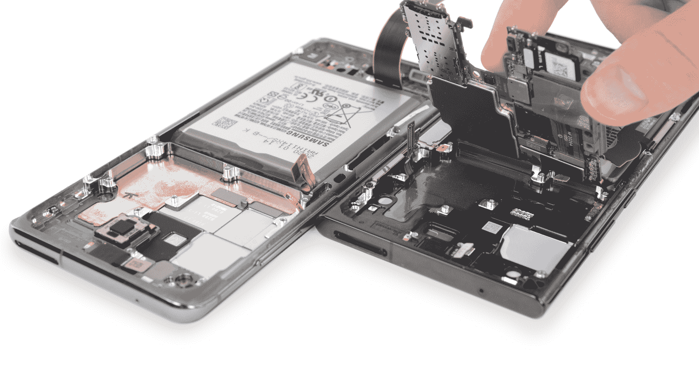

# 一些三星 Galaxy Note 20 Ultra 设备具有不同的冷却系统

> 原文：<https://www.xda-developers.com/samsung-galaxy-note-20-units-different-cooling-systems-ifixit/>

本月早些时候，当三星 Galaxy Note 20 Ultra 的评论在网上发布时，一些媒体报道称，该设备在执行某些密集型任务时会有点发热。Galaxy Note 20 Ultra 的多次拆解显示，三星运输了两种不同的冷却系统:一种由铜蒸汽室组成，另一种由石墨热垫组成。一些用户担心他们是否吃亏，这是可以理解的；毕竟，当你在[花 1300 美元买一部手机](https://www.xda-developers.com/best-galaxy-note-20-deals/)时，你不应该担心在硬件抽奖中落败。不过，现在没有理由担心，因为还没有证据表明一种冷却系统比另一种更好。

概括地说，iFixit 证实了在他们拆卸 Galaxy Note 20 Ultra 的过程中存在多层石墨导热垫，而不是三星通常在旧设备中使用(和销售)的铜蒸汽室冷却系统。正如 iFixit 指出的那样，一些 Galaxy Note 20 Ultra 型号仍然*采用铜蒸汽室系统，没有迹象表明不同的冷却系统与该设备的销售地区有关。例如，来自 JerryRigEverything 的[扎克有一个带石墨导热垫的国际(Exynos)单元，很像 iFixit 的美国(骁龙)单元。](https://www.youtube.com/watch?v=7eQG8mRlYHM&t=1s)*

 <picture></picture> 

Copper vapor chamber cooling (left) versus graphene cooling pads (right). Credits: [iFixit](https://www.ifixit.com/News/43501/why-samsung-built-competing-cooling-systems-inside-the-note-20-and-why-its-probably-fine)

iFixit 认为，你不应该担心你的 Galaxy Note 20 Ultra 是否有铜蒸汽室或石墨烯冷却垫。首先，仅仅因为你的手机感觉热并不意味着它实际上过热了。如果你的手机感觉温暖，那么这意味着热量正在有效地从 CPU 和 GPU 中散发出去。冷却系统旨在保护内部组件不被加热到危险水平，这反过来意味着组件将持续更长时间，也能够更长时间地保持最佳性能。

应该指出的是，现在，没有一个关于手机过热的投诉是通过拆卸来确认哪个冷却系统在使用。没有其他已知的方法来确认使用哪种冷却系统；这些信息不会显示在包装上、手机外壳上、软件中等等。因此，你不能将任何感觉到的过热问题归咎于铜蒸汽室或石墨烯冷却垫系统。

**[三星 Galaxy Note 20 论坛](https://forum.xda-developers.com/galaxy-note-20)**| |**|[三星 Galaxy Note 20 Ultra 论坛](https://forum.xda-developers.com/galaxy-note-20-ultra)**

iFixit 的结论是，三星足够信任这两种冷却系统，可以互换使用。蒸汽冷却系统是三星几年前大力宣传的东西，但也许三星看到石墨烯冷却垫在散热方面同样有效，所以他们对使用这两个系统感到满意。虽然三星还没有发表自己的声明，但 iFixit 的热系统工程师格雷格·克雷默(Greg Kramer)表示，“[蒸汽室]和石墨之间的性能几乎没有区别。只要考虑到间隙公差，就可以很容易地将它们互换。”

双重采购实际上是行业中的常见做法，尤其是在处理大量产品时。公司需要确保他们有安全的组件供应来满足对其设备的需求，因此他们有时从多个供应商处采购组件来满足数量。这通常不是问题，因为公司希望确保两种组件提供相同的性能。如果你想一想，一家公司没有理由想要故意欺骗他们的一部分买家——当消费者发现性能上的巨大差距时，会引发愤怒，正如我们已经看到的用户对三星在某些地区运送其(可以说是劣质的)Exynos 芯片组的反应。

尽管[三星营销的 Galaxy S10+的](https://news.samsung.com/global/how-the-galaxy-s10-plus-supercharged-specs-take-gaming-to-the-next-level)蒸汽室冷却被证明是有效的，但 iFixit 指出，这种解决方案有一些缺点，例如在安装过程中很脆弱，如果加热稍微超过极限，就容易膨胀。值得注意的是，Galaxy Note 20 Ultra 甚至不是第一款采用替代石墨冷却系统的三星手机，因为 iFixit 指出，该系统实际上可以在第一代 [Galaxy Z Flip](https://forum.xda-developers.com/galaxy-z-flip) 中找到。因此，如果你担心三星发给你的 Galaxy Note 20 Ultra 会采用什么冷却系统，那就不必担心。如果有证据表明一个解决方案事实上优于另一个，我们当然会用那个信息更新这篇文章。