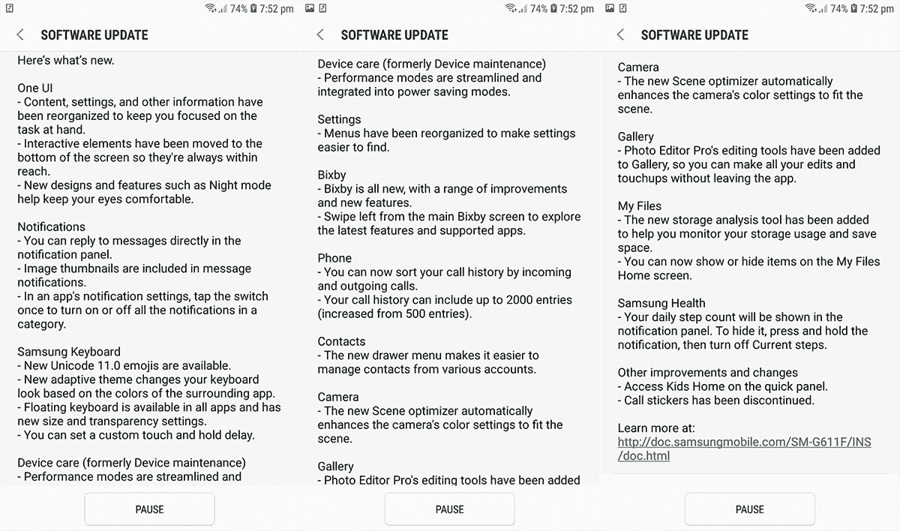

# 三星为 Galaxy On7 Prime 推出了只有一个用户界面的安卓系统

> 原文：<https://www.xda-developers.com/samsung-galaxy-on7-prime-android-pie-one-ui/>

# 三星为 Galaxy On7 Prime 推出了只有一个用户界面的安卓系统

三星已经开始为其平价智能手机三星 Galaxy On7 Prime 推出基于 Android Pie 的 One UI 更新。

自从三星宣布基于 Android Pie 的用户界面以来，其更新的及时性一直让我们感到惊讶。除了瞄准其旗舰产品，三星还对中端产品如[Galaxy A6+](https://www.xda-developers.com/samsung-galaxy-a6-one-ui-android-pie-update/)和入门级设备如[Galaxy J4+或 Galaxy J6](https://www.xda-developers.com/samsung-galaxy-j4-j4-j6-android-pie-one-ui/)表现出了类似的热情。现在，三星的另一款平价智能手机 Galaxy On7 Prime 在印度尝到了 Android Pie 更新的甜头。

Galaxy On7 Prime 于去年在印度推出，价格为₹12,990(当时约 200 美元)，规格比 Galaxy J7 Prime 略有升级。虽然 Galaxy On7 Prime 不再在线销售，但很高兴看到 Android Pie 更新在手机上发布，考虑到它甚至不在更新的[设备中。](https://www.xda-developers.com/samsung-galaxy-s8-note-8-android-pie-one-ui-update-roadmap/)

 <picture></picture> 

Courtesy of SamMobile

至于 One UI 更新，它的大小稍微超过 1GB，我们建议使用 Wi-Fi 连接，特别是如果你的日常数据使用量有上限的话。此次更新主要带来了一个全新的界面，超越了之前的三星体验用户界面。通过一个用户界面，三星将互动功能移到了屏幕底部，这样用户就可以在大显示屏的情况下单手继续使用手机。除此之外，此次更新还带来了全系统的夜间模式(即三星对黑暗模式的称呼)，并对 Galaxy On7 Prime 的设置进行了重组。

此次更新包括快速回复、浮动三星键盘、相机中的“场景优化器”、Bixby 的改进等新功能。此外，在快速设置中有儿童之家的快速访问快捷方式，在通知阴影中有一个步骤计数器。

要安装更新，请在 Samsung Galaxy On7 Prime 上前往“设置”>“软件更新”。如果 OTA 还不可用，这将在几天内完成。

* * *

[**来源:SamMobile**](https://www.sammobile.com/2019/05/08/galaxy-on7-prime-android-pie-update-rolling-out-in-india/)