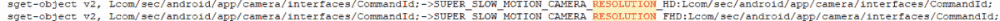
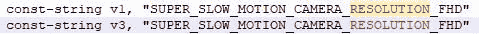

# 三星 Galaxy S10 的新相机功能在 APK 拆解中曝光

> 原文：<https://www.xda-developers.com/samsung-galaxy-s10-may-have-hdr10-video-recording-1080p-super-slow-motion-best-shot-and-more/>

像许多其他智能手机制造商一样，三星倾向于在正式发布最新软件功能之前透露这些功能。例如，在基于 Android 8.0 奥利奥的三星 Experience 9 发布会上，三星 Galaxy Note 8 的摄像头 APK 对三星 Galaxy S9 的新[智能扫描功能](https://www.xda-developers.com/samsung-galaxy-s9-intelligent-scan-face-unlock-iris-scanner/)颇有微词。三星 Galaxy Tab S4 泄露的固件有证据指向三星 Galaxy Note 9 中的[蓝牙 LE S Pen](https://www.xda-developers.com/samsung-galaxy-note-9-s-pen-features-samsung-galaxy-tab-s4-firmware/) 。甚至三星 Galaxy Note 9 基于 Android Pie 的 One UI 软件也有证据指向即将到来的三星 Galaxy S10 系列的新[明亮夜晚](https://www.xda-developers.com/samsung-galaxy-s10-bright-night-camera-low-light/)相机模式。现在，我们发现了三星可能为即将到来的 Galaxy S10 智能手机推出的新相机功能的证据。这些功能包括全高清超慢动作、最佳拍摄、HDR10+视频录制、缺陷检测改进、超稳定视频录制以及支持超广角的场景优化器。

## 1080p 超慢动作

首先，我们已经发现代码显示，支持录制 FHD (1080p)分辨率的超级慢动作视频。三星的 Super Slow-mo 功能首次出现在三星 Galaxy S9 上，它允许你在自动模式下以 720p 拍摄 0.2 秒的 960fps 视频，或在手动模式下以 720p 拍摄 0.4 秒的 480fps 视频。三星 Galaxy Note 9 也有这项功能，可以在 720p 分辨率下拍摄 0.4 秒的 960fps 视频。该功能被移植到了[三星 Galaxy S8](https://www.xda-developers.com/samsung-galaxy-s8-super-slow-motion-ar-emoji/) 和[三星 Galaxy Note 8](https://www.xda-developers.com/samsung-galaxy-note-8-super-slow-motion-ar-emojis/) 上，但这两款设备都不支持 960fps。随着 FHD 分辨率的提高，超级慢动作功能将产生更详细的慢动作视频。三星还将优化 Super Slow-mo，使其能够在弱光条件下拍摄视频。

##    0.8 秒超级慢动作

随着三星 Galaxy S10 的推出，三星将扩展对超级慢镜头的支持，在标准质量下捕捉 0.8 秒，在高质量下捕捉 0.4 秒。三星的一个警告是超慢速电影的帧率。很有可能三星让 Galaxy S10 做 0.4 秒的 960fps 和 0.8 秒的 480fps，然后通过软件增强到 960fps。

## 最佳拍摄

下一个相机功能被称为最佳拍摄，听起来它会帮助你拍摄完美对准的照片。Galaxy S10 会在检测到一个镜头已经排队时按下快门，而不是排队拍摄一个精彩的镜头并扭动拇指按下快门。

## 实时对焦的散景效果

自三星 Galaxy Note 8 发布以来，三星一直拥有实时聚焦功能。这是三星版的非常流行的人像模式。自从它在 iPhone 7 Plus 上流行以来，许多原始设备制造商一直在努力使它变得更好。然后随着 iPhone 8 Plus，苹果引入了舞台灯光。这使得用户可以通过将背景变成黑白或者改变光线在用户脸上的显示方式来改变背景的模糊程度。三星将在 Galaxy S10 中引入类似的效果。这些将是模糊，色点，单色，幻灯片光，旋转，复古，变焦。模糊将是正常的散景模糊，色点将模糊的背景变成黑色和白色，单声道将使整个画面变成黑色和白色，侧光将在你的脸一侧添加灯光效果，旋转将围绕背景旋转灯光。vintage 和 zoom 会怎么做，不得而知。

## 文件扫描

在 Galaxy Note 9 中，三星为 Bixby Vision 添加了对第三方插件的支持。有了这个插件支持，Adobe 发布了一个文档扫描仪插件。三星似乎正在将这种文档扫描支持直接添加到相机中。该相机将使用人工智能显示一个按钮，以便在不失真的情况下拍摄文档。

## HEIF 格式图片

随着 Galaxy S10 的推出，三星将增加对 HEIF 图像格式的支持。与存储为 JPG 或 PNG 的文件相比，这种图像格式可以高效地存储图像。以前的三星手机都不支持这种图像格式。HEIF 不好的一面是支持。很少有设备能够查看 HEIF 格式的照片，因此分享它们将是一个问题。

## 支持超广角的场景优化器

三星 Galaxy S10 不仅有场景检测功能来确定正确的配置，还会在适当的时候自动建议切换到超广角镜头。下面列出的新缺陷检测模式中也引用了该功能。

## HDR10+视频录制

三星将增加的更令人印象深刻的新相机功能之一是 HDR10+视频录制。因此，三星 Galaxy S10 将有可能在播放之外处理 HDR10+视频录制。我们不知道它会以什么样的分辨率和帧速率录制，也不太可能在手机发布前知道。不幸的是，在 HDR10+中录制的视频可能只能在第一方三星视频应用程序中正常观看，至少如果你试图从智能手机上观看视频。

## 超广角视频记录

我们还发现了引用超广角镜头录制视频的字符串。三星 Galaxy S10 可能能够在录制视频时无缝切换镜头。如果您录制 60fps 的视频并切换到超宽，它似乎会将视频限制在 30fps。这种超广角传感器据传是 16MPs 在约 123 FOV。

## 广角双重拍摄

在使用三星的人像模式功能 Live Focus 拍照时，您还将能够拍摄超广角镜头照片。当前的三星智能手机允许您使用长焦镜头和普通镜头双重拍摄照片，但由于三星 Galaxy S10 可能会有超广角镜头，因此三星很自然地会通过超广角支持来扩展这一功能。

## 缺陷检测升级

三星还将更新他们的缺陷检测功能，提供新的建议。在三星 Galaxy Note 9 和 [Galaxy S9](https://www.xda-developers.com/samsung-galaxy-s9-scene-optimizer-android-pie/) 上，瑕疵检测告诉用户对象何时眨眼或者照片是否模糊。这项功能正在更新，以允许相机应用程序推荐用户可以用来拍摄更好照片的特定模式。这些字符串提到了食物模式、广角自拍、自拍屏幕闪光灯、全景和实时对焦的建议。

## 场景优化升级

随着 Galaxy Note 9 的推出，三星推出了场景优化器。这使得手机能够识别场景，并根据图片中的内容优化图片的颜色。它能识别的场景数量有限，准确地说大约 20 个。随着 Galaxy S10 的推出，三星将增加 10 个场景以及更多场景优化功能。下面是 10 个新场景，但是更新中最有趣的部分是 HDR 和肖像。三星 Galaxy S10 将从过量的背景光中识别出何时需要 HDR，并自动启用它。Galaxy S10 还会识别您何时正在给某人拍照，并启用肖像模式。我们不确定这是否会自动启用实时对焦，或者只是优化人物照片的颜色。

## 超稳定视频

三星可能为 Galaxy S10 添加的另一个新功能是“超级稳定”。这种新模式可能会在三星 Galaxy S10 上提供比现有型号更好的视频稳定性。

* * *

所有这些新功能都让我对即将推出的三星 Galaxy S10 系列智能手机感到兴奋。这些新的相机功能以及“明亮的夜晚”等功能将使 Galaxy S10 成为一款出色的移动相机。不过，我们会在一周多一点的时间里找到答案。

[**三星 Galaxy S10 论坛**](https://forum.xda-developers.com/galaxy-s10)