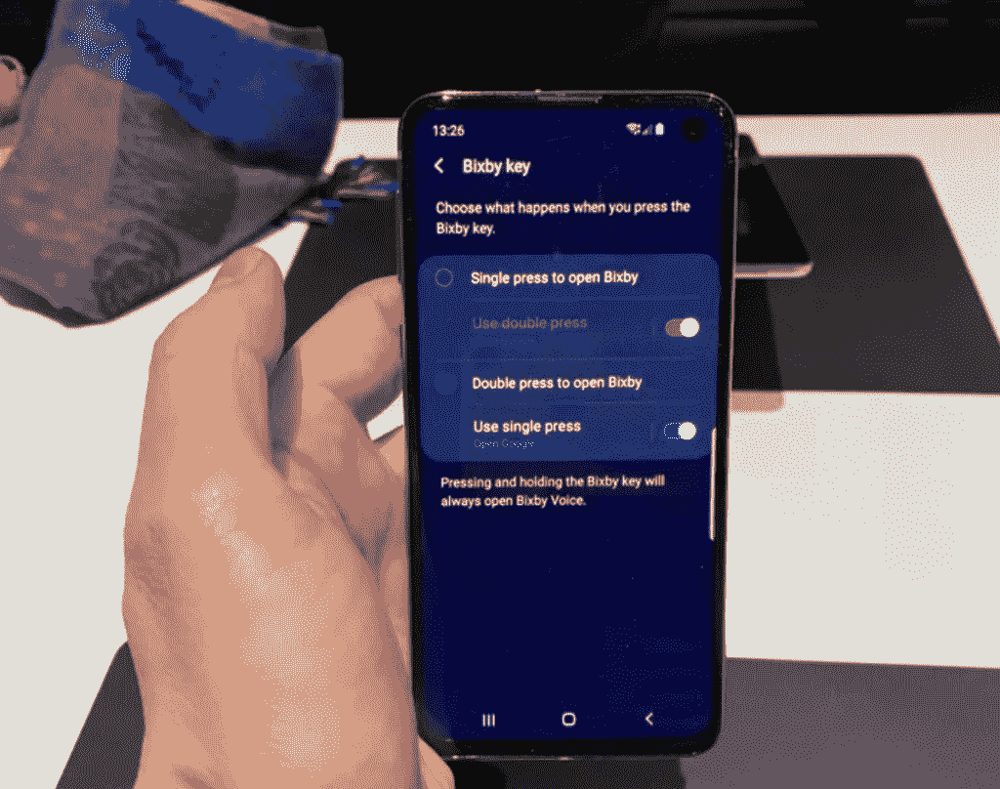

# 以下是三星 Galaxy S10 所有次要的新软件功能

> 原文：<https://www.xda-developers.com/samsung-galaxy-s10-new-software-features/>

随着三星在[发布了多少新硬件](https://www.xda-developers.com/samsung-galaxy-s10-event-february-20/)，人们很容易迷失在所有的公告中。还有[三星 Galaxy Fold](https://www.xda-developers.com/samsung-galaxy-fold-specifications-pricing-availability/) 、 [Galaxy Buds、Galaxy Watch Active、Galaxy Fit](https://www.xda-developers.com/samsung-galaxy-watch-active-galaxy-buds-galaxy-fit-official/) 、 [Galaxy S10、Galaxy S10e、Galaxy S10+](https://www.xda-developers.com/samsung-galaxy-s10-s10-and-s10e-launch-with-the-snapdragon-855-ultrasonic-in-display-fingerprint-scanners-reverse-wireless-charging-and-a-whole-lot-more/) 和 [5G Galaxy S10+](https://www.xda-developers.com/samsung-galaxy-s10-5g-verizon-europe/) 。我们尽力整合了关于这些新设备的所有新闻，但总会有一些新功能在主题演讲中没有占据中心位置。尤其是在三星 Galaxy S10 上，一个 UI 的新变化，即三星的 Android 9 Pie 的修改版本。One UI 是几个月前在三星开发者大会上宣布的，并已推广到 Galaxy S8、Galaxy Note 8、Galaxy S9 和 Galaxy Note 9，因此在三星粉丝的心目中并不新鲜。我参加了在纽约举行的三星 837 公开活动，在那里我花了一些时间了解 Galaxy S10 系列。在我使用这款设备的短暂时间里，我注意到一个 UI 有一些值得一提的变化。

## 数字福利

在使用三星 Galaxy S10 时，我在浏览设备设置时注意到的第一件事是包含了数字福利。Digital Wellbeing 可帮助您跟踪您的应用程序和屏幕使用情况，并帮助您管理您使用设备的时间。随着 Android Pie 的发布,[在谷歌 Pixel 智能手机上首次亮相](https://www.xda-developers.com/digital-wellbeing-google-pixel-xl-google-pixel-2-xl/),但[也在运行 Android Pie 的 Android One 设备上实现了](https://www.xda-developers.com/android-one-digital-wellbeing/)。三星现在已经在一个用户界面中实现了这一功能，这对我们来说是一个惊喜，因为它没有出现在 Galaxy Note 9 或其他三星设备上。

**更新:**我们最初报道三星包含了谷歌的数字福利，然而，事实证明并非如此。在检查 APK 后，它似乎是由三星制造的。三星的版本看起来和感觉上与谷歌的相似，所以我们认为他们是同一个 APK。

## 双击唤醒

我在使用三星 Galaxy S10 时注意到的下一个新软件功能是双击唤醒。目前三星 Galaxy Note 9 的一个用户界面有唤醒选项，但现在双击唤醒提供了另一种快速打开设备的方法。这是一个在 Android 社区非常受欢迎的设置，三星终于添加了它。

## AR 表情符号

下一个变化是大大改进的 AR 表情符号，至少与 Galaxy S9 和 Galaxy Note 9 上的 AR 表情符号相比是这样的。三星 Galaxy S10 上的 AR 表情比以前的版本更加生动，坦率地说，没有那么令人毛骨悚然。这些也有使用谷歌 ARCore 的全身跟踪，但我无法测试这一点，因为演示单元上缺乏 ARCore。根据我的经验，升级后的人脸跟踪并不比以前更好。

三星还克隆了 iPhone XS 的一个新功能，允许 AR 表情头像层叠在你的脸上，成为一张虚拟的脸。还有一个新的 mini-me 模式，它会在你的肩膀上放一个 AR 表情符号。

## 不再用力按 Home 键

在使用演示设备和与其他拥有 Galaxy S10 的人交谈时，三星似乎取消了流行的硬按 home 键功能。该功能在屏幕底部放置了一个压敏 home 按钮，即使导航栏被隐藏，您也可以访问 home 按钮。它首次出现在三星 Galaxy S8 上，是过去几年三星设备中最小但也很有用的功能之一。该功能的取消很可能是由于超声波显示屏下指纹扫描仪，但这并不能解释三星 Galaxy S10e 上缺乏该功能。

## Bixby 按钮重映射

 <picture></picture> 

Image courtesy of The Verge

感谢三星真正听取了消费者的意见，Bixby 按钮终于不需要第三方应用程序就可以重新映射。它可以被重新映射为一系列不同的功能，如打开应用程序或相机。虽然我没有机会检查具体的功能， *[The Verge](https://www.theverge.com/2019/2/20/18233819/samsung-galaxy-s10-bixby-button-remap-reassign)* 报道说你实际上可以用它来打开谷歌助手。三星已经将其从 Bixby 按钮变成了一个实用按钮。

## 摄像头响铃通知 LED

三星将挡板做得如此之薄如此之小，他们不得不移除一些硬件功能，不幸的是包括通知 LED。据已经拥有三星 Galaxy S10+的 SamCentral Discord 服务器的一名成员称，通知 LED 被摄像头切口周围的一圈灯取代。这个光环会根据通知改变颜色和亮度。在使用摄像头时，前置摄像头周围还会显示一个白色圆环。这是一个整洁的隐私功能，让我想起了 [Android Q](https://www.xda-developers.com/android-q-privacy-permission-controls/) 。

## 打开相机 SDK

三星已经与 Instagram、Snapchat 和其他社交媒体公司合作，以提高其应用程序的图片质量。众所周知，Android 设备在社交媒体应用程序中产生的图片质量很差，因为这些应用程序没有利用 Camera2 API，而是对取景器进行截图。三星紧随谷歌之后，与应用开发者合作，使他们的相机 SDK 开源。这意味着 Instagram、Snapchat、Snow、Lime 都将使用这个新的 SDK。

## Instagram 整合

 <picture></picture> 

Image via *The Verge*

Instagram 与三星 Galaxy S10s 有特殊的集成。相机应用程序将获得 Instagram 的特定相机模式。这种模式可以让你在三星的相机应用程序中拍照，然后直接发送到 Instagram stories。切换到相机模式，拍张照片就行了。

## 明亮的夜晚，星爆，和文件扫描

正如我们在 Galaxy S10 发布前报道的那样，三星正在为这些设备引入一种用于弱光摄影的[亮夜](https://www.xda-developers.com/samsung-galaxy-s10-bright-night-camera-low-light/)相机模式。明亮的夜晚是[更新场景优化模式](https://www.xda-developers.com/samsung-galaxy-s10-may-have-hdr10-video-recording-1080p-super-slow-motion-best-shot-and-more/)的一部分。《明亮的夜晚》似乎与谷歌的[夜视](https://www.xda-developers.com/google-pixel-night-sight-google-camera-review/)功能相似，尽管我们还没有机会比较这两者。

文档扫描将自动添加一个按钮来扫描共享的文档。starbust 是一种新模式，它将“在后置摄像头拍摄的黑暗场景中，自动为光源添加 starbust 耀斑。”如果您不想使用这些设置，可以禁用它们。

## 显示颜色配置文件

生动自然的屏幕模式是其颜色模式的新版本。三星手机过去有自适应显示、AMOLED 影院、AMOLED 照片和基本模式。这些新模式适用于 Galaxy S10 的新动态 AMOLED 显示屏。

* * *

所有这些新的用户界面功能都很好看。我们不知道三星是否会将这些功能带到运行 One UI 的旧设备上。鉴于三星过去的记录，该公司最有可能在 Galaxy S9 和 Galaxy Note 9 上发布这些功能，并在未来进行更新。在接下来的几天里，我们应该会从三星那里听到更多关于这些令人惊叹的新功能的消息。

[**三星 Galaxy S10 论坛**](https://forum.xda-developers.com/galaxy-s10)

我们还将寻找三星 Galaxy S10 上可能遗漏的其他新功能。与此同时，在等待 Galaxy S10 发货的同时，请务必查看我们的设备动手操作(T1)或获取 T2 的新壁纸(T3)来装饰你的设备。