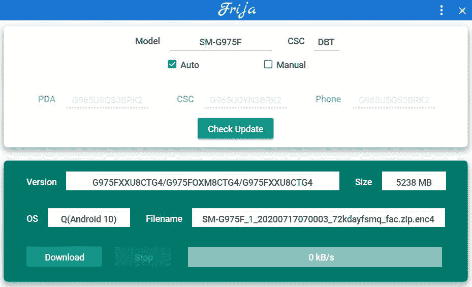

# 三星 Galaxy S10 系列获得 2020 年 8 月安全补丁

> 原文：<https://www.xda-developers.com/samsung-galaxy-s10-plus-s10e-august-2020-security-patches-update/>

# 三星 Galaxy S10 系列获得 2020 年 8 月安全补丁的新更新

三星正在为 Galaxy S10 系列的 Exynos 驱动的全球版本推出 2020 年 8 月的安全补丁和新的软件更新。

除了谷歌的通用 [Android 安全公告](https://source.android.com/security/bulletin) (ASB)，几个主要的原始设备制造商如三星都有他们自己版本的安全公告。如果你看一下三星移动安全门户的 [Android 部分，你就可以清楚地了解到所有已披露的影响闭源供应商组件的安全漏洞，Android 中的底层 Linux 内核，以及三星迄今为止已修复的各种 OS 框架。在撰写本文时，最新的每月安全补丁级别(SPL)仍在三星的公告上列出为 2020 年 7 月，但 OEM 已经开始在一些地区为 Galaxy S10 系列推出 2020 年 8 月的安全补丁。](https://security.samsungmobile.com/securityUpdate.smsb)

**XDA 论坛:[银河 S10e](https://forum.xda-developers.com/galaxy-s10e) ||| [银河 S10](https://forum.xda-developers.com/galaxy-s10) ||| [银河 S10 加](https://forum.xda-developers.com/s10-plus)**

全新打造的版本号为*g 97 xfx u8 ctg 4*，目前提供 Galaxy S10(型号 **SM-G973F** )和 Galaxy S10+(型号 **SM-G975F** )的国际版版本，两者均搭载内部 [Exynos 9820](https://www.xda-developers.com/samsung-exynos-9820-samsung-galaxy-s10/) SoC。有趣的是，我们到目前为止还找不到 Galaxy S10e(型号 **SM-G970F** )的类似版本，但应该很快就会推出。OTA 更新在 DBT 地区可用，这是三星在德国的代码。更新的完整更新日志还不可用，但我们知道三星在这个版本中发布了一个新的引导加载程序(v8)。因此，最终用户一旦安装了此更新，就无法降级到旧版本。

三星以批量推送更新著称。即使你在德国，你可能也要等几天才能在你的设备上弹出 OTA 通知。如果你习惯手动刷新，那么你可以使用一个名为 [Frija](https://forum.xda-developers.com/s10-plus/how-to/tool-frija-samsung-firmware-downloader-t3910594) 的社区开发工具从三星的存储库中下载更新的固件。所需的参数可以在下面的屏幕截图中找到:

 <picture></picture> 

Thanks to XDA Senior Member [henklbr](https://forum.xda-developers.com/member.php?u=1586120) for the screenshot

Frija 创建的解密固件包可以在任何地区的 Exynos Galaxy S10 型号上使用 Odin 进行[闪存，而不仅仅是德国型号。请注意，美国和加拿大的骁龙 855 动力版本的 Galaxy S10 与上述更新不兼容。](https://www.xda-developers.com/download-stock-odin-firmware-samfirm/)