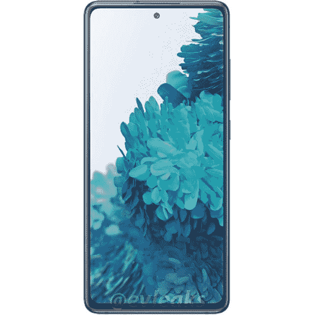

# 【更新 2:更多颜色】这是我们第一次看到三星 Galaxy S20 FE(粉丝版)

> 原文：<https://www.xda-developers.com/samsung-galaxy-s20-fan-edition-render-leak/>

**更新 2 (08/18/2020 @ 04:04 AM ET):** 三星 Galaxy S20 FE 的更多渲染图已经泄露，展示了该手机的六种不同颜色。

**更新 1(****08/17/2020****@****02:04AM****ET):**三星 Galaxy S20 FE 更多渲染图泄露。滚动到底部了解更多信息。下面保留了 2020 年 8 月 3 日发表的文章。

今年早些时候，在新冠肺炎关闭一切之前，三星 Galaxy S20、S20+和 S20 Ultra 发布，三星将在两天后推出新的 [Galaxy Note 20 和 Galaxy Note 20 Ultra](https://www.xda-developers.com/tag/samsung-galaxy-note20/) 。在 2 月份发布 Galaxy S20 的几周前，三星推出了 [Galaxy S10 Lite](https://www.xda-developers.com/samsung-galaxy-s10-lite-review/) 和 [Galaxy Note10 Lite](https://www.xda-developers.com/samsung-galaxy-note-10-lite-review/) ，这两款设备在三星典型的发布周期中显得很奇怪。S10 Lite 和 Note 10 Lite 都是其旗舰产品的更实惠版本，看起来三星可能会在 Galaxy S20 上重复这一策略。感谢著名泄密者埃文·布拉斯，我们现在第一次看到了 Galaxy S20 的“粉丝版”。

 <picture></picture> 

Credits: [Evan Blass](https://www.patreon.com/posts/samsung-galaxy-40035727).

三星此前曾将粉丝版(或 FE)的绰号用于 [Galaxy Note FE](https://forum.xda-developers.com/note-fe) ，这是灾难性的 Galaxy Note7 的重新发布，但使用了固定电池。然而，这一次，Galaxy S20 并不是因为爆炸灾难而被召回两次，所以你可能会猜到，这是一个不同的情况。Evan Blass 的 Patreon 上发布的渲染图显示，Galaxy S20 粉丝版看起来与三星的香草 Galaxy S20 非常相似，有相同的壁纸和前置摄像头的居中打孔切口。但这次的显示屏完全是平的，而且边框明显比旗舰产品 Galaxy S20 上的大。

由于来自 *SamMobile* 的报道，我们之前在六月份听说了 Galaxy S20 粉丝版的。该出版物报道称，三星正在开发型号为 SM-G780(针对全球市场)和 SM-G781(针对美国市场)的 Galaxy S20 变体。全球型号显然将提供 5G 和 5G，而美国型号将只提供 5G 型号。 *SamMobile* 没有透露该设备的详细规格，但相信它应该提供至少 128GB 的内部存储空间，并搭载 Android 10 和一个 UI 2.5。著名的三星泄密者 [Ice Universe](https://twitter.com/UniverseIce/status/1283655566317850624) 认为，该设备将像 Galaxy S20 系列的其他产品一样，拥有 120Hz 的刷新率显示屏，相同的高通骁龙 865 处理器，IP68 防尘防水认证，以及直径 3.3 毫米的小打孔切口。韩国出版物 [*The Elec*](http://www.thelec.kr/news/articleView.html?idxno=6777) 报道称，Galaxy S20 粉丝版将拥有三摄像头配置，包括 12MP 广角( [Ice Universe](https://twitter.com/UniverseIce/status/1287374156552519681?s=20) 报道称是索尼 IMX555)、12MP 超广角和 8MP 长焦摄像头，具有 3 倍光学变焦；他们还报道称，该设备将有一个 32MP 自拍摄像头，屏幕尺寸在 6.5-6.7 英寸之间，价格约为 90 万韩元(约 753 美元)，将于 10 月上市。最后， *[GalaxyClub](https://www.galaxyclub.nl/nieuws/samsung-galaxy-s20-fe-krijgt-zelfde-accucapaciteit-als-de-galaxy-s20-komt-naar-europa-in-vrolijke-kleuren/)* 报道称，这款手机的电池容量将为 4,500mAh，在欧洲的颜色变体将为绿色、橙色、红色和白色。

* * *

## 更新:三星 Galaxy S20 FE 泄露的更多渲染图

三星 Galaxy S20 FE 的更多渲染图已经泄露，[这次来自@OnLeaks](https://pricebaba.com/blog/samsung-galaxy-s20-fan-edition-renders-360-video-exclusive) 。

该报告称，Galaxy S20 FE 将与标准 Galaxy S20 非常相似。它将有一个平面显示器，侧面有非常轻微的弯曲。该设备的框架将是金属的，但背板可能是塑料的。这款手机还将跳过 3.5 毫米耳机插孔。

* * *

## 更新 2:更多颜色的三星 Galaxy S20 FE

Evan‘evleaks’Blass 分享了新的 Galaxy S20 FE 渲染图，展示了六种颜色的手机。

这应该给用户提供了广泛的颜色选择，包括一些经典的黑色和白色。