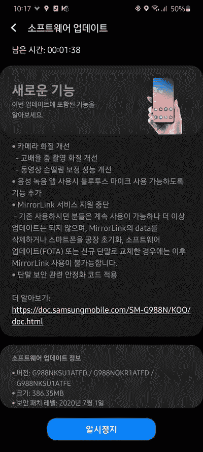
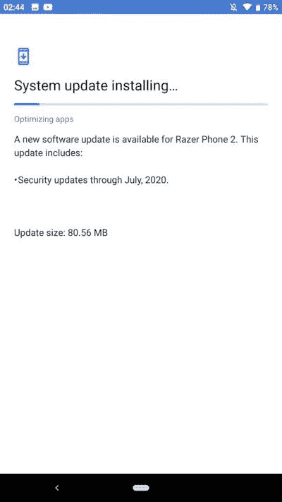

# 三星 Galaxy S20 和 Razer Phone 2 收到 2020 年 7 月安全补丁的更新

> 原文：<https://www.xda-developers.com/samsung-galaxy-s20-razer-phone-2-receive-updates-july-2020-security-patches/>

# 三星 Galaxy S20 和 Razer Phone 2 收到 2020 年 7 月安全补丁的更新

三星和雷蛇已经开始分别为 Galaxy S20 和 Razer Phone 2 推出 2020 年 7 月的安全补丁。继续阅读，了解更多信息！

三星的旗舰产品 Galaxy S20 系列再次打破了自己的记录，即在谷歌 Pixel 阵容之前获得每月安全更新。就像上个月的事件一样，该公司现在已经能够将 2020 年 7 月的安全补丁集交付给常规的 Galaxy S20 以及“Plus”和“Ultra”变种。令人有点意外的是，Razer Phone 2 还获得了一个意想不到的 OTA，它同样将该手机的 Android 安全补丁级别(SPL)提高到 2020 年 7 月。

## 三星 Galaxy S20

在编写报告时，Galaxy S20 的韩国 5G 版本(型号 **SM-G98xN** )是唯一获得新更新的版本。与全球型号不同，这些型号由高通骁龙 865 SoC 驱动，这意味着交叉闪存固件是不可能的。标记为 *G98xNKSU1ATFD* 的更新固件带来了放大拍摄的相机增强功能，并提高了视频稳定性。这次更新也反对 MirrorLink 服务，正如几个月前三星提到的[。](https://www.xda-developers.com/samsung-drops-support-mirrorlink-car-mode-find-my-car/)

 <picture></picture> 

Credits to Twitter user [@Kuma_Sleepy](https://twitter.com/Kuma_Sleepy/status/1276159043816562690) for the screenshot!

**[银河 S20/S20+/S20 超论坛](https://forum.xda-developers.com/galaxy-s20)**

**在亚马逊购买—三星 Galaxy:[S20](https://www.amazon.in/Samsung-Galaxy-Storage-Additional-Exchange/dp/B08445DF23/?tag=xdaportalin-21)| |[S20+](https://www.amazon.in/Samsung-Galaxy-Storage-Additional-Exchange/dp/B084451YSS/?tag=xdaportalin-21)| | |[S20 超](https://www.amazon.in/Samsung-Galaxy-Storage-Additional-Exchange/dp/B08444S68Q/?tag=xdaportalin-21)**

## 雷蛇手机 2

在 Razer 智能手机业务未来的所有不确定性中，Razer Phone 2 的新更新确实是一股新鲜空气。[新版本](https://forum.xda-developers.com/razer-phone-2/how-to/july-5-2020-security-update-build-p-t4123045)的版本号是*P-sm R4-RC 001-RZR-2006 16.3181*，也就是说，它是基于 Android Pie 的设备全球变种的 MR4 更新。MR3 版本[在近三个月前](https://forum.xda-developers.com/razer-phone-2/how-to/mr3-global-march-2020-security-update-t4070675)发布，因此从 2020 年 3 月到 2020 年 7 月的补丁级别的跳跃是相当显著的。

 <picture></picture> 

Thanks Rox for the tip!

**[【Razer phone 2 xd a 论坛】](https://forum.xda-developers.com/razer-phone-2)**

Razer 还没有在他们的官方下载门户上发布更新后的工厂图像，所以你必须等待 OTA 发布你的设备。另一方面，Galaxy S20 用户可以使用像 [Frija](https://forum.xda-developers.com/s10-plus/how-to/tool-frija-samsung-firmware-downloader-t3910594) 这样的工具直接从三星更新服务器下载新固件。