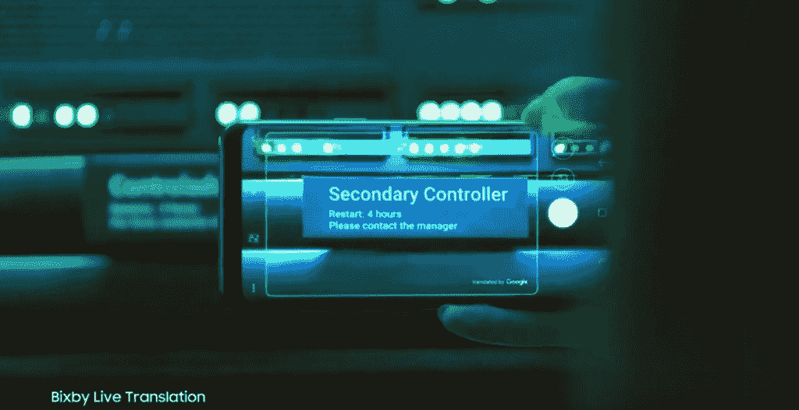
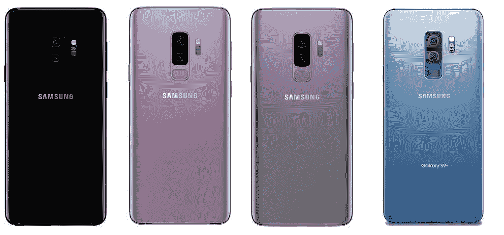

# 三星 Galaxy S9 和 Galaxy S9+是官方的:规格，功能，价格和可用性

> 原文：<https://www.xda-developers.com/samsung-galaxy-s9-and-galaxy-s9-are-official-specifications-features-prices-and-availability/>

经过几个月的期待和多次泄露，三星终于发布了他们的新 Galaxy S9 和 Galaxy S9+。之前的泄露已经公布了设计、硬件规格和大部分新的软件功能，但今天，三星终于在西班牙巴塞罗纳【2018 年世界移动通信大会的[三星 Unpacked](https://www.xda-developers.com/samsung-galaxy-s9-design-augmented-reality/) 活动中确认了一切。我们也知道手机什么时候上市，会有什么型号，会有什么配件，以及最终的价格。

简而言之，这些设备与去年的[三星 Galaxy S8](https://forum.xda-developers.com/galaxy-s8) 和 [Galaxy S8+](https://forum.xda-developers.com/galaxy-s8/samsung-galaxy-s8--s8-cross-device-development) 非常相似，除了一些小的硬件升级和一个大的摄像头升级。有了新的[高通骁龙 845](https://www.xda-developers.com/qualcomm-snapdragon-845-hands-on-benchmarks-first-impressions/) 或 [Exynos 9810](https://www.xda-developers.com/samsung-unveils-exynos-9810-3rd-generation-custom-cpu-cores-mali-g72mp18-gpu/) ，与去年的[高通骁龙 835](https://www.xda-developers.com/snapdragon-835-hands-on-and-qualcomm-visit-part-1-benchmarks-performance-power-savings/) 或 Exynos 8895 相比，你可以期待大约 30%更快的性能。使用新的可变 f/1.5 和 f/2.4 光圈相机，该相机将在良好和恶劣的照明条件下拍摄出出色的照片。随着 [Android 8.0 Oreo](https://www.xda-developers.com/android-8-0-oreo-google-released/) 的推出，这款手机将提供谷歌新软件的最佳功能，如[画中画模式](https://www.xda-developers.com/enable-android-o-picture-in-picture-mode/)，支持[自动填充 API](https://www.xda-developers.com/android-os-autofill-framework-will-finally-resolve-a-long-standing-lag-issue-with-password-managers/) ，[通知通道](https://www.xda-developers.com/notification-importance-controls-all-apps-android-oreo/)和打盹，[更严格的后台应用程序和服务限制](https://www.xda-developers.com/android-oreo-oem-background-app-limitations/)以获得更好的电池寿命和内存使用，等等。此外，[三星 Experience 9.0](https://www.xda-developers.com/samsung-experience-9-0-beta-android-oreo-features/) 带来了大修的键盘应用，新的边缘灯光效果，更多的锁屏定制，以及一些三星 Galaxy S9 和 Galaxy S9+独有的新功能。

让我们深入了解最新三星 Galaxy 旗舰产品的新特性。

## 三星 Galaxy S9 和 Galaxy S9+规格一览

|  | 

银河 S9

 | 

银河 S9+

 |
| **显示尺寸** | 5.8 英寸 QHD+ (2960x1440) sAMOLED 18.5:9 | 6.2 英寸 QHD+ (2960x1440) sAMOLED 18.5:9 |
| **玻璃类型** | 大猩猩玻璃 5 | 大猩猩玻璃 5 |
| **显示调色板** | HDR10 | HDR10 |
| **片上系统** | 高通骁龙 845/埃克斯诺斯 9810 | 高通骁龙 845/埃克斯诺斯 9810 |
| **RAM 容量** | 4GB | 6GB |
| **存储容量** | 64GB/128GB/256GB + Micro SD 卡插槽(最高 400GB) | 64GB/128GB/256GB + Micro SD 卡插槽(最高 400GB) |
| **扬声器系统** | AKG 调谐立体声扬声器 | AKG 调谐立体声扬声器 |
| **耳机插孔** | 是的，3.5 毫米 | 是的，3.5 毫米 |
| **前置摄像头** | 800 万像素前置摄像头，自动对焦 | 800 万像素前置摄像头，自动对焦 |
| **后置摄像头** | 1200 万像素，f/1.5 和 f/2.4 可变光圈 | 12MP 带 f/1.5 和 f/2.4 可变光圈+ 12MP 变焦镜头 f/2.4 |
| **电池容量** | 3000 毫安时电池 | 3500 毫安时电池 |
| **无线充电** | 是 | 是 |
| **快速充电** | 是的，三星自适应快速充电 | 是的，三星自适应快速充电 |
| **生物识别** | 虹膜、面部和指纹识别 | 虹膜、面部和指纹识别 |
| **防水防尘** | IP68 | IP68 |
| **软件** | 安卓 8.0 奥利奥搭配三星体验 9.0 | 安卓 8.0 奥利奥搭配三星体验 9.0 |

由于多次泄露，过去几个月来[规格](https://www.xda-developers.com/galaxy-s9-and-s9-render-and-specs-leak/)已经为人所知，这也是你对 2018 年高端旗舰的预期。这两款机型的显示屏基本上保持不变，均采用 QHD+ sAMOLED 面板，64GB 基本存储可通过微 SDHC 扩展，两款机型之间的 RAM 差异为 4/6GB，电池容量与三星 Galaxy S8 系列相同，采用三星的[自适应快速充电技术](https://www.xda-developers.com/charging-comparison-oneplus-huawei/)和 Qi 无线充电。虹膜扫描仪和面部识别，但有一个新的，聪明的功能，利用两者的优势，我们将在下面得到。后置指纹传感器也回归了，因为三星[不久前取消了内置指纹传感器的计划](https://www.xda-developers.com/samsung-aborts-in-display-fingerprint-sensor-galaxy-s9/)。喜欢它还是讨厌它，Bixby 按钮将留在三星 Galaxy 旗舰机上。最后，IP68 防尘和防水性能也体现在新型号上，正如去年的型号达到了相同的标准。

三星还选择保留[3.5 毫米耳机插孔](https://www.xda-developers.com/samsung-galaxy-s9-3d-renders-headphone-jack/)，苹果、[、谷歌](https://www.xda-developers.com/google-pixel-2-xl-announced-price/)和 [HTC](https://www.xda-developers.com/i-was-wrong-about-the-u11-htcs-latest-flagship-can-be-a-remarkable-phone-squeeze-or-not/) 等许多其他公司都决定取消这一插孔，转而支持通过 USB-C 端口传输音频。三星也用 AKG 调谐立体声扬声器升级了他们的扬声器。底部发射扬声器和耳机扬声器组成了双扬声器设置，它们还支持[杜比全景声](https://www.xda-developers.com/samsung-galaxy-s8-android-oreo-dolby-atmos/)音频增强。总的来说，三星 Galaxy S9 上的扬声器比 Galaxy S8 上当前的单声道扬声器声音更大，听起来更好。

## 三星 Galaxy S9 和 Galaxy S9+相机升级

三星一直将所有的注意力放在摄像头上，他们展示的升级就是证明。Galaxy S9 使用三星新的**可变光圈技术**，这将允许相机智能地在更适合白天拍摄的光圈 f/2.4 和更适合弱光和夜间拍摄的光圈 f/1.5 之间切换。这样做也有助于减少弱光图片中的噪声，这是目前许多智能手机相机的问题。Galaxy S9 的哥哥 Galaxy S9+拥有相同的可变光圈摄像头，但还增加了一个 12MP 变焦镜头。第二个镜头可以用于三星的**实时对焦模式**，这只是普通的人像模式，允许你在拍照后调整背景模糊。

该相机现在还拥有超级慢动作，这是一个 960fps 的慢动作，分辨率为 720p。这对于慢动作视频来说非常好，因为这远远低于 Galaxy S8 目前的速度。

## 三星 Galaxy S9 和 Galaxy S9+软件功能

 <picture></picture> 

Real-time translation with Bixby

随着 Galaxy S9 的发布，三星推出了他们的虚拟助手 Bixby 的新功能。Bixby 现在能够使用前置摄像头为你的脸添加化妆品，并且与 Sephora 合作，将允许你在通过 Bixby 购买化妆品之前，使用增强现实来查看化妆品在你身上的样子。Bixby Vision 现在通过 [Google Translate](https://www.xda-developers.com/xda-external-link/google-translate-brings-translation-to-any-app-with-floating-translation-button/) 支持**实时翻译**，尽管 Google Translate 应用本身已经具备了这一功能。

三星也对苹果的 3D 表情符号**有自己的理解。这些类似于 Animoji，但这些允许你从自拍中为自己制作一个头像，而不是像苹果的 Animoji 那样对着它说话。如果你不喜欢的话，你也可以自定义头像来改变它的特定部分。还有一个[深度感应贴纸功能](https://www.xda-developers.com/samsung-galaxy-s9-adjust-depth-stickers-images-photos/)，可以让你在 Galaxy S9+上使用双摄像头拍摄的照片上添加贴纸或图像，然后调整深度。**

 <picture></picture> 

Intelligent Scan combines the Iris scanner and facial recognition for faster, more accurate, and more secure biometric recognition

虽然 Galaxy S9 可能没有苹果 iPhone 8/X 级别的生物面部识别功能，但由于虹膜扫描仪和现有面部识别软件的新组合，称为[智能扫描](https://www.xda-developers.com/samsung-galaxy-s9-intelligent-scan-face-unlock-iris-scanner/)，Galaxy S9 将比其前代产品具有更准确和更快速的生物面部识别功能，同时还具有更安全的优势。

不过，总的来说，软件体验应该与目前 Galaxy S8 的 Android Oreo 更新中的三星 Experience 9.0 版本非常相似(正在对[三星 Galaxy Note8](https://www.xda-developers.com/install-any-ota-on-samsung-galaxy-s8-plus-or-galaxy-note-8/) 和[三星 Galaxy S7 Edge](https://www.xda-developers.com/samsung-galaxy-s7-edge-android-oreo-samsung-experience-9/) 进行测试)。可能会有其他小的变化，但我们不会知道他们，直到我们能得到我们的设备。

## 三星 Galaxy S9 配件

随着三星 Galaxy S8 和 Galaxy S8+的推出，该公司还推出了 [Samsung DeX](https://www.xda-developers.com/samsung-announces-linux-on-galaxy-for-dex/) :其平台[将智能手机转变为移动个人电脑](https://www.xda-developers.com/samsung-dex-is-androids-continuum-revolution-but-aimed-at-the-wrong-audience/)。随着新的 Galaxy 旗舰产品的推出，三星推出了新的 **[三星 DeX Pad](https://www.xda-developers.com/samsung-dex-pad-galaxy-leak/)** 。这类似于与 Galaxy S8 一起发布的三星 DeX Station，但这款设备允许你将设备用作 DeX 的触控板和键盘，所以你只需要一个显示器。

接下来，三星还推出了一款[快速无线充电器](https://www.xda-developers.com/samsung-galaxy-s9-s9-fast-wireless-charger-leaks/)(型号 EP-N5100)，与 Galaxy S8 提供的略有不同。总体而言，它略薄更平，但基本外形保持不变。它的无线充电技术采用 Qi 标准。在内部，只有两个充电线圈插入设备中，它们相互堆叠，因此手机可以在不同的位置充电。就像以前的充电器一样，在充电过程中，两个线圈中只有一个可以使用。支持 9V/2A、9V/1.67A、12V/2.1A 充电。然而，根据 FCC 文件，即使在 9V 操作下，功率也低于 15W，这意味着它不会比它的前身充电更快。预计充满电需要 2 个小时。

还有大量官方案例可供选择。有一个 LED 视图，ClearView，硅胶，保护站盖，和 Alcantara 外壳(所有这些也适用于 Galaxy S8 系列)。然而，新的是超针织案件似乎是一种纺织面料。当然，所有这些箱子都有多种颜色。

## 三星 Galaxy S9 和 Galaxy S9+定价、颜色和供货情况

 <picture></picture> 

Samsung Galaxy S9 in Midnight Black, Lilac Purple, Titanium Gray, and Coral Blue

Galaxy S9 和 Galaxy S9+都推出了两种新颜色:**淡紫色**和**钛灰色**。除了 Galaxy S8 的两种颜色之外，**午夜黑**和**珊瑚蓝**，总共有 4 种颜色可供选择。珊瑚蓝色似乎比三星 Galaxy Note 7、Galaxy S7 和 Galaxy S8 上使用的淡蓝色要暗一些。

在美国，预购将于 2018 年 3 月 2 日开始。美国电话电报公司、Sprint、T-Mobile、U.S. Cellular、威瑞森无线和 Xfinity Mobile 将从 3 月 16 日开始在商店销售这种设备，百思买零售和在线、亚马逊、好市多、山姆会员店、塔吉特和沃尔玛也将销售这种设备。Cricket Wireless 和 MetroPCS 将只提供午夜黑，而其他公司将提供丁香紫色、午夜黑和珊瑚蓝。

该设备也可以直接从三星购买，24 个月内每月 30 美元，价格为 719.99 美元(Galaxy S9)，或 24 个月内每月 35 美元，价格为 839.99 美元(Galaxy S9+)。以旧换新将于 3 月 2 日开始，预购者可以用[合格的以旧换新](https://shop-links.co/link/?exclusive=1&publisher_slug=xda&article_name=Samsung+Galaxy+S9+and+Galaxy+S9%2B+are+Official%3A+Specifications%2C+Features%2C+Prices%2C+and+Availability&article_url=https%3A%2F%2Fwww.xda-developers.com%2Fsamsung-galaxy-s9-and-galaxy-s9-are-official-specifications-features-prices-and-availability%2F&u1=UUxdaUeUpU20304&url=https%3A%2F%2Fwww.samsung.com%2Fus%2Ftrade-in%2F)节省高达 350 美元。

以下是运营商的定价:

| **载具** | **银河 S9** | **银河 S9+** |
| 美国电话电报公司(American Telephone and Telegraph Company) | 30 个月每月 790.20 美元或 26.34 美元(790.20 美元) | 915 美元或 30 个月每月 30.50 美元(915 美元) |
| 威瑞森 | 24 个月每月 800 美元或 33.33 美元(800 美元) | 24 个月每月 930 美元或 38.74 美元(930 美元) |
| T-Mobile | 24 个月每月 720 美元或 30 美元(720 美元) | 840 美元或每月 30 美元，共 24 个月，首付 120 美元(840 美元) |
| 冲刺 | 24 个月每月 792 美元或 33 美元(792 美元) | 912 美元或 24 个月每月 38 美元(912 美元) |
| 开锁 | $720 | $840 |

*   威瑞森为分期付款购买 Galaxy S9 或 S9+的用户提供 350 美元的折扣(以每月账单积分的形式)，并以可用的 Galaxy S8、iPhone 8 或更新产品进行交易。大多数其他 2017 年旗舰产品将获得 300 美元的账单信用，而旧设备将获得 100 至 200 美元的净收益。
*   T-Mobile 的以旧换新交易在每月购买计划中为 Galaxy S9 或 S9+提供高达 360 美元的账单积分。早在 Galaxy S7 的智能手机就符合条件；像“银河 S4 号”这样的老款旗舰机，你最多可以优惠 200 美元。

区域市场应该会在未来几天或几周内收到三星官方分支机构关于定价和可用性的消息，所以请留意您的区域分支机构的社交媒体页面！总的来说，欧洲人应该预计这款设备的零售价为 849€(Galaxy S9)和 949€(Galaxy S9+)。

## 三星 Galaxy S9 企业版

三星一直在企业市场和消费者市场占据重要地位。为了吸引企业为员工购买 Galaxy S9，三星推出了两款设备的特别**企业版**。当企业购买这种特殊型号时，他们还会得到以下好处:

*   保证 4 年安全补丁更新
*   延长设备保修
*   三星电子 FOTA(无线固件),以便 IT 部门能够远程配置和更新员工设备
*   24/7 三星技术支持
*   Knox 配置哪些公司可以用来为他们的设备创建自定义徽标
*   三星最新的 Knox 安全，版本 3.1

## 三星 Galaxy S9 开发和改造

XDA 论坛的主要吸引力是能够找到各种设备的大量定制 ROMS、内核、应用程序和各种 mod。我们的三星 Galaxy 论坛也不例外。你会在我们的论坛上发现大量的活动，所以如果你感兴趣，一定要来看看。

[**访问我们的三星 Galaxy S9 和 Galaxy S9 论坛**](https://www.xda-developers.com/samsung-galaxy-s9-forums-open-for-discussion/)

有一件事你必须记住，那就是骁龙和 Exynos 模型之间会有开发差异。这主要是因为,**骁龙变种通常不允许引导加载程序解锁**,而国际 Exynos 型号允许。不幸的是，这意味着 Exynos 车型的开发可能会早于骁龙车型。

然而，并非所有的希望都破灭了。由于三星旗舰产品的巨大人气，开发人员自然会被该产品所吸引。有人最终会找到一种方法，至少可以找到设备的根源(就像骁龙[三星 Galaxy S8、Galaxy S8+、](https://www.xda-developers.com/sampwnd-root-galaxy-s8-snapdragon/)和 [Note8](https://www.xda-developers.com/samsung-galaxy-note-8-root-samfail/) 发生的那样)。虽然这不会给 flash 带来像 [LineageOS](https://www.xda-developers.com/lineageos-15-android-oreo-officially-announced/) 这样的机会，但它至少会给用户一点定制的空间。

Exynos Galaxy S9/S9+用户将很快能够解锁引导加载程序，并开始进行修改，如 [Xposed 框架](https://www.xda-developers.com/xposed-framework-for-android-oreo-beta/)。然后他们可以开始应用修改，如 Firefds Xposed 模块，以便[根据自己的喜好定制三星体验 9.0](https://www.xda-developers.com/customize-samsung-experience-9-0-android-oreo-samsung-galaxy-s8/) 。

对于那些不喜欢 root 手机的人来说，由于内置的主题引擎，你仍然可以定制很多东西。以前，你需要使用 Sungstratum 插件来应用漂亮的系统主题。随着 Android Oreo 中**原生主题支持的引入，如果你想[安装自定义主题](https://www.xda-developers.com/custom-themes-android-oreo-substratum/)，你现在应该使用新的 [Andromeda 插件](https://www.xda-developers.com/andromeda-substratum-custom-themes-oreo/)用于底层。**

最后，我想说一句我相信你们很多人都感兴趣的事情: [Project Treble](https://www.xda-developers.com/googles-project-treble-modularize-android-so-oems-can-update-devices-faster/) 。是的，Galaxy S9/S9+与**项目的三重兼容性**一起开箱(那些最先获得该设备的少数幸运儿可以通过跟随我们的指南的[来确认这一点)。在我们说了高音如何帮助定制 AOSP ROM 开发之后，这个事实对 S9/S9+意味着什么？对于没有可解锁引导加载程序的骁龙型号，不幸的是，它根本不会帮助你获得 AOSP，因为你需要能够刷新一个通用系统映像(GSI ),这首先需要一个解锁的引导加载程序。然而，Exynos 模型可以解锁，这意味着应该有可能获得一个通用的 Android Oreo 构建和运行。这将是第一款运行 GSI 的 Exynos 设备，但如果有三重支持的](https://www.xda-developers.com/project-treble-android-oreo/)[联发科手机](https://www.xda-developers.com/obscure-mediatek-phone-kernel-source-android-oreo-project-treble/)可以做到这一点，那么 Galaxy S9 也应该有可能做到。谁知道，GS9/GS9+甚至可以在银河 S8 之前获得 [LineageOS 15.1](https://www.xda-developers.com/lineageos-honor-view-10-huawei-mate-10-pro-project-treble/) 或[carbon from](https://www.xda-developers.com/carbonrom-honor-view-10-project-treble-devices/)build！

* * *

## 结论

三星 Galaxy S9 和 Galaxy S9+可能不是 Galaxy S8 和 Galaxy S8+的主要升级，但它们肯定是去年型号的优秀继任者。每个型号的高价格可能会吓到你们中的一些人，但三星通常会提供高质量的产品，所以你可以放心，你的钱不会浪费。虽然你们中的许多人可能会继续称 Samsung Experience 臃肿，但它受到粉丝群的喜爱，因为它在谷歌 Android 的基础上提供了许多新功能。由于这些手机非常受欢迎，我们将密切关注与这两款手机相关的任何开发、mods、应用程序等。敬请关注 XDA 门户网站，我们的 Galaxy S9 报道才刚刚开始！

你对新的三星 Galaxy 旗舰有什么想法？请在下面的评论中告诉我们！