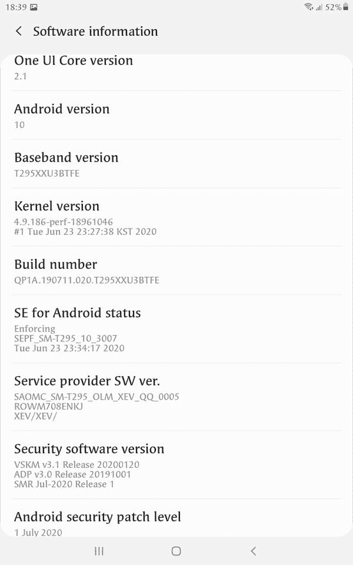

# 三星 Galaxy Tab A 8.0 和 Galaxy Tab A 10.1 2019 通过一个 UI 2.1 更新到 Android 10

> 原文：<https://www.xda-developers.com/samsung-galaxy-tab-a-8-0-galaxy-tab-a-10-1-2019-android-10-one-ui-2-1/>

# 三星 Galaxy Tab A 8.0 和 Galaxy Tab A 10.1 2019 通过一个 UI 2.1 更新到 Android 10

三星已经开始在多个地区推出基于 Android 10 的 One UI 2.1 更新到 Galaxy Tab A 8.0 和 Galaxy Tab A 10.1 (2019)。

One UI 2.1 是三星在 Android 10 基础上定制皮肤的最新迭代，Android 10 最近已经推出了 Galaxy Tab S4 和 Galaxy Tab S5e T1。在为高端市场提供服务后，该公司现在将 Android 10 引入其经济型平板电脑。Galaxy Tab A (2019)系列的 8 英寸和 10.1 英寸型号在不同地区都采用了 Android 10 更新，尽管这些设备中的 One UI 2.1 层可能缺乏一些“高级”功能。

**[三星 Galaxy Tab 一 XDA 论坛](https://forum.xda-developers.com/galaxy-tab-a)**

## Galaxy Tab A 8.0

全球 LTE 版本的 [8″ Galaxy Tab A 2019](https://www.xda-developers.com/samsung-galaxy-tab-a-2019-snapdragon-429-one-ui-pie/) (型号 **SM-T295** )在 XEV 区域获得了 One UI 2.1 更新，这是三星用来表示越南的代码。新固件的内部版本号为*t 295 xxxu 3 btfe*，将安卓安全补丁级别(SPL)提升至【2020 年 7 月。当前更新与该平板电脑的其他地区型号( **SM-T295C/T295N/T297** )或仅 Wi-Fi 型号( **SM-T290** )不兼容。

 <picture></picture> 

Thanks to XDA Senior Member [snifing](https://forum.xda-developers.com/member.php?u=5762191) for the screenshot!

还有一个 8 英寸的 2019 年 Galaxy Tab A 的 SKU[带有 S Pen](https://www.xda-developers.com/samsung-galaxy-tab-a-2019-s-pen/) 。它的 LTE 版本(型号 **SM-P205** )也获得了稳定的 Android 10/One UI 2.1 更新，并提供了 2020 年 7 月的安全补丁。在撰写本报告时，内部版本号为 *P205DXU5BTFB* 的 OTA 正在菲律宾推出。预计更新交付流程将在未来几周内扩大规模。

## 银河 Tab A 10.1

搭载 Exynos 7904 的 Galaxy Tab A 10.1 于 2019 年 2 月[推出](https://www.xda-developers.com/samsung-galaxy-tab-a-10-1-2019-germany/)，搭载 Android Pie。平板电脑的 LTE 版本(型号 **SM-T515** )现在以软件版本*t 515 Xu 4 btfk*的形式获得了其第一个主要的 Android 操作系统更新。截至目前，OTA 仅在意大利可用。再一次，Wi-Fi only 变体被排除在初始部署之外。

如果你想跳过等待队列，立即从三星更新服务器下载平板电脑的新固件包，请查看 XDA 的内部工具，如 [SamFirm](https://www.xda-developers.com/download-stock-odin-firmware-samfirm/) 和 [Frija](https://forum.xda-developers.com/s10-plus/how-to/tool-frija-samsung-firmware-downloader-t3910594) 。