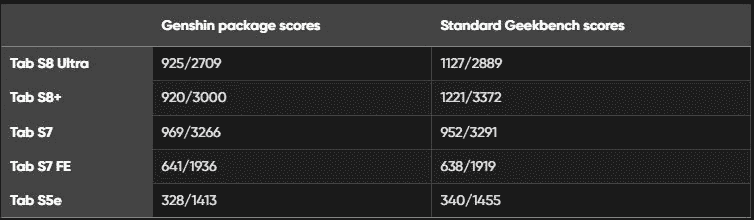

# 三星的旗舰产品 Galaxy Tab S8 系列平板电脑也降低了一些应用程序和游戏的性能

> 原文：<https://www.xda-developers.com/samsung-galaxy-tab-s8-series-performance-throttling/>

三星最近开始为 Galaxy S22 系列推出新的软件更新。此次更新[解决了与预装游戏优化服务(GOS)应用相关的性能节流问题](https://www.xda-developers.com/galaxy-s22-update-gos-performance-fix/)。它还在游戏助推器中引入了新的“游戏性能管理模式”，以提高 CPU/GPU 性能。虽然三星尚未为旧款 Galaxy 智能手机发布类似的更新，但来自 *Android Police* 的一份新报告称，性能节流问题也影响了 Galaxy Tab S8 系列。

如果你错过了我们之前关于这个问题的报道，三星最近[被发现抑制了 Galaxy 旗舰产品](https://www.xda-developers.com/samsung-throttling-popular-android-apps/)上几个流行应用和游戏的性能，追溯到 Galaxy S10。因此，Geekbench 指责三星操纵基准，[将最后四代 Galaxy 旗舰](https://www.xda-developers.com/geekbench-samsung-benchmark-manipulation/)从其库中除名。尽管三星已经承认了这个问题，并推出了 Galaxy S22 系列的更新，但事情对这家韩国 OEM 厂商来说并不乐观。

*Android Police* 现在发现 Galaxy Tab S8 Plus 和 Galaxy Tab S8 Ultra 在运行名为 Genshin Impact package 的 Geekbench 应用程序版本时也会降低性能。从下表中可以看出，Galaxy Tab S8 Plus 和 Galaxy Tab S8 在运行 Geekbench 的修改版本时性能受到了极大的抑制，单核 CPU 性能下降了 18-24%，多核性能下降了 6-11%。

 <picture></picture> 

Credit: Android Police

然而，Galaxy Tab S7、Galaxy Tab S7 FE 和 Galaxy Tab S5e 等老款三星平板电脑并没有降低性能，也提供了类似的结果。该出版物进一步指出，Galaxy Tab S8 系列不像 Galaxy S22 系列那样难以控制，可能是因为其大尺寸允许更好的散热。

现在新的 Galaxy Tab S8 系列也卷入了争议，Geekbench 已经将这些平板电脑从其 Android 基准图表中除名。三星尚未就此事发表声明，但我们预计该公司将为其旗舰平板电脑发布类似的软件更新，以解决性能节流问题。

* * *

**来源:** [安卓警察](https://www.androidpolice.com/samsung-galaxy-tab-s8-game-throttling/)，[推特](https://twitter.com/geekbench/status/1503475728649797633)