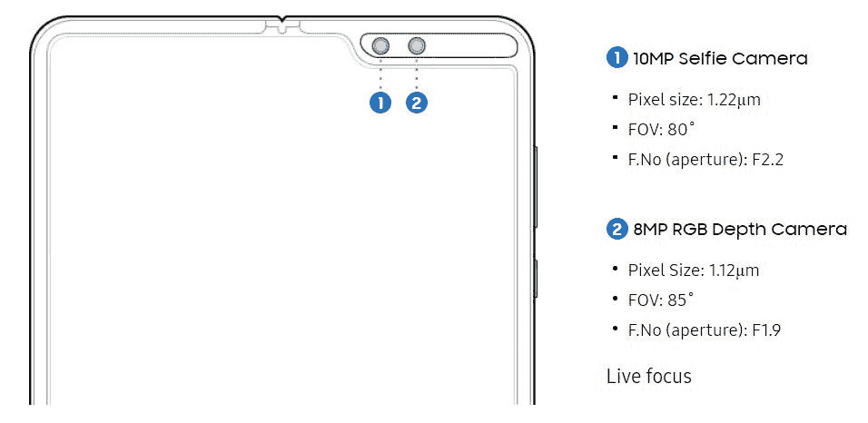

# 三星 Galaxy Z Fold 2 泄露的照片显示了打孔显示器

> 原文：<https://www.xda-developers.com/samsung-galaxy-z-fold-2-leak-blurry-photo-showing-off-hole-punch-display/>

三星正准备在 8 月 5 日的 [Galaxy Unpacked 2020 活动上](https://www.xda-developers.com/samsung-galaxy-note-20-galaxy-unpacked-august-5/)[展示一批新的消费技术](https://www.xda-developers.com/samsung-5-devices-galaxy-unpacked-2020/)。在此次活动中推出的五款设备中，有三星首款可折叠设备的下一代 bump。看起来[称之为三星 Galaxy Z Fold 2](https://www.xda-developers.com/samsung-galaxy-z-fold-2-name/) ，而不仅仅是“Galaxy Fold 2”，这款设备令人兴奋，因为它标志着该系列的一个改进步骤。三星现在有一些可折叠的机会，先是 Galaxy Fold，然后是“固定”版本，然后是 Galaxy Z Flip，以及最近的 [Galaxy Z Flip 5G](https://www.xda-developers.com/samsung-galaxy-z-flip-5g-qualcomm-snapdragon-865-plus-launch/) 。现在，一张泄露的照片让我们提前看到了 Galaxy Z Fold 2 的巨大正面。

这张泄露的 Galaxy Z Fold 2 照片展示了手机的内部显示屏，即实际上沿着其中心轴折叠的显示屏。

虽然粗略地看一下这张照片，你没有多少东西可以带走，但除了启动闪屏上的新名字，如果你仔细看，你可以注意到打孔显示。这是一张经过编辑的照片，更好地展示了打孔机:

正如你现在看到的，Galaxy Z Fold 2 的内部显示屏将有一个单穿孔前置摄像头，位于屏幕的右半部分。设备周围的保护唇不再有打孔器的延伸部分。与第一代设备上的前置摄像头相比，这是一个很大的变化，第一代设备有一个明显独特的凹槽设置，如下图所示:

 <picture></picture> 

Front camera setup on the first-gen Samsung Galaxy Fold

之前的报道暗示 Galaxy Z Fold 2 可能会有一个显示屏不足的摄像头，但现在看来不再是这样了。除此之外，新设备预计将配备 7.7 英寸的内部显示屏，更大的外部显示屏，充足的 RAM 和存储空间，最新的处理器，5G 功能，并将继续排除 S Pen。在接下来的日子里，我们应该了解更多。

* * *

**来源: [Naver](https://m.cafe.naver.com/ca-fe/web/cafes/anycallusershow/articles/3344479?useCafeId=false) (已删除)**

**主持人:[@黄某 01](https://twitter.com/hwangmh01/status/1288285137180880899/photo/1)**