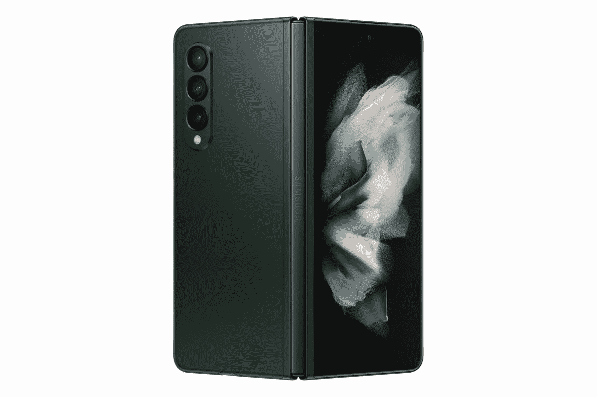

# 三星在 Galaxy Z Fold 3 上有一些很棒的优惠，就在今天

> 原文：<https://www.xda-developers.com/samsung-galaxy-z-fold-3-spring-discover-sale-usa/>

# 想买一台 Galaxy Z Fold 3 吗？三星美国公司今天提供 100 美元的商店积分，并接受碎屏折价

三星在 Galaxy Z Fold 3 上提供了很多激励措施，包括商店积分、裂纹屏幕的增强以旧换新等等！

三星 Galaxy Z Fold 3(T1)是 T2 最好的可折叠手机(T3)之一，即使在 2022 年也是如此。虽然已经出现了其他可折叠产品，可以更好地服务于不同的使用情况，但 Galaxy Z Fold 3 仍然是首选，因为它的可用性更广，耐用性也比前代产品更好。三星旗舰产品 foldable 的软件承诺在 Android 生态系统中也是无与伦比的，这标志着 Galaxy Z Fold 3 成为首批可以长期使用的可折叠产品之一。如果你在美国，想买 Galaxy Z Fold 3，今天就是时候，因为三星正在提供大量优惠，作为其[春季发现销售活动](https://www.xda-developers.com/samsung-spring-discover-sale/)的一部分。

 <picture></picture> 

Samsung Galaxy Z Fold 3

##### 三星 Galaxy Z Fold 3

作为春季发现销售活动的一部分，三星为 Galaxy Z Fold 3 提供了一系列激励措施。比如 100 美元的商店积分电子证书、高达 950 美元的碎屏设备以旧换新、Galaxy Tab S7 系列捆绑包的 40%折扣、100 美元的谷歌 Play 商店积分等等。

美国春季发现销售活动今天是最后一天，Galaxy Z Fold 3 是亮点产品。首先，当你购买 Fold 3 时，三星将提供 100 美元的电子证书。此电子证书作为 Samsung.com 的信用凭证有效，并可用于今年年底之前的未来购买。除此之外，你还可以叠加一些其他优惠。例如，三星提供高达 950 美元的优惠作为增强的以旧换新，它接受屏幕破裂的设备(尽管最好的价值是为三星家族的设备提供的)。例如，屏幕破裂的 Galaxy S21 Ultra 可以让你最多优惠 950 美元，而屏幕破裂的 Galaxy Z Fold 2 可以让你最多优惠 900 美元。三星甚至接受多台设备以旧换新，因此这是一种轻松的方式，可以让您抽屉里的一些旧设备发挥更大价值。

此外，如果你愿意，你可以捆绑一台 Galaxy Tab S7 系列设备，并获得平板电脑的 40%折扣。除此之外，每次购买还可以获得通常的优惠:100 美元的谷歌 Play 商店积分、3 个月的 Spotify Premium、6 个月的 SiriusXM 流媒体和 4 个月的 YouTube Premium(仅适用于新账户)。

请注意，破裂屏幕设备的电子认证和增强以旧换新仅在今天和美国有效。因此，如果你曾经想跳上可折叠宣传列车，今天是一个完美的日子，为它抢到一笔好交易。