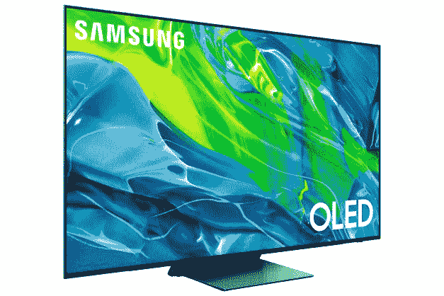

# 三星 S95B 是该公司的首款 OLED 电视，现在可以预订

> 原文：<https://www.xda-developers.com/samsung-opens-pre-orders-for-its-first-oled-smart-tv/>

三星的大多数智能电视都使用 QLED(量子点发光二极管)面板，这种面板类似于常规的 LED 屏幕，但有一层特殊的层来改善颜色和对比度。然而，该公司现在正在尝试一些不同的东西:一款有机发光二极管智能电视，旨在与 LG 的有机发光二极管电视系列竞争。

三星的第一台有机发光二极管 4K 电视“S95B 有机发光二极管 4K 智能电视”现在可以在该公司的在线商店预购。有两种尺寸可供选择，两种尺寸都要花费你——55 英寸的版本是 1299.99 美元，而 65 英寸的版本是 2999.99 美元。三星接受以旧换新来降低价格，但只针对特定的 Galaxy 手机(一部可用的 S21 Ultra 折价 600 美元)。

 <picture></picture> 

S95B Samsung OLED Smart TV (2022)

##### 三星 S95B 66 英寸 4K OLED 电视

三星的第一款 OLED 电视 S95B 现在可以预购。

这种型号的 OLED 面板应该比任何 QLED 电视都提供更深的黑色，因为单个像素在全黑场景下会关闭，而有机发光二极管没有其他显示技术那样的可见背光效果。除了不同的面板之外，S95B 支持高达 120Hz 的刷新率(在原生 4K 分辨率下)，并且额定为 HDR10+。这款电视还拥有与三星其他高端电视相同的“神经量子处理器”，可以将内容升级到 4K，外观比常规缩放略干净。不过，你仍然只有四个 HDMI 端口。

三星的第一台 OLED 电视在现实世界中如何与 LG 的有机发光二极管阵容相抗衡，还有待观察。LG 似乎在定价上确实有一点优势，至少——[55 英寸的 LG C1](https://shop-links.co/1770319082439193837?u1=fb613a7a-8b16-4fc7-b52e-81f3392b0dc4) 比 55 英寸的 S95B 便宜 100 美元，具有类似的无边框设计、人工智能升级和 120Hz 支持。如果高刷新率支持对你来说不重要(你好，任天堂 Switch 车主朋友)，那么 [55 英寸 LG A1](https://shop-links.co/1770319082295828889?u1=b88a6a07-60dd-4821-bbe7-4d94de265af2) 甚至更便宜。

今年早些时候，三星在 CES 2022 上发布了几款新的电视型号，包括采用 Micro LED 和 QLED 面板的型号。