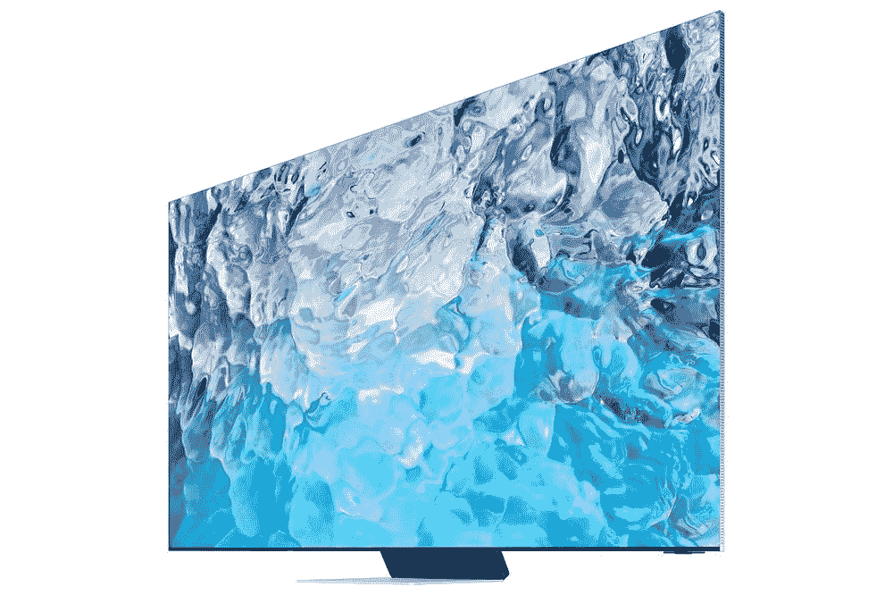

# 三星最好的(也是最贵的)8K 电视现在可以购买了

> 原文：<https://www.xda-developers.com/samsung-qn900b-preorder/>

三星制造了大量电视，以至于很难跟踪所有的电视。该公司[在 1 月份的 CES 2022](https://www.xda-developers.com/samsung-details-new-microled-mini-led-and-lifestyle-tvs-for-2022/) 期间宣布了其 2022 年的大部分阵容，现在可以购买到配有 QLED 面板和 8K 分辨率的最高端型号。正如你所料，这根本不是负担得起的。

新款三星 Neo QLED 8K 智能电视(QN900B)有三种尺寸可供选择:65 英寸、75 英寸或 85 英寸。定价分别定为 4，999.99 美元、6，499.99 美元和 8，499 美元。这是一大笔钱，但三星将为预购者提供 200 美元的商店积分。这相当于 85 英寸机型价格的 2%，真是一个大折扣。

 <picture></picture> 

QN900B Samsung Neo QLED 8K Smart TV (2022)

##### 三星 NQ900B 8K QLED 电视

这款高端 8K 电视现在可以预购，包括 200 美元的商店积分。

这里的主要卖点是带有“超薄 One Connect”的“Infinity Screen”，这意味着电视面板本身非常薄，几乎看不见边框，而所有硬件(包括 HDMI 端口)都包含在一个单独的小盒子中。你会得到一个高端 QLED 屏幕，一个改善视角的防眩光涂层，120Hz 刷新率支持，以及其他一些有用的功能。

三星包括在其大多数其他电视中发现的相同的神经量子处理器，该处理器为非 8K 内容提供人工智能增强的升级。还有通常的 Smart Hub 软件体验，包括访问最流行的流媒体服务和媒体应用程序。最近，[三星一直在改善其智能电视](https://www.xda-developers.com/samsung-gaming-hub-feature-for-samsung-smart-tvs/)上的云游戏支持，尽管目前没有任何云平台可以在原生 8K 分辨率下玩游戏。

[三星还在周四](https://www.xda-developers.com/samsung-opens-pre-orders-for-its-first-oled-smart-tv/)发布了其首款有机发光二极管智能电视 S95B 三星有机发光二极管智能电视。该型号有两种尺寸，价格从 55 英寸的 1，299.99 美元到 65 英寸的 2，999.99 美元不等。S95B 也可预购，但不像上述 Neo QLED 8K 型号那样有商店积分奖励。