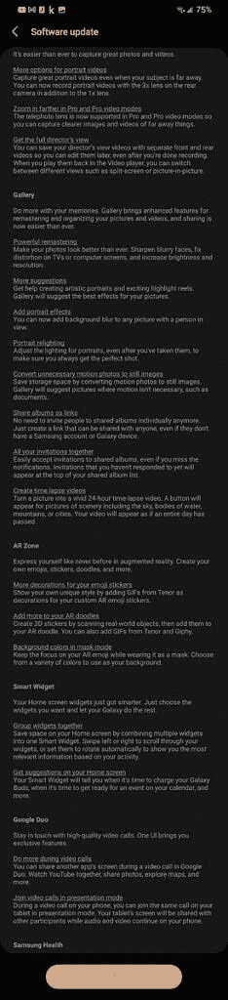

# 三星开始向 Galaxy S21 系列推出一款 UI 4.1

> 原文：<https://www.xda-developers.com/samsung-rolling-out-one-ui-4-1-galaxy-s21-series/>

今年早些时候，三星推出了最新版本的 Android 皮肤 One UI 4.1 和 Galaxy S22 T1 系列。最近，Galaxy Z Fold 3 和 Galaxy Z Flip 3 开始进行更新，为可折叠产品带来了许多新的软件功能。现在，三星已经开始在一些地区推出 [Galaxy S21 系列](https://www.xda-developers.com/samsung-galaxy-s21/)。

根据我们论坛和 Reddit 上最近的报道，One UI 4.1 已经开始在加拿大的 Galaxy S21 系列中推出。目前，更新仅限于 Galaxy S21、Galaxy S21 Plus 和 Galaxy S21 Ultra 的加拿大骁龙版本(SM-G99xW ),但在接下来的几天里，它应该会在更多版本和地区推出。

正如你在所附的截图中看到的，Galaxy S21 系列的 One UI 4.1 引入了几个新功能，如 Google Duo live integration、Expert RAW 应用程序、对象橡皮擦、快速共享、三星键盘中的语法集成等。此次更新还为设备带来了 2022 年 3 月的 Android 安全补丁。如果您的设备上还没有收到 OTA 通知，您可以前往设备设置中的软件更新部分手动检查更新。或者，您可以等待几天，让更新自动显示在您的设备上。

 <picture></picture> 

Credit: XDA Senior Member [srkoza](https://forum.xda-developers.com/m/srkoza.4059517/)

三星计划在未来几个月内向一系列其他 Galaxy 智能手机和平板电脑发布一款 UI 4.1。其中包括 Galaxy S20 系列、Galaxy Z Fold 2、原 Galaxy Fold、Galaxy Z Flip 和 Z Flip 5G、Galaxy Tab S7 FE、Galaxy Note 20 系列、Galaxy Note 10 系列和 Galaxy S10 系列。不过，三星尚未为这些设备提供明确的发布时间表。

*你的 Galaxy S21 系列设备收到过一个 UI 4.1 吗？请在下面的评论区告诉我们。*

* * *

**来源:** [银河 S21 超 XDA 论坛](https://forum.xda-developers.com/t/canada-galaxy-s21-ultra-discussions-sw-updates-everything-related-to-the-sm-g998w.4270291/page-8#post-86583901)， [Reddit](https://www.reddit.com/r/GalaxyS21/comments/tepn4f/one_ui_41_update_for_galaxy_s21_series_will/i0u1uwo/)