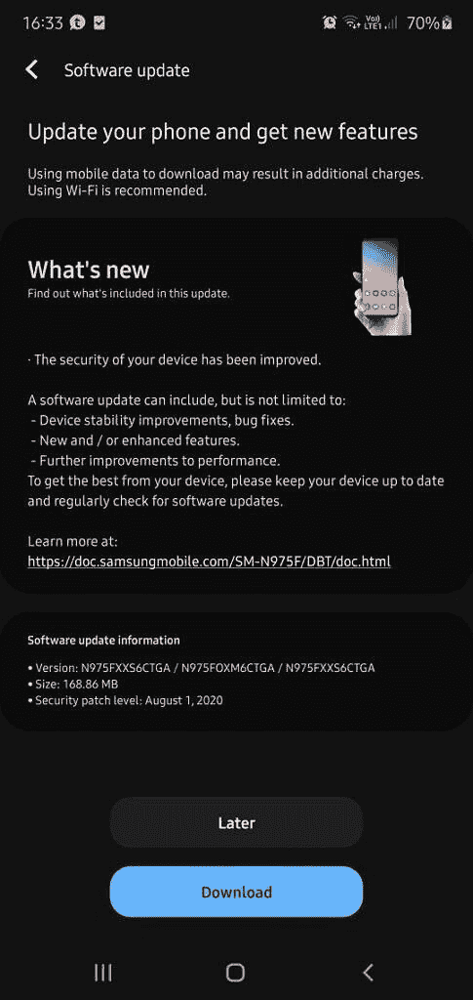
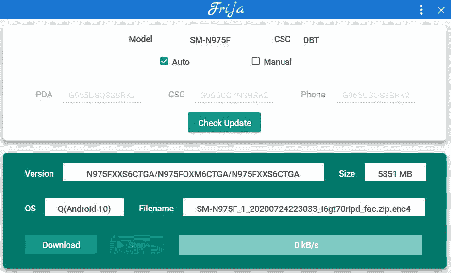

# 三星 Galaxy Note 10 系列获得 2020 年 8 月安全补丁的新更新

> 原文：<https://www.xda-developers.com/samsung-rolls-out-august-2020-security-update-galaxy-note-10-series/>

# 三星将于 2020 年 8 月推出 Galaxy Note 10 系列的安全更新

三星 Galaxy Note 10 系列现在已经开始接收 OTA 更新，其中包含 2020 年 8 月的安全补丁和新的 bootloader。

就在一天前，三星[开始在一些地区推出](https://www.xda-developers.com/samsung-galaxy-s10-plus-s10e-august-2020-security-patches-update/)Galaxy S10 系列的 Exynos 版本的更新。此次更新包括 Galaxy S10、Galaxy S10+和 Galaxy S10e 的 2020 年 8 月安全补丁，以及这些设备的新引导加载程序(v8)。尽管大多数 Galaxy S10 用户尚未获得更新，但三星现在已经开始为 Exynos 驱动的 Galaxy Note 10 设备推出类似的更新。

**[三星 Galaxy Note 10 XDA 论坛](https://forum.xda-developers.com/galaxy-note-10) || [三星 Galaxy Note 10+ XDA 论坛](https://forum.xda-developers.com/galaxy-note-10+)**

三星 Galaxy Note 10 系列的最新更新(软件版本 N975FXXS6CTGA/N975FOXM6CTGA)的大小为 168.86MB，其中包括 2020 年 8 月的安全补丁。与 Galaxy S10 系列的 OTA 更新非常相似，此次更新也为 Galaxy Note 10 系列带来了新的 bootloader (v6 ),这意味着最终用户一旦安装了此更新，将无法再降级到旧版本。

 <picture></picture> 

Thanks to XDA Senior Member [jaylence](https://forum.xda-developers.com/member.php?u=4704453) for the screenshot

与三星之前的所有更新一样，最新的 OTA 更新目前正在向少数用户推出，预计将在未来几天内覆盖所有 Galaxy Note 10 系列设备。如果你不想等待 OTA 更新，你可以使用一个名为 [Frija](https://forum.xda-developers.com/s10-plus/how-to/tool-frija-samsung-firmware-downloader-t3910594) 的社区开发工具，从三星的存储库中为你的设备下载更新的固件。所需的参数可以在下面的截图中找到。

 <picture></picture> 

Thanks to XDA Senior Member [henklbr](https://forum.xda-developers.com/member.php?u=1586120) for the screenshot

一旦你下载了 Frija 创建的解密固件包，你就可以使用 Odin 在你的设备上刷新它。如果你不熟悉用 Odin 升级你的三星设备的固件，你可以遵循这篇文章中的说明。请注意，上述更新仅适用于国际 Exynos 9825 供电的 Galaxy Note 10 设备，它与 Galaxy Note 10 系列的骁龙 855 供电版本不兼容。