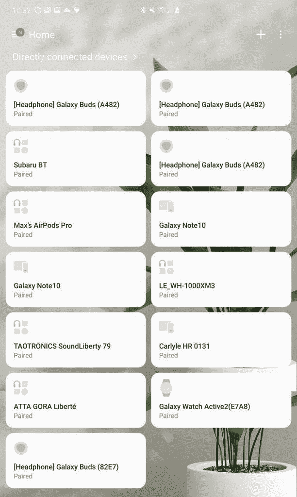

# 三星 SmartThings 1.7.43-22 为联网设备添加了新的“虚拟家庭”功能和一览式仪表盘

> 原文：<https://www.xda-developers.com/samsung-smartthings-new-virtual-home-feature-at-a-glance-dashboard-connected-devices/>

三星 SmartThings 是三星的智能家居设备平台。该应用程序取代了 40 多个应用程序，这些应用程序执行的是它目前拥有的零碎功能。 [SmartThings](https://shop-links.co/link/?exclusive=1&publisher_slug=xda&article_name=Samsung+SmartThings+1.7.43-22+adds+a+new+%22Virtual+Home%22+feature+and+at-a-glance+dashboard+for+connected+devices&article_url=https%3A%2F%2Fwww.xda-developers.com%2Fsamsung-smartthings-new-virtual-home-feature-at-a-glance-dashboard-connected-devices%2F&u1=UUxdaUeUpU27297&url=https%3A%2F%2Fwww.samsung.com%2Fus%2Fsmartthings%2F&ourl=https%3A%2F%2Fwww.samsung.com%2Fus%2Fsmart-home%2Fsmartthings%2F) 在 2018 年 3 月接受了一次重大检修，让用户处理 SmartThings 连接的设备。SmartThings 生态系统是谷歌助手驱动的 [Nest](https://www.xda-developers.com/google-apple-amazon-develop-open-source-smart-home-standard/) 和 Alexa 驱动的智能家居生态系统的竞争对手。通过 SmartThings，用户可以控制他们的智能家居设备，如空调、空气净化器、灯泡、电视、冰箱等。这一切都集成在一个应用程序中。现在，该应用程序已经收到了 Play Store 的更新，带来了新的功能。

 <picture></picture> 

At a glance dashboard in Samsung SmartThings

三星 SmartThings 1.7.43-22 现在让用户可以一目了然地查看其连接设备的状态。这相当于当前连接到应用程序的所有设备的仪表板。它包括电话、耳塞、客厅设备等。该功能的目的是用户可以快速检查所有连接设备的状态。

第二个主要功能是三星所谓的“虚拟家庭”。这使得用户可以在模拟中尝试智能事物和控制设备的功能，即使他们实际上没有连接的设备。它旨在让用户了解 SmartThings 平台的功能，如果他们喜欢虚拟家庭功能，至少他们中的一些人将被迫购买连接到它的设备。三星指出，支持的设备和服务可能因地区而异。由于不同地区适用的法律不同，三星 SmartThings 本身作为一个平台在特定地区可用。

更新的更改日志记录如下:

-轻松查看连接设备的状态，一目了然

-通过我们的“虚拟家庭”探索智能事物-即使您没有连接设备

(*支持的设备和服务可能因您所在的地区而异)

*截图感谢[麦克斯·温巴赫](https://www.xda-developers.com/author/mweinbach/)。*