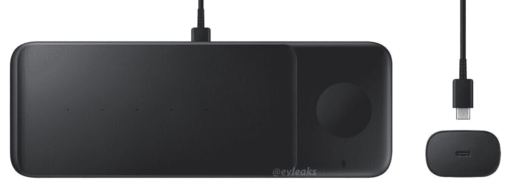

# 三星无线充电器 Pad Trio 可能适合 Galaxy Note 20、Galaxy Watch 3 和 Galaxy Buds Live

> 原文：<https://www.xda-developers.com/samsung-wireless-charger-pad-trio-charge-galaxy-note-20-galaxy-watch-3-galaxy-buds-live-same-time/>

据报道，三星正准备发布一款三合一无线充电器。据称，这款设备被命名为三星无线充电器 Pad Trio，可能会同时为你的 [Galaxy Note 20](https://forum.xda-developers.com/galaxy-note-20) 、 [Galaxy Watch 3](https://forum.xda-developers.com/smartwatch/samsung-galaxy-watch-3) 和 [Galaxy Buds Live](https://www.xda-developers.com/samsung-galaxy-buds-live-feature-rich-wireless-earbuds/) 充电。

泄密者埃文·布拉斯在他的个人主页上分享了一张充电器的图片。图像显示了一个细长的充电板，有足够的空间容纳三种不同的设备。如果你仔细观察，你可以看到三种不同类型设备的符号，包括智能手机、智能手表和耳塞。这张照片还带有一个电源模块，可以通过 USB-C 充电。

 <picture></picture> 

Credits: Evan Blass

虽然这张图片提供了一些关于三星无线充电器 Pad Trio 的线索，但仍有一些细节我们不知道。例如，目前还不清楚它将支持什么 Qi 无线充电模式，以及它可以以多快的速度同时为每个设备充电。

三星目前提供了一款[无线充电器 Duo Pad](https://shop-links.co/link/?exclusive=1&publisher_slug=xda&article_name=Samsung%27s+Wireless+Charger+Pad+Trio+may+charge+your+smartphone%2C+smartwatch%2C+and+earbuds+at+the+same+time&article_url=https%3A%2F%2Fwww.xda-developers.com%2Fsamsung-wireless-charger-pad-trio-charge-galaxy-note-20-galaxy-watch-3-galaxy-buds-live-same-time%2F&u1=UUxdaUeUpU29630&url=https%3A%2F%2Fwww.samsung.com%2Fus%2Fmobile%2Fmobile-accessories%2Fphones%2Fwireless-charger-duo-pad-black-ep-p5200tbegus%2F) ，可以为两个设备(智能手机和智能手表，两个智能手机等)的任意组合充电。).不过，尽管无线充电器 Duo 的特点是有一个倾斜的垫，可以轻松地看到你的智能手机显示屏，但无线充电器 Pad Trio 似乎是平的。

3 合 1 无线充电器并不新鲜。但是，当然，我们还没有看到三星自己的产品。随着该公司在过去一个月发布了如此多不同的无线充电设备，三星开发新的无线充电器也就不足为奇了。

目前还不清楚无线充电器三重奏何时发布，也不知道它的价格。Charge Duo Pad 售价 99 美元，因此我们可以预计这款产品的价格不会高于这一价格。三星计划在 9 月 1 日为 Galaxy Z Fold 2 举办另一场[拆包活动](https://www.xda-developers.com/samsungs-galaxy-z-fold-2-unpacked-part-2-september-1/)，因此或许我们届时会获得官方细节。

**[三星 Galaxy Note 20 论坛](https://forum.xda-developers.com/galaxy-note-20)**| |**|[三星 Galaxy Note 20 Ultra 论坛](https://forum.xda-developers.com/galaxy-note-20-ultra)**