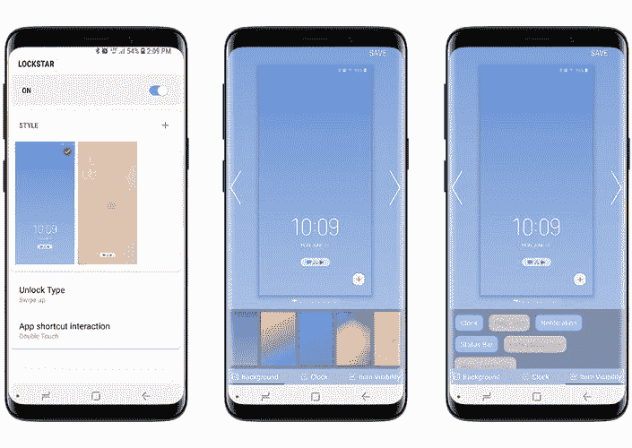
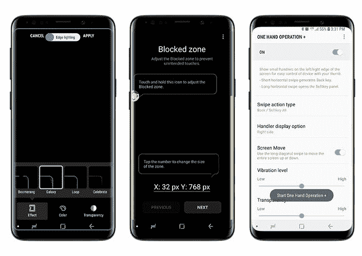

# 三星的 Good Lock 提供了最酷的智能手机功能&无人谈论的定制

> 原文：<https://www.xda-developers.com/samsungs-good-lock-features-editorial/>

三星的 Galaxy S 和 Galaxy Note 仍然是全球数百万人事实上的 Android 体验，仍然是休闲人群中最畅销的手机，也是发烧友的首选。虽然这些设备在一段时间内有点可预测性，但毫无疑问，它们是非常出色的产品，肯定是最重要的两款 Android 旗舰产品。

事实上，Note 9 无疑是三星有史以来最好的设备。当然，这有点可预测，但也是对三星多年来一直在尝试的每一个好主意(也许除了弯曲的边缘)的彻底提炼和汇编。总的来说，我几乎可以说它是有史以来发布的最好的智能手机，即使它不会特别吸引互联网上的每一个 Android 爱好者。当然，它很贵，但至少在其他 OEM 厂商牺牲可扩展存储、耳机插孔、无线充电等宝贵功能或采用仍有争议的 notch 时，它的成本令人信服。

> Good Lock 真正改变了 Note 9 用户界面的外观和感觉。

奇怪的是，Galaxy Note 9 的一个我最喜欢的功能几乎完全没有得到三星的宣传。这是来自 Galaxy 应用商店的一个“应用套件”,仅此一项就意味着大多数人不会看到它——谁*实际上*浏览 Galaxy 应用呢？但是，即使你彻底排斥 OEM“膨胀软件”，**三星 Good Lock** 重新启用该公司的盗版游戏商店是非常值得的。这个小应用程序最初是在几年前在 Galaxy S7 上发布的，作为 SystemUI 的替代品和锁屏定制程序，支持重点颜色调整和一些美学修改以及简洁的功能。一代人之后，它几乎在几个 Android 版本中消失了。

最近[好锁针对 Galaxy S9 和 Note 9 重新发布了](https://www.xda-developers.com/samsung-good-lock-multistar/)。2018 年，“好锁”这个名字有点用词不当，因为它的*远远不止是锁屏替代品*。

## 什么样的好锁包含:

*   LockStar -自定义锁屏(可以重新排列元素等)。
*   自定义通知阴影和状态栏(设置透明度，模糊背景，选择颜色和阿尔法)。
*   任务转换器-最近使用的应用程序用户界面的新外观和效果(水平最近切换器，更多快捷方式)。
*   惯例-本质上是 Tasker。使用条件控制手机功能和设置。
*   钟面-自定义 AOD 和锁屏时钟。
*   边缘照明+ -定制边缘照明效果(本质上是边缘照明的“扩展包”)。
*   边缘触摸-在屏幕周围建立死区，以防止意外触摸(如果你讨厌曲面屏幕，这是完美的选择)。
*   单手操作+ -拇指手势导航(这是一个特别牛逼的部分，下面会详细介绍)。声音助手-个性化声音设置和管理应用程序音量(每个应用程序和上下文音量设置)。
*   多星分屏和多任务调整(为所有应用启用多窗口，改变浮动窗口透明度)。

可以说，这里有很多。这套应用程序提供了大量的定制功能。三星实际上做了很好的总结:

> “你的手机反映了你的个人品味和偏好。从你的锁屏到你的声音，每一个设置都透露出你喜欢如何展示自己并与你的设备互动。”

这个感觉绝对准确。确实有各种各样的空间来调整用户界面以适应个人口味，好的锁确实给了你实现这一点的工具。下面我将分享我所做的一些修改，以及我最喜欢的功能。

* * *

## **我的设置**

现在，我正在使用 LockStar，QuickStar，Task Changer，ClockFace，Edge Lighting，MultiStar 和 One Hand Operation +。这种组合真正改变了 Note 9 的用户界面的外观和感觉。

我的锁定屏幕看起来像我想要的样子。每当我的手机放在桌子上时，通知就会在显示屏的边缘点亮一条别致的小彩虹——这比典型的 AOD 解决方案更清晰的通知提醒。我将导航栏设置为隐藏，主要通过右边缘的拇指滑动来导航(Android 中左边缘有太多的菜单窗格)。我用 iOS/Pie 风格的水平滚动任务切换器取代了原生的三星任务切换器(我绝对讨厌它)，它与水平任务管理器配合得非常好。MultiStar 让多任务变得更加有用。最后，我的通知阴影的主题与便笺本身的蓝色和黄色配色方案相匹配。

> 最好的功能是那些每天都为 UX 增加真正价值的功能，Good Lock 提供了大量这样的功能。

为什么所有这些都很重要？因为 Good Lock 的套件提供了简单的方法来“覆盖”三星设备在软件方面固有的许多缺点，它让人们减轻了拥有这样一个大设备的一些后果，并通常改善了三星的关键功能。扩展前面提到的要点，**侧手势导航**在如此高的手机上令人惊叹，因为单手触及底部导航栏变得不可行，因为它需要危险的手部体操和小拇指支持。例如，一个好的设置是“滑动到中间”代表后退，“斜向下滑动”代表最近，而“深按”代表主页。——甚至感觉比传统手势*还要好一点，因为曲面屏的*。最重要的是，切换到**水平任务管理器**进一步让你“滚动”和切换应用程序，而不需要用一只手重新调整你的握持。你可以增强**多窗口和浮动窗口**，通过**在所有应用**、**中启用它，防止应用在没有焦点的时候“暂停”**，然后在每个浮动窗口上添加一个按钮，使你能够改变窗口的透明度，或者像三星所说的“幽灵模式”。

 <picture></picture> 

LockStar

其他受欢迎的功能包括**添加一个按钮，从通知**中启动多窗口应用程序，能够为任何应用程序启用**“聊天头”通知**，设置**单个应用程序音量**、**声音和不同时间的铃声配置，**和**允许多个应用程序同时播放声音** -如果你想听有声读物和背景音乐，这很好。你甚至可以设置一个应用程序通过连接的音频设备或耳机播放声音，而其他应用程序通过手机的扬声器播放声音。

 <picture></picture> 

One Hand

对我来说，Note 9 出色的硬件包加上 Good Lock 的增强定制，是一款不可思议的设备。最好的功能是那些每天为 UX 增加真正价值的功能，Good Lock 提供了大量这样的功能。此外，在三星旗舰产品上，去除让我抓狂的 TouchWiz(或“三星体验”)中数量少得多但仍然存在的恼人部分的能力令人难以置信地耳目一新。如果你有 Galaxy S9 或 Note 9，并且没有尝试过 Good Lock，那么就帮自己一个忙，下载它。这真的是一个非常棒的奖励。