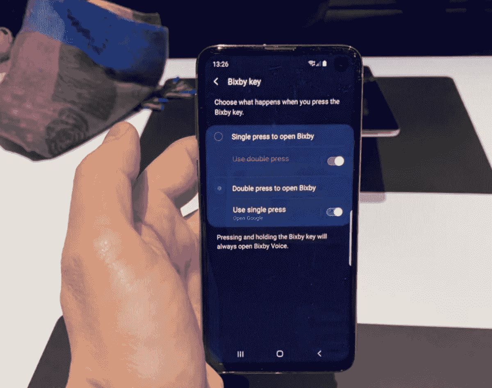

# 三星 Galaxy S9，Note 9，其他人将通过更新获得 Bixby 重新映射

> 原文：<https://www.xda-developers.com/samung-galaxy-note-9-bixby-remapping/>

**2019 年 2 月 28 日更新:**三星已经开始推出 Bixby 应用程序的更新，允许 Galaxy Note 9、Galaxy S9/S9+、Galaxy Note 8 和 Galaxy S8/S8+用户自定义 Bixby 按钮。

三星智能手机展示了其在硬件领域的独创性和专业知识。虽然其软件并非 100%如此，但三星一直在接受消费者的反馈，并通过新的基于 [Android 9 Pie 的 One UI](https://www.xda-developers.com/samsung-one-ui-review-android-pie-galaxy-s9-galaxy-note-9/) 显著改善了其软件体验。该公司似乎也听到了一些关于其智能助手 Bixby 和旗舰产品上的 Bixby 按钮的反馈，这就是为什么[新推出的 Galaxy S10](https://www.xda-developers.com/samsung-galaxy-s10-hands-on/) 可以轻松地重新映射按钮以启动任何其他应用程序。

对于那些将购买任何一款 [Galaxy S10 设备](https://www.xda-developers.com/samsung-galaxy-s10-s10-and-s10e-launch-with-the-snapdragon-855-ultrasonic-in-display-fingerprint-scanners-reverse-wireless-charging-and-a-whole-lot-more/)的人来说，这是一个好消息，但三星承诺该功能也将应用于旧款旗舰产品。三星现已证实，包括 [Galaxy S8/S8+](https://www.xda-developers.com/exynos-samsung-galaxy-s8s-one-ui-update-starts-rolling-out-in-europe/) 、 [Galaxy S9/S9+](https://www.xda-developers.com/samsung-galaxy-s9-one-ui-android-pie-sprint-verizon/) 、 [Galaxy Note 8](https://www.xda-developers.com/samsung-galaxy-note-8-one-ui-update-eastern-europe/) 和 [Galaxy Note 9](https://www.xda-developers.com/samsung-galaxy-note-9-one-ui-beta-android-pie/) 在内的老款三星旗舰机将能够重新映射 Bixby 按钮，以启动任何其他应用程序。

 <picture></picture> 

Courtesy of [The Verge](https://www.theverge.com/2019/2/21/18235405/samsung-galaxy-phones-bixby-button-remapping-customization-feature)

使用 Bixby 按钮启动不同应用程序的功能目前仅限于 Galaxy S10。据[三星新闻编辑部](https://news.samsung.com/global/in-depth-look-4-more-powerful-more-personal-bixby-on-the-galaxy-s10)(via[*【The Verge】*](https://www.theverge.com/2019/2/21/18235405/samsung-galaxy-phones-bixby-button-remapping-customization-feature)称，旧设备有望在未来通过软件更新获得这一功能。更新的唯一前提是你的三星旗舰必须运行最新的 One UI。虽然该公司没有透露更新在旧设备上到来之前的确切等待时间，但三星对及时软件更新的新热情让我们希望它不会太长。

目前，Galaxy S10 上的按钮可以重新映射，以打开任何特定的应用程序或触发快速命令——或一系列动作。您可以选择通过点击或双击按钮来启动应用程序。您选择的选项之外的选项将自动分配给 Bixby。

例如，如果你选择单按 Bixby 按钮来启动 YouTube 或 WhatsApp，双按将自动分配到启动 Bixby。而且，长按按钮总是会启动 Bixby。

虽然我们还不知道你是否必须保持 Bixby 启用才能保持按钮工作，但似乎你可以学会避免 Bixby，如果你不从你的生活中完全调度它的话。

## 更新 1: Bixby 应用更新

正如原文章中所报道的那样，用户在新的 Bixby 应用程序更新(通过 [*SamMobile*](https://www.sammobile.com/2019/02/28/samsung-bixby-key-remapping-older-flagships/) )时有两种选择:单按和双按。其中一个必须映射到 Bixby。另一个可以是第三方应用。打开 Bixby 应用程序，进入**设置>高级功能> Bixby 键。**