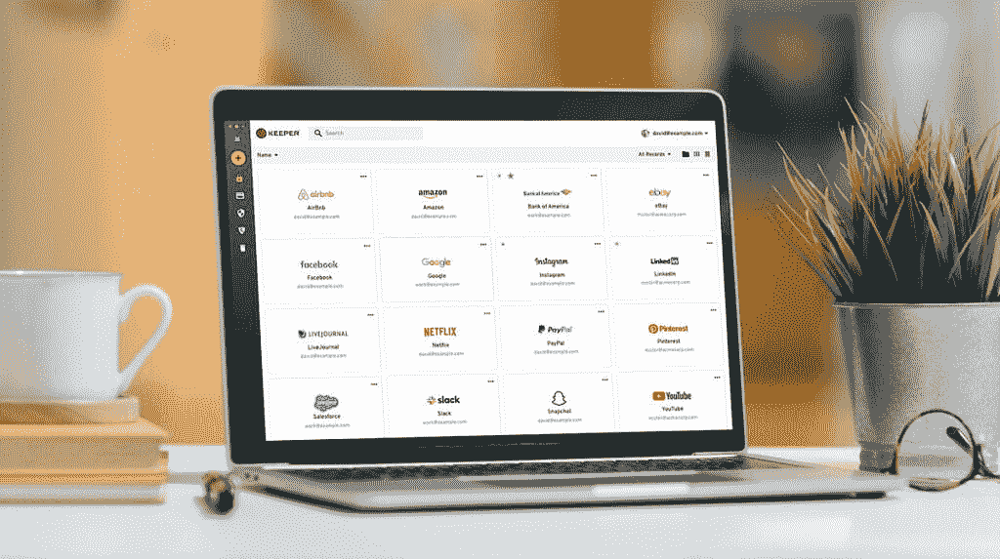

# 最佳密码管理器节省 30%

> 原文：<https://www.xda-developers.com/save-30-on-keeper/>

如果你一直在拖延对密码管理解决方案的投资，你不会想错过这个来自 Keeper 的 30%的交易。虽然 Keeper 是一个跨平台的所有设备的密码管理器，但它可以做得更多。Keeper 为您提供所需的安全性提升，让您对自己对所有不同在线帐户的监管充满信心。在一个安全的地方储存许多不同类型的文件，如保险、政府、医疗或任何你可能需要的东西。

当您轻松地将所有帐户信息输入到 Keeper 中时，您总是只需点击一下就可以登录任何服务。使用复杂的密码，并用 Keeper 内置的密码生成器和安全工具定期更新。您甚至会收到关于可能包括您的信息在内的重要安全漏洞的通知。保持在这些类型的数据泄漏的顶端，并以全新的方式管理您的密码。

 <picture></picture> 

Keeper Security

在本次限时特卖期间，可以 30% 的优惠获得 [Keeper Unlimited。使用该套餐，您将获得以下所有好处:](https://click.linksynergy.com/fs-bin/click?id=PwGPyZUCyTs&offerid=1096510.101&type=3&subid=0&LSNSUBSITE=LSNSUBSITE)

*   在您的保险箱中保护无限的密码
*   自动填充密码
*   生成强密码
*   使用指纹或面部识别登录
*   从您的任何设备访问和同步您的密码
*   锁定安全保管库中的文件和照片
*   安全共享密码和登录信息
*   安全存储信用卡和借记卡信息

*   用文件夹和类别组织密码
*   兼容 Apple Watch 进行双因素认证
*   零知识安全
*   与两步验证提供程序集成
*   利用 AES-256 和 PBKDF2 技术
*   启用自定义注销计时器
*   通过 TRUSTe 和 SOC-2 认证，让您高枕无忧

如果你想确定 Keeper 是最好的解决方案，那就利用他们的免费试用吧。您可以看到他们的软件在移动设备、浏览器插件、平板电脑、笔记本电脑和计算机上运行。今天是掌握您的密码安全和简化您的帐户凭证管理的好时机。

我们感谢 Keeper 赞助了这篇文章。我们的赞助商帮助我们支付与运行 XDA 相关的许多费用，包括服务器成本、全职开发人员、新闻撰稿人等等。虽然您可能会在门户内容旁边看到赞助内容(这些内容将始终被标记为赞助内容),但门户团队对这些帖子不承担任何责任。赞助内容、广告和 XDA 仓库完全由一个独立的团队管理。XDA 绝不会通过接受金钱来赞扬一家公司，或以任何方式改变我们的观点或看法，从而损害其新闻诚信。我们的意见不能被收买。