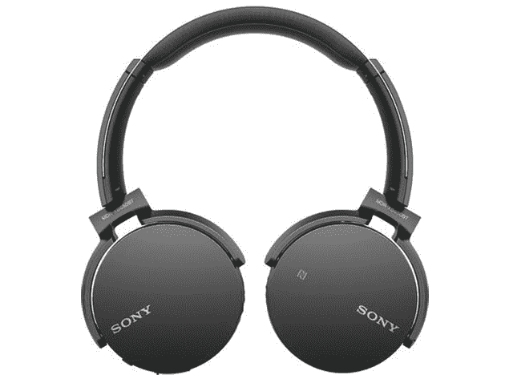
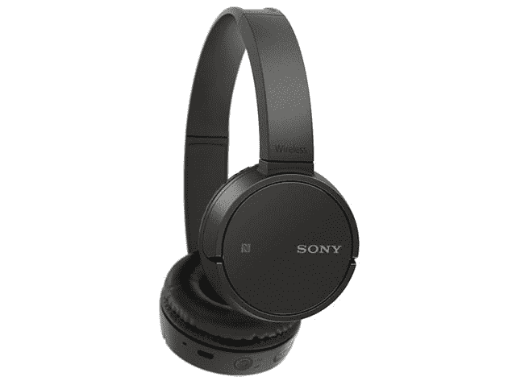
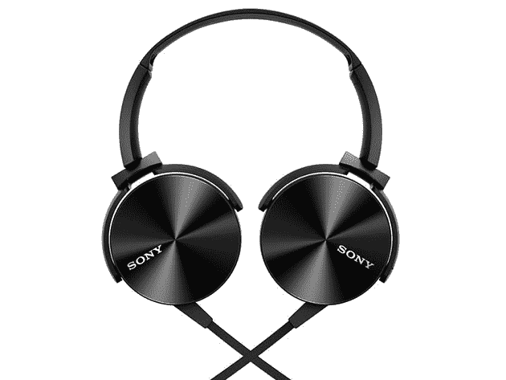

# 购买这些开放式索尼耳机可节省高达 60%的费用

> 原文：<https://www.xda-developers.com/save-up-to-60-on-these-open-box-sony-headphones/>

自从 1979 年发布随身听以来，索尼一直处于音频技术的最前沿。这家科技巨头生产一些最好的耳机，尽管你通常需要为这个品牌支付额外费用。如果你正在寻找一个更实惠的升级，看看 XDA Developers Depot 的一些新的开放式索尼耳机的诱人交易。

对于外行人来说，新的开箱商品通常被认为是商店货架上的多余库存。他们可能在包装上贴有各种标签，并且/或者已经与客户接触过。此外，包装有时会显示出额外处理的迹象。无论如何，产品仍将被验证为新的状态，并放在干净的包装中，所以你可以相信他们会像新的一样工作，同时享受相当大的折扣。

****

被可信评论描述为“技术上令人印象深刻”的是， [MDR-XB650BT 耳机](https://depot.xda-developers.com/sales/sony-xb650bt-wireless-on-ear-bluetooth-headphones-open-box?utm_source=xda-developers.com&utm_medium=referral&utm_campaign=sony-xb650bt-wireless-on-ear-bluetooth-headphones-open-box&utm_term=scsf-376321&utm_content=a0x1P000004NLdb&scsonar=1) 在充满电的情况下可以持续使用 30 个小时。它们通过蓝牙或 NFC 连接到您的手机，采用额外的低音技术来获得更丰富的声音，内置麦克风用于免提通话。正常情况下 129.99 美元，耳机是 [现在 59.99 美元](https://depot.xda-developers.com/sales/sony-xb650bt-wireless-on-ear-bluetooth-headphones-open-box?utm_source=xda-developers.com&utm_medium=referral&utm_campaign=sony-xb650bt-wireless-on-ear-bluetooth-headphones-open-box&utm_term=scsf-376321&utm_content=a0x1P000004NLdb&scsonar=1) 开盒。

## **索尼 ZX220BT 无线入耳式蓝牙耳机**

****

感谢 1.18 寸的圆顶驱动、 [这些入耳式耳机](https://depot.xda-developers.com/sales/sony-zx220bt-wireless-on-ear-bluetooth-headphones-open-box?utm_source=xda-developers.com&utm_medium=referral&utm_campaign=sony-zx220bt-wireless-on-ear-bluetooth-headphones-open-box&utm_term=scsf-376327&utm_content=a0x1P000004NLdb&scsonar=1) 连续八小时传递动态音频。它们通过蓝牙工作，或者你可以用它们点击任何 NFC 设备来实现即时无线连接。它们还有独特的旋转设计，非常适合旅行。它们通常是 79.99 美元，但你现在可以用 34.99 美元的开箱抢购。

****

配备 1.18 英寸驱动器，具有扩展的低频范围， [这些超低音耳机](https://depot.xda-developers.com/sales/sony-mdr-xb450ap-extra-bass-headphones-open-box?utm_source=xda-developers.com&utm_medium=referral&utm_campaign=sony-mdr-xb450ap-extra-bass-headphones-open-box&utm_term=scsf-376328&utm_content=a0x1P000004NLdb&scsonar=1) 在亚马逊上被评为 4 星/5 星。声学密封有助于保持低音，而智能钥匙应用程序允许您通过点击进行调整。此外，它们的重量只有 5.82 盎司。正常售价为 79.99 美元，目前开箱仅售 29.99 美元。

****

对于预算有限的发烧友来说， [ZX110AP 耳机](https://depot.xda-developers.com/sales/sony-zx110ap-extra-bass-headphones-headset-with-mic-for-iphone-android-open-box?utm_source=xda-developers.com&utm_medium=referral&utm_campaign=sony-zx110ap-extra-bass-headphones-headset-with-mic-for-iphone-android-open-box&utm_term=scsf-376329&utm_content=a0x1P000004NLdb&scsonar=1) 提供了令人印象深刻的规格。他们拥有 1.38 英寸钕动态驱动器，提供清脆的高音和强劲的低音，并采用封闭式设计来锁定声音。你还可以得到毛绒耳垫、嵌入式遥控器、免提通话麦克风和折叠式设计。它们的零售价为 29.99 美元，但它们现在的开盒价降至 16.99 美元。

*价格随时变化*