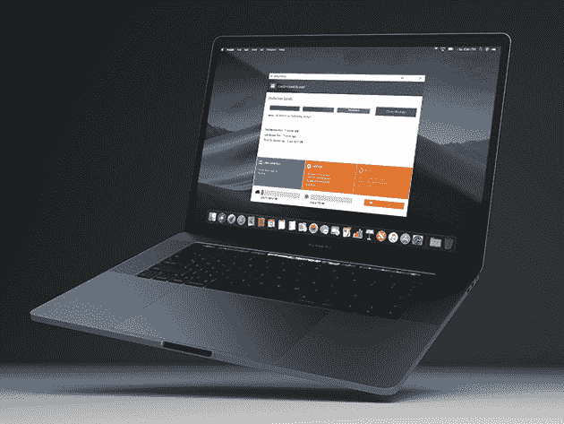
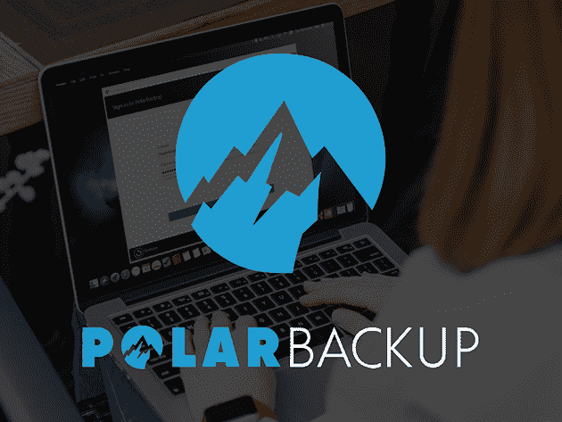

# 订购这些 VPN 和云存储服务可节省高达 95%的费用

> 原文：<https://www.xda-developers.com/save-up-to-95-on-these-vpn-and-cloud-storage-subscriptions/>

向任何网络安全专家询问他们的最佳建议，他们会建议使用 VPN 并备份你的文件。如果你想在不倾家荡产的情况下听从这个建议，可以去 XDA 开发者仓库看看这些交易。

## **keep solid VPN Unlimited:Infinity 计划(10 台设备)**

拥有遍布全球的 400 多台服务器和军用级加密，[KeepSolid VPN Unlimited](https://depot.xda-developers.com/sales/keepsolid-vpn-unlimited-lifetime-subscription-5?utm_source=xda-developers.com&utm_medium=referral&utm_campaign=keepsolid-vpn-unlimited-lifetime-subscription-5&utm_term=scsf-434877&utm_content=a0x1P000004YFBxQAO&scsonar=1)是一个很棒的选择。命名为 PC Mag 的顶级 VPN，这项服务为您的所有设备提供无限保护，绝对没有日志记录。价值 299 美元， [覆盖 10 台设备的终身订阅现在是 59 美元](https://depot.xda-developers.com/sales/keepsolid-vpn-unlimited-lifetime-subscription-5?utm_source=xda-developers.com&utm_medium=referral&utm_campaign=keepsolid-vpn-unlimited-lifetime-subscription-5&utm_term=scsf-434877&utm_content=a0x1P000004YFBxQAO&scsonar=1) 。

## **Degoo Premium:终身 10TB 备份计划**

****

凭借超过 Dropbox、OneDrive 和 Google Drive 总和的云存储空间，[Degoo Premium](https://depot.xda-developers.com/sales/degoo-premium-lifetime-backup-plans-10tb?utm_source=xda-developers.com&utm_medium=referral&utm_campaign=degoo-premium-lifetime-backup-plans-10tb&utm_term=scsf-434878&utm_content=a0x1P000004YFBxQAO&scsonar=1)让您备份所有设备。您的数据受到 AES-256 加密的保护，自动文件检测使一切保持最新。 [现在订购价格为 99.99 美元](https://depot.xda-developers.com/sales/degoo-premium-lifetime-backup-plans-10tb?utm_source=xda-developers.com&utm_medium=referral&utm_campaign=degoo-premium-lifetime-backup-plans-10tb&utm_term=scsf-434878&utm_content=a0x1P000004YFBxQAO&scsonar=1) 跳上终身 10TB 计划，价值 3600 美元。

## **ThunderDrive 云存储:终身订阅**

****

基于运行速度比亚马逊存储快 6 倍的 Tier IV 数据中心设施，[ThunderDrive](https://depot.xda-developers.com/sales/thunderdrive-cloud-storage-lifetime-subscription?utm_source=xda-developers.com&utm_medium=referral&utm_campaign=thunderdrive-cloud-storage-lifetime-subscription&utm_term=scsf-434879&utm_content=a0x1P000004YFBxQAO&scsonar=1)还可以在 256 位 AES 加密后保持您的文件锁定。它价值 1200 美元，但您现在可以花 59 美元 获得 [2TB 终身计划。](https://depot.xda-developers.com/sales/thunderdrive-cloud-storage-lifetime-subscription?utm_source=xda-developers.com&utm_medium=referral&utm_campaign=thunderdrive-cloud-storage-lifetime-subscription&utm_term=scsf-434879&utm_content=a0x1P000004YFBxQAO&scsonar=1)

## **EurekaDrive 启动计划:终身订阅(100GB)**

****

寻找网站存储？[eureka drive](https://depot.xda-developers.com/sales/eurekadrive-starter-plan-lifetime-subscription?utm_source=xda-developers.com&utm_medium=referral&utm_campaign=eurekadrive-starter-plan-lifetime-subscription&utm_term=scsf-434880&utm_content=a0x1P000004YFBxQAO&scsonar=1)为备份您托管的文件提供一个安全的家。该平台提供 30 天恢复、牢不可破的 SSL 安全性和 100GB 存储空间。终身订阅价值 195 美元，但你现在可以花 39 美元 [获得入门计划。](https://depot.xda-developers.com/sales/eurekadrive-starter-plan-lifetime-subscription?utm_source=xda-developers.com&utm_medium=referral&utm_campaign=eurekadrive-starter-plan-lifetime-subscription&utm_term=scsf-434880&utm_content=a0x1P000004YFBxQAO&scsonar=1)

## **Zoolz 家庭云备份:1TB 云备份存储**

****

长期备份的理想选择， [Zoolz](https://depot.xda-developers.com/sales/zoolz-cloud-backup-for-home-1tb-of-cloud-backup-storage-1-user-1-year?utm_source=xda-developers.com&utm_medium=referral&utm_campaign=zoolz-cloud-backup-for-home-1tb-of-cloud-backup-storage-1-user-1-year&utm_term=scsf-434881&utm_content=a0x1P000004YFBxQAO&scsonar=1) 使用基于超安全 AWS 基础设施的经济实惠的冷存储。这项服务可以自动备份您的计算机、硬盘驱动器，甚至 NAS。 [现在订购 19.99 美元](https://depot.xda-developers.com/sales/zoolz-cloud-backup-for-home-1tb-of-cloud-backup-storage-1-user-1-year?utm_source=xda-developers.com&utm_medium=referral&utm_campaign=zoolz-cloud-backup-for-home-1tb-of-cloud-backup-storage-1-user-1-year&utm_term=scsf-434881&utm_content=a0x1P000004YFBxQAO&scsonar=1) 终身获得 1TB，价值 199 美元。

## **极地云备份:终身订阅(2TB)**

****

针对 Mac 和 Windows 进行了优化， [极地备份](https://depot.xda-developers.com/sales/polar-backup-lifetime-subscription-2tb?utm_source=xda-developers.com&utm_medium=referral&utm_campaign=polar-backup-lifetime-subscription-2tb&utm_term=scsf-434882&utm_content=a0x1P000004YFBxQAO&scsonar=1) 使用重复数据删除和块级上传来实现更快的服务。您的数据受到 AES-256 加密的保护，并存储在 AWS 服务器上。由于双倍的降价，2TB 的终身套餐从 590 美元降到了 49.99 美元。

*价格随时变化*