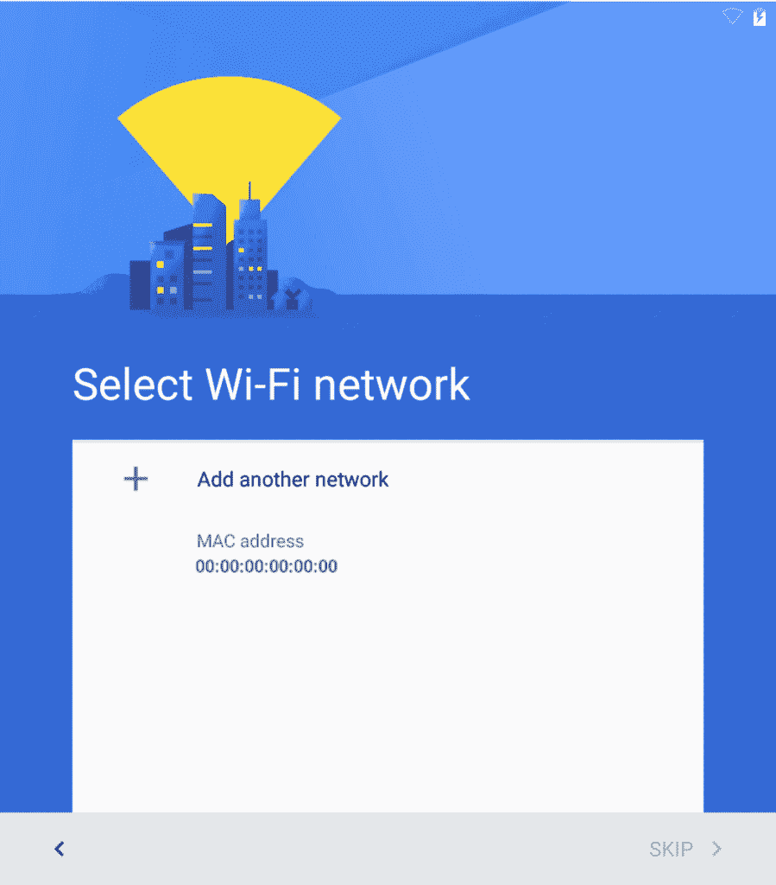
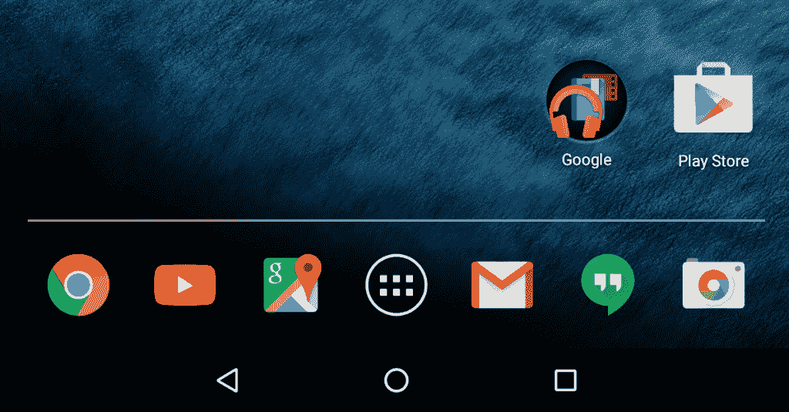
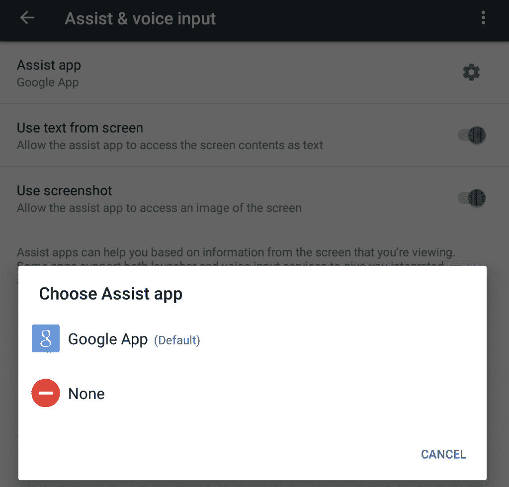
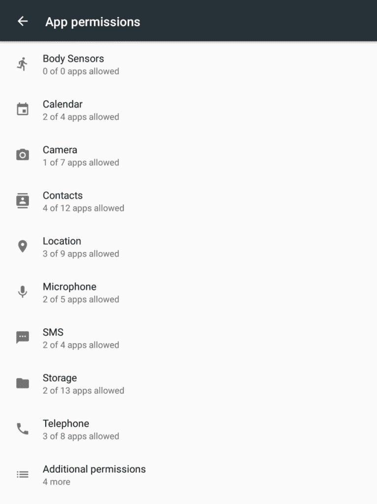
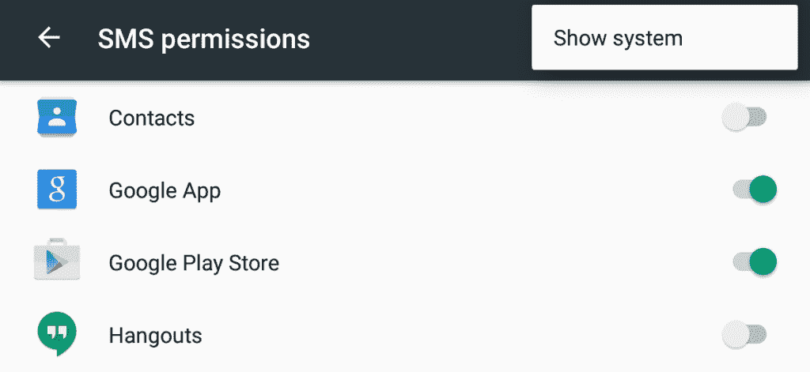
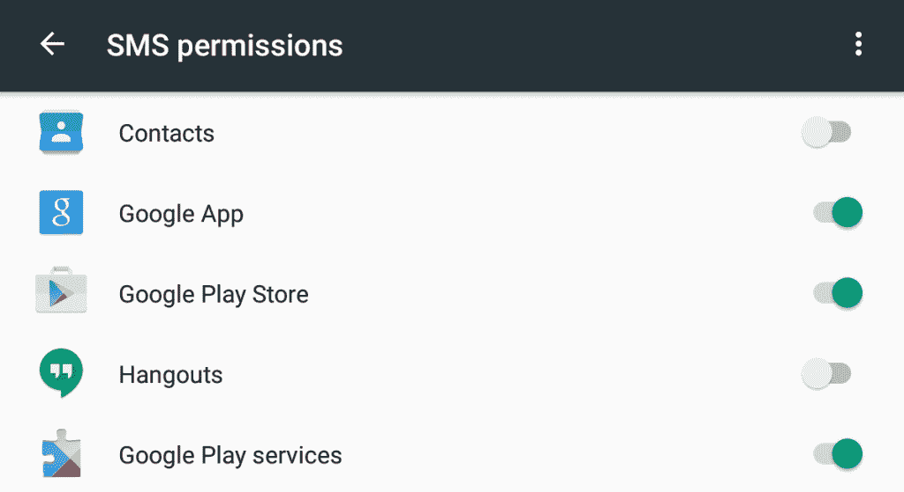
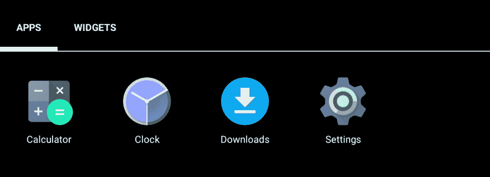

# 设置 Android 棉花糖，没有谷歌

> 原文：<https://www.xda-developers.com/setting-up-android-marshmallow-without-google/>

又到了一年中的这个时候——Android 仙女已经在世界各地的 Nexus 设备上洒满了灰尘，Android M (6.0)也来了！可惜的是，随着每一个新版本的 Android，与谷歌服务的深度整合都在增加。

虽然在很大程度上，谷歌擅长保持他们的 AOSP API 开放(参见 Dianne Hackborn 的这篇文章中关于谷歌和 AOSP 分离的一些讨论的例子)，但总有一些人(像我一样)宁愿将设备与外部服务联系的风险降至最低，他们宁愿将谷歌排除在他们的设备之外。

尽管如此，随着 M 的出现，无疑会有一些人尝试 M，他们希望了解更多保护自己的方法，本指南的大部分内容也适用于其他软件，因此它也是对管理 Marshmallow 上的权限和数据的介绍，以及新用户界面如何工作的一些奇怪之处。

> 对于大多数人来说，没有谷歌服务运行 Android 是不可想象的，但它实际上是相当令人耳目一新和解放的

本指南基于 Nexus 7 (2013)设备，因此请注意，其他设备上的某些内容可能会有所不同。最值得注意的是，您可能需要在使用硬件加密的设备上安装一个非验证内核，因为这些设备似乎在出厂时启用了 dm-verity。关于这意味着什么的更多信息，请看[这篇门户文章](http://www.xda-developers.com/a-look-at-marshmallow-root-verity-complications/)。

### 入门指南

 <picture></picture> 

Note that the "Skip" option is disabled

在 Android Marshmallow 上，经过(至少对我来说)长得离谱的启动(亲爱的谷歌，请使用 [WITH_DEXPREOPT](https://lists.omnirom.org/pipermail/maintainers/2015-August/000147.html) 制作图像)和稀疏的欢迎屏幕后，你会遇到的第一件事是登录 WiFi 的要求。不幸的是，至少在默认情况下，没有跳过这一步的选项。人们只能假设这是试图执行重新激活锁检查(出于防盗原因)。尽管如此，当你不能上网时，你当然可能想要设置一个平板电脑，或者可能只是不想让谷歌“打电话回家”。在这种情况下，您需要绕过它。引导到 TWRP(或类似的定制恢复，提供根 shell)和 mount /system(注意，如果设备强制执行 dm-verity，这样做会停止设备引导)。

在那里，运行以下命令，这将从安装向导中删除连接要求:

 `sed-I ' s/ro . setup wizard . network _ required = true/ro . setup wizard . network _ required = false/g '/system/build . prop

这改变了在设置期间需要网络的线路，从而不需要网络。当您在这里时，您可能还想防止系统用库存恢复覆盖您的自定义恢复。为此，只需将文件/system/recovery-from-boot.sh 重命名为其他名称，如/system/recovery-from-boot . disabled:

 `mv/system/recovery-from-boot . sh/system/recovery-from-boot . disabled

在这一点上，你会遇到光荣的发射器。全是谷歌软件！但是，嘿，这就是这篇文章的目的，所以让我们开始吧！除非你想，否则在这个过程的最后，你不需要上网。只为真正*偏执的*！

 <picture></picture> 

Lots of Googly bits on the stock launcher - let's get started!

### Android 设备管理器

默认情况下，谷歌启用 Android 设备管理器功能。如果你正在遵循这个指南，你会想要摆脱它(它有设备管理权限)-前往设置>安全，设备管理员，并**取消选中框。**

### 立即可用(辅助 API)

Android 6.0 的一个新功能是“辅助”API，它是为个人助理风格的应用程序(Google Now、Cortana 等)设计的，可以访问你屏幕上的任何内容，目的是提供上下文相关的建议。当您调用辅助功能时(通过按住 home 键)，所选的应用程序将接收当前屏幕的内容，除非正在显示的应用程序选择退出。在 [API 发布说明](http://developer.android.com/about/versions/marshmallow/android-6.0.html#assist)中有更多信息。无论如何，既然我们在这里删除任何谷歌，并得到一个股票 Nexus 图像削减回尽可能少的安装，是时候禁用它了。

 <picture></picture> 

Here you can select the assist app you want to use (or none)

幸运的是，Google 为 Assist API 特性添加了一个控件。它可以在设置>应用程序>目录(右上角) >默认应用程序>辅助和语音输入中找到。这不容易被发现，愤世嫉俗者会认为这可能是故意的，使其难以被发现或禁用。但一旦你到达那里，你可以点击“辅助应用”(不是有齿轮的部分)，你就可以选择**“无”**。如果您想在此处激活某个辅助应用程序，您也可以选择该应用程序的访问权限。

从一个关键的角度来看，在“无”上使用禁止入内的标志似乎是潜在地阻止你选择它。这对最终用户来说可能是公平的，但亲爱的读者，不要担心，你的手机或平板电脑不会因为选择这个而爆炸。如果您愿意，将来也可以再次启用它。

### 禁用权限

 <picture></picture> 

An overview of your apps' permissions on Android M

Android 6.0 提供了一个相当漂亮的功能来控制设备上应用程序使用的权限。它也适用于系统应用程序，尽管这在某种程度上是隐藏的。让我们向前看，看看如何控制谷歌软件使用的权限。前往设置>应用程序>目录(右上角) >应用程序权限。您将看到设备上的应用程序正在使用的各种权限的概述。

在这里，您可以输入一个类别来查看可以访问给定数据集的应用程序。不过有一点需要注意，那就是你所看到的并不是故事的全部。溢出菜单下有一个显示系统应用程序的选项。如果你关心手机上预装的应用程序，每次查看此菜单时，你都会想要使用它。

 <picture></picture> 

See the apps using permissions, note the overflow menu option to see system apps

一旦你启用了系统选项，你会更好地了解哪些应用程序已经声明了权限(尽管不是所有的应用程序最初都会启用它们)。请注意，Google Play 服务已经出现，并且确实启用了。如果您愿意，可以继续禁用对所有这些权限的访问。如果你想摆脱谷歌，继续前进可能是明智的。大多数可以删除，因为我们将在一分钟内完全禁用这些应用。

 <picture></picture> 

Google Play Services has made an appearance

### 禁用时间

现在是时候禁用你不需要的东西了。此时，关闭设备位置可能是个好主意(因为遵循本指南的任何人可能都希望禁用位置，除非他们选择其他方式)-设置在通常的位置，或者在设置菜单中，或者在下拉快速设置区域中。

> 你可以在棉花糖上从谷歌上删除几乎所有东西

如果你回到设置>应用程序，你现在可以开始考虑禁用手机上的谷歌软件。这让你摆脱了大部分的专有服务添加到你的设备之前，你得到了它。不过，还是那句话，先做最重要的事情！进入溢出菜单，并确保你点击“显示系统”，以阻止系统隐藏谷歌服务的一些更根深蒂固的部分。在这一点上，我们应该给予谷歌应有的信任——虽然他们确实将自己的服务紧紧缠绕在 ROM 上(以至于他们[可能因捆绑销售而受到反垄断调查](https://recode.net/2015/09/25/googles-android-bundle-moves-further-into-antitrust-crosshairs/)),但他们至少给了你摆脱它们的选择(禁用一个软件包与摆脱它几乎是一样的，任何臃肿软件消除爱好者可能都会证明这一点)。

如果你想删除谷歌上的所有内容，我会试着突出显示你可能想删除的内容。要删除一个应用程序，在列表中点击它，并使用下一个屏幕中的“禁用”按钮将其驱逐到禁用应用程序区域的深处。虽然你可以按任何顺序来做，但我建议按这个顺序来做，以防你得到不同的行为(在本文的测试中，我发现有些情况下你不能完全禁用谷歌核心服务的某些部分，我怀疑这可能是因为最后禁用了那些部分)。请注意，你可能不想摆脱所有这些，但这取决于你-这都是关于有选择这样做，并作出自己的决定。

| 

应用名称

 | 

笔记

 |
| --- | --- |
| Google Play 服务 | 谷歌服务产品的核心——去除这一点会破坏使用 Play 服务的应用，但这是将谷歌从你的设备中完全驱逐出去的良好开端 |
| 谷歌服务框架 | Google Play 服务的孪生兄弟。如果你要除掉一个，那就两个都除掉！ |
| 日历 | 既然 F-Droid 上有一个[开源的、几乎一模一样的](https://f-droid.org/repository/browse/?fdid=ws.xsoh.etar)，为什么还要使用一个“专有的”谷歌日历呢？ |
| 照相机 | 我将把这一个留给你，虽然你应该注意到发货的照相机可能与在 AOSP 的不相同。如果你关心软件的自由和再现性，你可能想用 AOSP 相机代替。 |
| 铬 | 链接到谷歌服务的专有浏览器——你可能想看看开源的 Firefox 浏览器，或者 Chromium 的源代码版本。 |
| 云打印 | 我不希望通过云打印——我认为阅读这篇文章的人也是如此。 |
| 联系人 | 希望有人会制作一个独立版本的 AOSP 联系人应用程序，就像上面的日历一样。 |
| 设备策略 | 它的中间有一个谷歌图标！这似乎与将企业策略应用到您的设备有关。您可能不需要这个，而且它可能已经默认为您禁用了 |
| 文件（documents 的简写） | 想让谷歌看到你编辑的所有文档吗？不，我也不知道。已禁用，期待 Android 上 [LibreOffice 的进展。](https://f-droid.org/repository/browse/?fdid=org.documentfoundation.libreoffice) |
| 驱动器 | 想把你所有的文件都储存在谷歌的服务器上？不，我不这么认为。已禁用，请查看 [OwnCloud](https://f-droid.org/repository/browse/?fdid=com.owncloud.android) ,获取存储方面的开放式替代方案 |
| 谷歌邮箱 | 至此，你可能已经明白了——你想让谷歌扫描你的电子邮件来获取个人信息和广告吗？不...让我们摆脱它吧——股票电子邮件应用程序(你需要从 AOSP 编译它，现在谷歌已经把它干掉了),或者 K9，这两个都可以很好地用于 IMAP 和 Exchange 邮件(AOSP 在这方面更好)。 |
| 谷歌客户经理 | 嗯，现在你不需要谷歌账户了，对吧？ |
| 谷歌应用 | 如果你不想让你的设备总是监听，以防你碰巧说“好吧谷歌”，或者如果你只是一般不喜欢谷歌，摆脱这一点。 |
| 谷歌备份传输 | 如果你已经做到了这一步，你不可能让谷歌得到你的备份，所以让我们摆脱它！ |
| 谷歌连接服务 | 可能和菲有关？无论如何，在没有源代码库的情况下，如果你想尽可能只运行开源软件，去掉它可能是明智的。 |
| Google 联系人同步 | 谷歌不需要知道你在和谁说话——看看 [DavDroid](https://f-droid.org/repository/browse/?fdid=at.bitfire.davdroid) 的开源标准兼容解决方案，允许你与 OwnCloud 等自托管 CardDav 服务器同步联系人。 |
| 谷歌键盘 | 它包含一些处理滑动的专有代码，所以你可能需要安装另一个键盘并移除它。 |
| Google 一次性初始化 | 如果你不使用谷歌，为了干净起见，不妨把它去掉！ |
| Google 合作伙伴设置 | 这里不需要谷歌合作伙伴！ |
| Google Play * | 如果你不想在你的设备上使用谷歌，留着这些也没用。他们都依赖于谷歌的其他服务 |
| 谷歌文本到语音引擎 | 你可能不想给谷歌发信息让它读给你听？ |
| 谷歌+ | 至此你明白了。任何极端的人都不会使用社交网络！ |
| 聚会场所 | 你不会通过谷歌的服务器向我的服务器发送信息，对吗？一个开源的替代 XMPP 聊天客户端是 [Conversations](https://f-droid.org/repository/browse/?fdid=eu.siacs.conversations) 。 |
| 保持 | 别碰我们的购物清单，谷歌！开源替代方案 |
| 地图 | 你不会希望有人跟踪你的。有很多不错的开源映射解决方案[出](https://f-droid.org/repository/browse/?fdid=net.osmand.plus)T2 出。 |
| 市场反馈代理 | 你不可能在这一点上使用 Play Store，所以他们的反馈软件也没用 |
| 照片 | 这些似乎与 Google+ Photos 服务有关，你不会希望 Google 在你的私人照片上学习人脸识别。 |
| 打印假脱机系统 | 人们真的用手机和平板电脑打印？好吧，反正你大概禁用了云打印！ |
| 工作表 | 通过谷歌的电子表格？别管闲事 |
| 幻灯片 | 通过谷歌演示？不，谢谢，看看像 [Impress 这样的东西。JS](https://github.com/impress/impress.js) ，可以制作 HTML 可视幻灯片 |
| Google Play 的声音搜索 | 不，谢谢，我不想让你听到我听到的 |
| 油管（国外视频网站） | 你可以通过 Firefox 等开源浏览器访问 YouTube，并使用 uBlock 来阻止谷歌的追踪。或者你可以看看[开源媒体平台](http://www.mediagoblin.org/)。 |

如果你成功了，恭喜你。你现在已经得到了你真正能得到的尽可能多的无谷歌设备，而不用去从头开始编译 AOSP。

 <picture></picture> 

Look Ma, no Google!

### 最后

如果你想下载软件，建议你看一下[F-Droid](https://f-droid.org/)F-Droid 是一个开源软件的集合，你可以自由下载、分享、使用、检查、修改和学习。显然，这并不适合所有人——对大多数人来说，没有谷歌服务就运行 Android 是不可想象的，但它实际上可以非常令人耳目一新和自由——如果你不太依赖谷歌服务，你可以获得一部非常耐用的手机，电池续航时间惊人，同时仍然可以访问电子邮件和其他你需要的应用程序。

这篇文章旨在了解谷歌服务是如何从安卓中分离出来的，令人欣慰的是，你可以在棉花糖上删除谷歌的几乎所有内容。除了第一步(在设置过程中停止设备使用 WiFi)，所有这些都不需要 root。

你认为你的手机上没有任何谷歌服务也能应付吗？你已经移除谷歌服务了吗？请在下面的评论中告诉我们你的想法。哦，你现在可以去开通 WiFi，储备一些锡纸或者买一些法拉第口袋。``