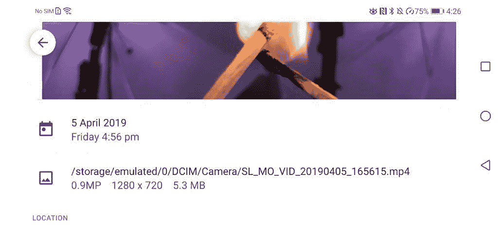

# 在荣誉视图上以 960fps 拍摄 20[视频]

> 原文：<https://www.xda-developers.com/shooting-at-960fps-on-the-honor-view20-video/>

Honor View20 有一个慢镜头选项，可以以 120fps、240fps 和 960fps 拍摄。这种超高速帧速率以 30fps 回放，以创建一些真正令人惊叹的慢动作镜头，前提是你选择了正确的主题。上面的视频展示了使用 Honor View20 慢动作摄像机进行的一些测试。

| 

帧频

 | 

解决

 |
| --- | --- |
| 120fps | 1080x1920 |
| 240fps | 720x1280 |
| 960fps | 720x1280 |

当以 960fps 拍摄时，你有大约一秒钟的短暂时间来捕捉动作。镜头被放慢到大约 10 秒，以产生慢动作效果。这个截屏显示了一个剪辑的信息，其大小为 5.3MB。

 <picture></picture> 

Slow motion 960fps videos are filmed at 720p resolution.

[**荣誉观 20 论坛**](https://forum.xda-developers.com/honor-view-20)

*编者按:*Honor view 20 无法真正录制 960fps 的超慢动作视频。View20 加入了像[小米 Mix 3](https://www.xda-developers.com/xiaomi-mi-mix-3-960-fps-galaxy-note-9/) 这样的产品，使用帧插值来填充间隙，使它看起来像真的是 960fps。尽管 View20 上的图像传感器能够达到 720p@480fps，所以它只需要每隔一帧进行插值。索尼 IMX586 缺乏专用的 DRAM 芯片，在将捕获的大量帧传递到图像缓冲区并最终写入存储之前，需要临时存储这些帧，因此它无法管理每秒记录 960 帧。真正具有 960fps 视频录制功能的智能手机只有索尼 Xperia XZ 旗舰产品和三星 Galaxy S9 旗舰系列和其他产品。也就是说，如果你不太仔细地看主题，并且避免像流水这样的困难主题，View20 上 960fps 的记录是可以接受的。