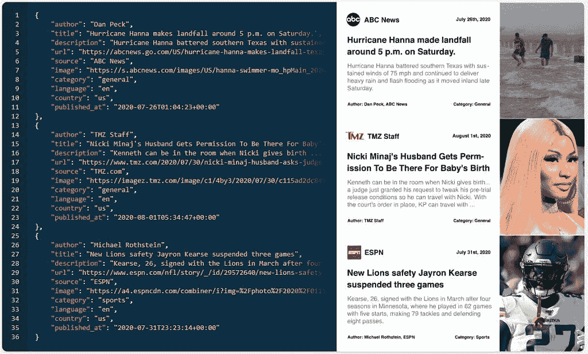

# 简单的 REST API，用于在应用程序中实现新闻数据

> 原文：<https://www.xda-developers.com/simple-rest-api-for-implementing-news-data-into-your-app/>

如果你想在你的应用程序或网站中实现新闻订阅，mediastack 可能是你的最佳选择。Mediastack 提供了一个强大的 API，可以从各种不同的新闻来源中提取数据。这个 API 可以向用户显示实时和历史新闻数据。您将能够访问一个实时新闻数据的世界，发现趋势和头条新闻，监控品牌，并访问世界各地的突发新闻。

这个强大的 REST API 兼容 50 多个国家。你将能够以 13 种语言获取所有这些不同国家的新闻。访问 7，500 多个新闻来源，获取与您的主题相关的数据。这是向您的应用程序或网站添加自定义新闻功能的简单方法。

*   实时新闻数据
*   历史新闻数据
*   新闻标题
*   7500 多个新闻来源
*   50 多个国家
*   13 种语言

 <picture></picture> 

News publishers can be unpredictable, dynamic and difficult to keep track of. Using our easy-to-implement REST API you will be able to retrieve news information of any type, delivered on a silver platter — see for yourself!

开始很容易。免费试用 mediastack API，看看它是否是适合您的解决方案。他们的免费计划会给你每月 500 个电话。付费计划每月将为您提供高达 250，000 次通话。目前，超过 2，000 人在他们的新 API 中使用 mediastack。每天都有数千篇文章被添加到他们的数据库中。

新闻发布者是不可预测的，动态的，难以跟踪的。使用我们易于实现的 REST API，您将能够检索任何类型的新闻信息，这些信息是以银盘形式交付的——自己看吧！

[**在 MEDIASTACK.COM**入门](https://mediastack.com/)

###### 我们感谢 mediastack 赞助了这篇文章。我们的赞助商帮助我们支付与运行 XDA 相关的许多费用，包括服务器成本、全职开发人员、新闻撰稿人等等。虽然您可能会在门户内容旁边看到赞助内容(这些内容将始终被标记为赞助内容),但门户团队对这些帖子不承担任何责任。赞助内容、广告和 XDA 仓库完全由一个独立的团队管理。XDA 绝不会通过接受金钱来赞扬一家公司，或以任何方式改变我们的观点或看法，从而损害其新闻诚信。我们的意见不能被收买。