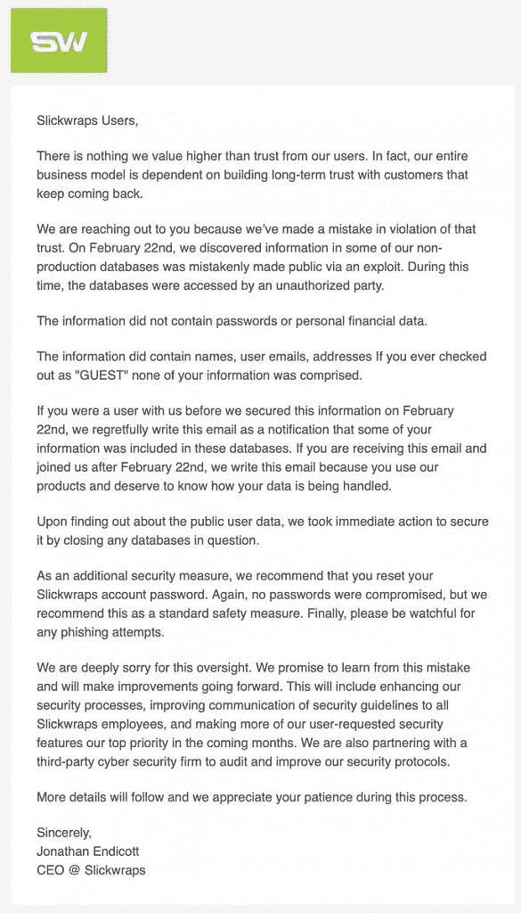

# 智能手机皮肤制造商“Slickwraps”遭到黑客攻击，其客户数据被曝光

> 原文：<https://www.xda-developers.com/slickwraps-smartphone-skins-data-breach/>

如果你曾经从 Slickwraps 购买过皮肤，你今天可能会收到一封令人担忧的电子邮件(一定要检查你的垃圾邮件文件夹)。这封名为“收件人:所有 SLICKWRAPS 客户”的电子邮件解释说，该公司遭到黑客攻击，数千名用户的信息处于危险之中。如果这听起来很糟糕(确实如此)，情况会变得更糟。

那封电子邮件*实际上不是由 Slickwraps* 发出的，而是由能够从他们的客户数据库中访问 377，428 个电子邮件地址的人发出的。所有这一切都始于一名安全研究员在 [Twitter 上以@Lynx0x00](https://twitter.com/Lynx0x00/status/1230848719630880774?s=20) 为名发布的一篇中型帖子半病毒式传播。Medium 帖子(在发布时已被暂停)解释了他们是如何由于该公司糟糕的安全实践而入侵 Slickwraps 的。Lynx 能够获得如此多的访问权限，以至于他们基本上可以“删除整个公司”

对于过去购买过 Slickwraps 皮肤的人来说，更重要的是客户数据不受保护。Slickwraps 最终发出了一封官方的电子邮件，声称只有姓名、用户电子邮件、地址被暴露，但密码或个人财务数据没有被暴露。这在发送的第一封“收件人”电子邮件中显而易见，其中包括收件人的地址和*的电话号码*(slick wraps 没有提到)。

 <picture></picture> 

A copy of the email that Slickwraps sent to its customers affected by the breach.

这种说法暗示他们今天(2 月 22 日)才被告知违规？)，基于中帖所透露的内容，这是不真实的。他们还声称只有创建账户的用户的信息被泄露，但这似乎也不是真的。Slickwraps 已经关闭了他们的数据库，他们现在正与一家未具名的第三方网络安全公司合作，以提高安全性。

Slickwraps 表示，更多的细节将随后公布，但目前，他们建议用户重置密码。然而，损害已经造成了，既损害了顾客的个人数据，也损害了 Slickwraps 的声誉。我们强烈建议你在这里阅读原始[媒体帖子的存档版本，以了解这是如何展开的整个故事。它并没有描绘出该公司的美好前景。](http://archive.is/yEIJT#selection-733.28-733.57)