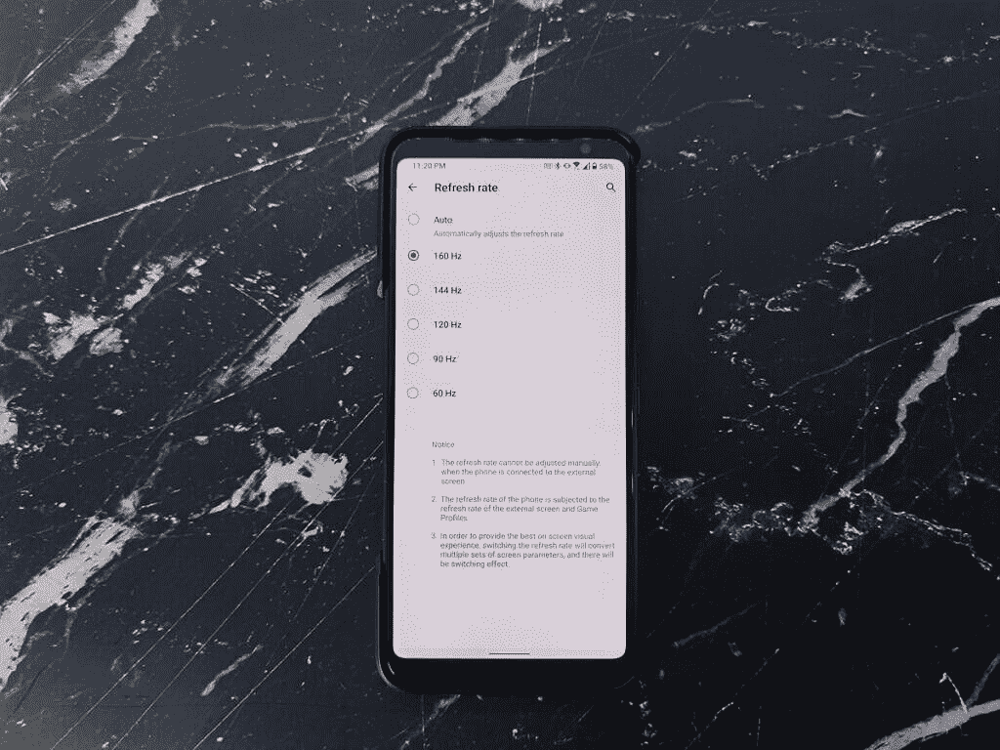
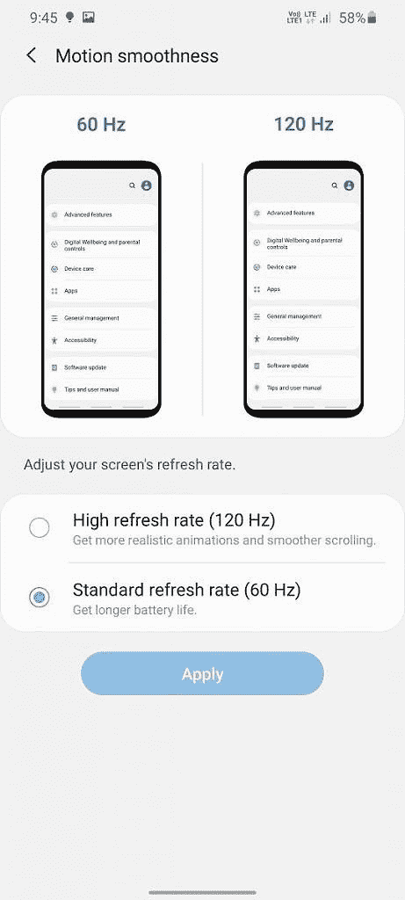
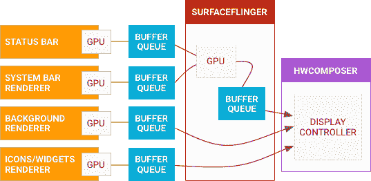

# 什么是刷新率？Galaxy Note 20 的自适应刷新率讲解！

> 原文：<https://www.xda-developers.com/smartphone-display-refresh-rates-explained/>

如今，智能手机上更高刷新率的显示屏风靡一时。我们经常遇到智能手机公司和技术爱好者谈论更快更平滑的显示屏，并积极使用 90Hz、120Hz 甚至 144Hz 等术语。大多数设备制造商不仅倾向于更高的刷新率，而且还强烈地将它们作为更好的显示质量的指标。刷新率是显示器的属性；它以赫兹(Hz)为单位，通常被营销人员用来强调更流畅的用户体验。

PC 显示器厂商靠刷新率诱惑用户已经好几年了。然而，当谈到智能手机时，高于正常刷新率是一个相对新颖的功能——因此，相当炒作。直到去年推出[一加 7 Pro](https://forum.xda-developers.com/oneplus-7-pro) ，显示屏[刷新率才成为智能手机发烧友和科技记者的焦点话题](https://www.xda-developers.com/oneplus-7-pro-confirmed-better-display/)。[一加 7 Pro 推出时配有 90Hz 显示屏](https://www.xda-developers.com/the-oneplus-7-pro-is-here-with-a-90hz-qhd-display-snapdragon-855-and-up-to-12gb-of-ram/)，比当时 60Hz 的标准高出 50%。自那以后，许多智能手机公司，包括三星、谷歌、小米、Realme、OPPO、Vivo 和其他公司，都纷纷效仿，在其旗舰产品甚至中端设备上推出了更平滑的显示屏。

虽然一加可以被认为给移动消费者带来了更高的刷新率，但实际上是 PC 硬件制造商 Razer 在一加之前一年在第一代 Razer 手机上推出了 120Hz 显示屏。尽管 Razer 经常被认为推动了更高刷新率显示器的趋势，但事实上，日本的夏普是第一个在 2015 年推出 120Hz 显示屏智能手机的品牌。

但在我们看一看所有推出的刷新率高于 60Hz 的流行手机之前，我们有必要解释一下这一特性本身。

## 刷新率是多少？

智能手机显示屏总是在工作，完成的事情比想象的要多得多。每次必须呈现新的东西时，显示器上的每个像素都必须更新。除了少数例外[像 OnePlus 5](https://www.xda-developers.com/confirmed-oneplus-5-display-upside-down-likely-reason-jelly-scrolling/) ，像素从上到下更新，整行像素一次刷新。当所有像素行从上到下更新时，显示器已经刷新了一次。因此，显示器的刷新率是显示器更新或刷新的频率。

大多数电视、电脑显示器和智能手机显示器的典型刷新率为 60Hz。60Hz 的刷新率意味着显示器每秒刷新 60 次。换句话说，显示器上的图像每 16.67 毫秒更新(或刷新)一次。一帧或图像占据显示器的持续时间称为刷新时间。正如所料，刷新时间与任何显示器的刷新率成反比。

 <picture></picture> 

ASUS ROG Phone 3 refresh rate selector

类似地，90Hz 显示器每秒刷新 90 次，而 120Hz 显示器每秒刷新 120 次。因此，90Hz 和 120Hz 显示器分别具有 11.11ms 或 8.33ms 的较小刷新时间值。因此，具有更高刷新率显示屏的智能手机必须能够应对每秒推动更多像素带来的额外负载。

虽然人类无法感知这些瞬间的变化——除非是水银、闪光，或者是[、T1、、T3——但是可以用慢动作](https://pixar.fandom.com/wiki/Dash_Parr)观察到[。但是如果你不能观察到帧的变化，那么是什么使得从 60Hz 到 90Hz、120Hz 或 144Hz 的刷新率的跳跃如此明显呢？](https://www.youtube.com/watch?v=Hzyrm_aJOik)

## 更高(90Hz、120Hz 或 144Hz)刷新率的优势

以上问题的答案在于动画。虽然我们看不到一个刷新的帧，但我们肯定可以在智能手机的显示屏上看到更平滑的连续帧。播放相同的动画时，以 90Hz 刷新的显示器产生的帧数是 60Hz 显示器的 1.5 倍，即 50%。作为额外帧的结果，在 90Hz 甚至 120Hz 的显示器上，动画期间的运动看起来更平滑。

这并不意味着更高的刷新率实际上会影响动画的速度。你可以把它想象成在 YouTube 上观看每秒 24 或 30 帧(FPS)的视频和每秒 60 帧的视频之间的区别。

## 更高刷新率的危险

尽管它对 UI 流畅性有很多好处，但更高刷新率的显示器有一个明显的缺点，那就是功耗增加。与 60Hz 相比，当显示器刷新率设置为 90Hz 时，手机会消耗更多的功率，因为为每个动画渲染更多的帧需要额外的工作。因此，120Hz 刷新率模式比 60Hz 或 90Hz 模式消耗更多的功率——假设我们在同一显示器上比较这些刷新率。

考虑到这种额外的功耗，许多设备制造商在其定制的 Android 软件中提供了“自动”刷新率切换模式的选项。通常，这些“自动”模式会根据应用程序、亮度水平、电池电量或其他因素，在设定值之间改变显示器刷新率，例如，在支持高达 90Hz 刷新率的显示器上，在 60Hz 和 90Hz 之间。这种自动切换可以优化电池的使用，同时确保用户拥有良好的体验。

## 刷新率趋势

在一加 7 Pro 推出后，智能手机行业对更高刷新率显示器的需求激增，使夏普和雷蛇的努力黯然失色。在一加 7 Pro 之后推出的其他一些采用 90Hz 显示屏的手机包括[努比亚红色魔法 3](https://www.xda-developers.com/nubia-red-magic-3-review/) 、[像素 4 和 4XL](https://www.xda-developers.com/google-pixel-4-4-xl-display-analysis/) 、[一加 7T](https://www.xda-developers.com/oneplus-7t-review-premium-practical-smartphone/) 、[一加 7T Pro](https://www.xda-developers.com/oneplus-7t-pro-xda-review/) 、 [Realme X2 Pro](https://www.xda-developers.com/realme-x2-pro-xda-review/) 和 [OPPO Reno3 Pro](https://www.xda-developers.com/oppo-reno3-pro-5g-quad-rear-camera-china-launch/) 。[华硕领先竞争对手](https://www.xda-developers.com/asus-rog-phone-ii-120hz-display-game-list/)，在 [ROG 手机 II](https://www.xda-developers.com/asus-rog-phone-ii-specs-features-pricing-availability/) 上推出了第一款 120Hz AMOLED 显示屏，结束了我们在 2019 年看到的高刷新率显示屏战争。

2020 年，包括小米和摩托罗拉在内的更多智能手机公司加入了这一潮流，在 [Mi 10/Mi 10 Pro](https://www.xda-developers.com/xiaomi-mi-10-pro-launched-globally-snapdragon-865-108mp-camera-90hz-display/) 和 [Edge/Edge+](https://www.xda-developers.com/motorola-edge-edge-plus-announced/) 旗舰智能手机上安装了 90Hz AMOLED 显示屏。与此同时，一加和 OPPO 加大了赌注，分别为其旗舰产品[一加 8 Pro](https://www.xda-developers.com/oneplus-8-pro-review-never-settle-on-hardware/) 和 [OPPO Find X2 Pro](https://www.xda-developers.com/oppo-find-x2-pro-hands-on-first-impressions/) 配备了 120Hz 刷新率的四核高清 AMOLED 显示屏。三星自己终于在今年进入了这个领域，尽管它已经是高刷新率有机发光二极管面板的最大供应商，其 [Galaxy S20 系列](https://www.xda-developers.com/samsung-galaxy-s20-specs-features-pricing-availability/)，三种型号都支持全高清分辨率下的 120Hz 刷新率。

 <picture></picture> 

Samsung Galaxy S20 Ultra refresh rate selector

随着一加、OPPO 和三星与华硕早些时候提供的高刷新率体验相匹配，这家台湾公司更进一步，推出了配备 144Hz 显示屏的华硕 ROG 手机 3(T1)，可以超频到 160hz(T3)。这是迄今为止我们在商用智能手机上看到的最高刷新率。与此同时，许多设备制造商选择了刷新率为 90 或 120Hz 的液晶显示器，从而在更实惠的设备上获得更流畅的显示体验。受益者名单包括旗舰杀手，如 [Realme X3 SuperZoom](https://www.xda-developers.com/realme-x3-superzoom-review-an-actual-flagship-killer/) 和中端表演者，如 [Redmi K30](https://www.xda-developers.com/xiaomi-redmi-k30-5g-4g-120hz-display-snapdragon-765g-64mp-sony-imx686-china-launch/) 、 [POCO X2](https://www.xda-developers.com/poco-x2-review-better-than-poco-f1/) 、 [Realme X50 5G](https://www.xda-developers.com/realme-x50-5g-snapdragon-765g-120hz-master-edition-ui/) 、 [Realme 6/6 Pro](https://www.xda-developers.com/realme-6-6-pro-launched/) 等等。

这项技术在智能手机上比一加 7 Pro 推出前更加普遍。然而，设备制造商仍然将他们关于更高刷新率的谈话限制在对用户的好处上，而没有解释实际上是什么实现了更流畅的体验。下面的部分阐述了 Android 智能手机上高刷新率显示器的工作原理，并强调了其他组件的作用，包括 CPU、GPU，有时还包括一个称为 DPU 的专用芯片。

## Android 渲染的工作原理

正如我们之前提到的，典型的智能手机显示屏每秒钟刷新一帧 60 次。绘制每一帧的信息由 CPU 和 GPU 处理，并根据设备的处理能力以一定的速度推出。CPU 和 GPU 处理数据并发送到显示器的速率称为帧速率，用每秒帧数(FPS)表示。帧速率，可互换地称为 FPS，相对来说比刷新率更常见，但两者经常被混淆为相同的。

与显示器的刷新率不同，智能手机的刷新率通常是恒定的，帧率会根据应用及其对 CPU-GPU 的影响等因素而变化。60Hz 的显示器每秒能够绘制 60 帧。同样，刷新率为 90Hz、120Hz 或更高的显示器每秒分别能够绘制 90、120 或更多帧。虽然这些是显示器刷新的速度，但帧速率取决于 CPU 和 GPU 处理将帧绘制到显示器所需信息的速度。为了进一步理解这一点，理解智能手机显示器如何呈现不同的图像或帧是很重要的。

我们在智能手机屏幕上看到的不是单个图像或元素，而是多个元素的组合，称为“层”这些不同的层可能包括状态栏、主屏幕或活动应用程序、各种小工具和窗口，以及导航栏(如果你还没有切换到[导航手势](https://www.xda-developers.com/google-gesture-navigation-android-10/)。)这些图层由一个名为 [SurfaceFlinger](https://source.android.com/devices/graphics/surfaceflinger-windowmanager) 的 Android 服务组合成一幅图像。来自所有这些不同层的信息以数据队列的形式发送，并以先入先出方式工作的缓冲区的形式组合。SurfaceFlinger 将所有这些层组合成一个表面，并控制这个缓冲队列流向显示器 [HAL](https://source.android.com/devices/architecture/hal) 。

 <picture></picture> 

SurfaceFlinger buffer queue portraying the flow of graphics data in Android. [Source](https://source.android.com/devices/graphics)

该缓冲队列确保新的帧或图像仅在准备好呈现该图像时才被发送到显示器。正如你所记得的，一个典型的 60Hz 显示器需要 16.67 毫秒才能完全刷新，SurfaceFlinger 负责确保一个帧在显示器上停留一个刷新周期，而下一个帧只有在 16.67 毫秒过去后才会被推送。你可以想象 SurfaceFlinger 的工作方式类似于十字路口的交通指挥阻止司机堵塞道路。

整个过程，从应用程序渲染一帧开始，到该帧在显示器上呈现，包括五个步骤，由谷歌所谓的 [Android 编排器](https://android-developers.googleblog.com/2020/04/high-refresh-rate-rendering-on-android.html)控制。设计者通过优化每步花费的时间来控制每帧的渲染时间，以确保有足够的帧缓冲。谷歌工程师在谷歌 I/O 2018 期间发表了关于“【Android 如何渲染的演讲，我们建议您观看以下内容，了解整个过程:

正如您所看到的，与 60Hz 显示器相比，90Hz、120Hz 或 144Hz 显示器的刷新时间要短得多，导致编排器处理和呈现每帧数据的持续时间更短。应用程序或系统很可能无法满足更快的帧传输要求。在这种情况下，帧速率被简单地削减到等于多个刷新时间周期的更大间隔，而不是仅仅一个；例如，不能维持以 60fps 运行的游戏不得不在 60Hz 显示器上降低到 30fps 渲染，以便看起来流畅，因为显示器被限制为以 16.6 毫秒的倍数呈现图像。(这特别与以静态刷新率操作的显示器相关。)下面是具有静态刷新率的 120Hz 显示器的工作原理:

120Hz 的显示器每 8.33 毫秒刷新一次，并且必须每 8.33 毫秒接收一个新帧，以保持 120FPS 的帧速率。如果应用程序或智能手机产生下一帧需要更长的时间，比如 10 毫秒，那么编排器会显示当前帧两次，即。持续 16.6 毫秒(2x 8.3 毫秒)，导致视在帧速率减半或降低至 60FPS。这是由于 [VSYNC](https://www.youtube.com/watch?v=1iaHxmfZGGc) (垂直同步)，这是一种防止新帧在没有完全渲染的情况下从缓冲区推送到显示器的技术。[在 Android 上，VSYNC](https://source.android.com/devices/graphics/implement-vsync) 优化了应用程序和其他进程的唤醒时间，以最大限度地减少口吃。

此外，帧速率可以进一步降低到每帧 3、4 或 5 个刷新周期，从而达到 40FPS (120/3)、30FPS (120/4)、24FPS (120/5)或更低的帧速率。同样，同时支持 90Hz 和 120Hz 模式的显示器可以支持更大范围的帧速率，如 120FPS、90FPS、60FPS (120/2)、45FPS(90/2)、40FPS(120/3)、30FPS(90/3)、24FPS(120/5)等。

如果 CPU-GPU 渲染帧的速率与上面指定的这些值不同步，我们可能会看到由于帧速率和刷新率不一致而导致的断断续续或抖动。尽管使用了 VSYNC，jank 或假信号仍然是具有静态刷新率的显示器的主要问题。幸运的是，Android 中的 UI 子系统使用了一种叫做“ [render ahead](https://android-developers.googleblog.com/2020/04/high-refresh-rate-rendering-on-android.html) 的技术，将一帧的呈现延迟了一个 vsync 这可以将吞吐量保持在 90Hz，同时给应用程序 21 毫秒而不是 10 毫秒来产生一帧。

这就让我们想到了一个问题:为什么大多数智能手机显示屏的刷新率都是静态的？目前的答案是，因为显示器的视觉输出随其刷新率而变化，制造商必须针对不同的刷新率对显示器进行不同的校准。因此，坚持静态刷新率值是为每种支持的显示模式编码单独校准的安全方式。显示器制造商一直依赖液晶显示器的非静态替代品，三星刚刚为有机发光二极管显示器提出了一个解决方案，我们将在后面的章节中讨论。

### 视觉增强专用芯片

另一个组件在视频信号链中的 SurfaceFlinger 到达显示控制器之前加速该复合层。这个组件被称为显示处理单元或 DPU。DPU 通常是 SoC 上的专用组件，通过处理显示旋转、图像缩放和软件增强等任务来分担 GPU 上的负载。大多数中端和高端智能手机 SOC 都配有与 GPU 一起工作的专用 dpu。一些 dpu 的例子包括 ARM 的 Mali-D71 或高通的 Adreno 系列，补充了 GPU 的 Adreno 系列。

一些旗舰设备也可能附带一个额外的芯片来增强视觉效果。例如，一加 8 Pro 和 OPPO Find X2 Pro 就是其中两款使用 Pixelworks 的 [Iris 5 芯片的设备。这可以用来加速像](https://www.xda-developers.com/pixelworks-iris-5-visual-processor-android-display-experience-oppo-find-x2/) [MEMC](https://www.xda-developers.com/oneplus-8-memc-youtube-netflix-vlc/) 这样的功能，以实现更平滑的图像渲染，自动调整显示亮度、对比度或白平衡，SDR 到 HDR 的升级，或其他图像质量的增强。除了视觉增强之外，Iris 5 芯片还可以通过将部分处理从主 SoC 卸载来提高设备的能效，从而在以更高的刷新率运行时降低电池功耗。

## 显示器如何处理更高的刷新率？

来自显示处理器或 DPU 的渲染帧和数据被发送到显示控制器，显示控制器控制水平像素带的更新，从而在显示器上呈现每个新帧。

如果队列中没有更多的输入帧——假设 CPU 过热，无法持续渲染帧，显示器会维持一帧，直到新的帧进入，这称为“面板自刷新”对于用户来说，这种粘性帧在智能手机上可能看起来像是冻结的。

正如我们上面解释的，智能手机制造商必须校准显示器参数，以输出所需的亮度、色调和温度、伽马值等。用于不同的显示模式。XDA 的显示器分析师[迪伦·拉加](https://www.xda-developers.com/author/dylan-raga/)在他的[谷歌 Pixel 4/4XL 显示器分析](https://www.xda-developers.com/google-pixel-4-4-xl-display-analysis/)、*中指出，完美的校准在大规模生产中几乎是无法实现的。*“失误往往会导致性能和色彩输出的变化，这在较低亮度时最为明显，这也是为什么 [Pixel 4/4XL 在发布时会在低亮度时将刷新率降至 60Hz](https://www.xda-developers.com/google-pixel-4-why-90hz-limited-brightness/)。

这些限制迫使设备制造商仅针对单一或少量显示模式校准他们的显示器。由于这一限制，大多数设备无法按需无缝切换到更低的刷新率以降低功耗。然而，最近的一项进展使三星得以进军[制造第一款支持真正动态或可变刷新率切换的智能手机有机发光二极管显示屏](https://www.xda-developers.com/samsung-galaxy-note-20-ultra-first-phone-new-vrr-variable-refresh-rate-oled-display/)。

动态刷新率意味着显示器的刷新率根据推送到显示器的内容的帧速率进行调整。这可以产生更平滑的滚动和动画。可变刷新率的概念已经在 PC 游戏玩家中流行，作为显示撕裂和抖动的解决方案。制造 PC 显示器的公司与 NVIDIA 和 AMD 等显卡制造商合作，支持他们的专有技术——NVIDIA G-SYNC 和 AMD FreeSync。这些技术通过同步显示器的刷新率和视频信号的帧速率，允许显示器和图形卡之间更好的通信，以提供更平滑的视频输出。

*动态刷新率消除了 GPU 推送的内容帧速率与显示器刷新率之间的任何不匹配*

在智能手机上，借助于高通的专利 Q-Sync 技术，类似的事情是可能的，该技术最初是与 T2 的 Snapdragon 835 T3 一起推出的。与 NVIDIA 和 AMD 提供的技术类似，高通的 Q-Sync 允许显示器的刷新率与 CPU-GPU 渲染的帧速率相匹配。第一部使用这项技术的手机是 2018 年的第一代 [Razer 手机](https://www.xda-developers.com/razer-phone-display-analysis/)。它采用了该公司称为“ *UltraMotion* 的显示器，利用 IGZO 薄膜晶体管，不允许显示器部分刷新，但也可以在更有效地使用电源的同时做到这一点。

值得注意的是，到目前为止，动态刷新率仅在配有液晶显示屏的智能手机上可行，但三星必将通过[三星 Galaxy Note 20 Ultra](https://www.xda-developers.com/samsung-galaxy-note-20-ultra-review-exynos/) 引领新潮流。

## 为什么 Galaxy Note 20 Ultra 的自适应刷新率很重要？

新发布的三星 Galaxy Note 20 Ultra 是第一款支持“自适应”(或动态)刷新率的有机发光二极管显示屏的智能手机。这意味着 Galaxy Note 20 Ultra 显示器的刷新率可以根据您正在做的事情在低至 10Hz 和高达 120Hz 的刷新率之间无缝切换。

正如 [*AnandTech*](https://www.anandtech.com/show/15966/samsung-display-announces-first-vrr-mobile-display-inside-note20-ultra) 解释的那样，Galaxy Note 20 上的显示屏根据你运行的应用程序以不同的速率刷新。与只能以特定速率刷新的传统显示器(如 120Hz 面板上的 60Hz 和 120Hz)不同，新的三星面板支持更多的步进，如 10Hz、24Hz、30Hz、60Hz 和 120Hz，并在它们之间无缝切换，而不会影响亮度或颜色输出。

通常，当你玩游戏时，Galaxy Note 20 Ultra 显示器的刷新率会在 60 赫兹和 120 赫兹之间切换。看电影时刷新率保持在 24Hz(由于[24 fps](https://www.filmindependent.org/blog/hacking-film-24-frames-per-second/)的电影标准)，阅读时降低到 10Hz。请注意，尚不清楚显示器是否具有真正动态(或可变)的刷新率，因为这需要刷新率与帧速率完全同步，而 Galaxy Note 20 Ultra 似乎还没有做到这一点。

由于三星是全球智能手机 AMOLED 显示屏的领先生产商，我们可以预计“自适应”刷新率 AMOLED 显示屏将用于其他设备制造商的未来旗舰设备。一些最早的潜在买家可能包括一加，因为该公司正准备推出其一加 8T T1。

与此同时，我们也有一些建议，让您充分利用现有设备。

## 如何提高智能手机的刷新率

每部配备 90Hz、120Hz 或 144Hz 显示屏的智能手机都带有一个设置菜单，可以让您在支持的刷新率模式之间切换。例如，大多数配备 90Hz 显示屏的智能手机将允许您在 90Hz 和 60Hz 之间调整刷新率，而配备 120Hz 显示屏的智能手机应该允许您在 120Hz 和 60Hz 之间进行选择。华硕 ROG 电话二和 ROG 电话 3 也让你选择之间的间隔(即。90Hz)，让您能够更好地控制显示器刷新率，从而降低电池消耗。

同时，在大多数定制的 Android 皮肤中，刷新率在某些情况下会自动降低到 60Hz，即使它被设置为更高的值。这种缩减的一致性可能会因自定义 Android 皮肤而异，并要求 OEM 将可以利用更高刷新率的应用列入白名单。但是，如果您不希望刷新率随着不同的条件而自动变化，您有时可以在某些设备上将刷新率强制设置为最高值。

如果您拥有一台 90Hz 或 120Hz 显示屏的一加设备，您可以使用 [ADB 命令解锁真正的 90Hz/120Hz 模式](https://www.xda-developers.com/oneplus-7-pro-true-90hz-display-mode/)，而不考虑应用程序。(参见[如何在你的电脑上安装 ADB](https://www.xda-developers.com/install-adb-windows-macos-linux/) ！)一加 7 Pro、一加 7T、一加 7T Pro、一加 8、一加 8 Pro 和[新一加 Nord](https://www.xda-developers.com/oneplus-nord-review/) 都支持此 ADB 命令。此外，您还可以使用 XDA 认可的开发商 [arter97](https://forum.xda-developers.com/member.php?u=4898097) 的 [AutoHz app](https://www.xda-developers.com/autohz-android-app-control-per-app-refresh-rate-oneplus-8-pro/) 来设置每个 app 的刷新率。

类似的调整也存在于 Realme X2 Pro 和其他具有高刷新率显示屏的 Realme 和 OPPO 智能手机上，尽管你需要 root 才能在每个应用程序中强制更高的刷新率。在谷歌 Pixel 4 和 Pixel 4 XL 设备上，你可以在开发者选项中找到“强制 90Hz 刷新率”选项。

### 如何超频你的手机显示器

你也可以在某些小米设备上超频显示。例如，你可以将[小米 Mi 9 超频至 84Hz](https://forum.xda-developers.com/Mi-9/themes/mod-overclock-screen-to-84hz-t3942063) 、 [Redmi K20 Pro (Mi 9T Pro)超频至 69Hz](https://forum.xda-developers.com/mi-9t/themes/mod-overclock-screen-to-75hz-refresh-t3951339) ，以及运行在该公司定制 Android 皮肤——MIUI——上的大量其他小米或非小米设备超频至[在 Android 10 上高达 69Hz](https://forum.xda-developers.com/Mi-9/themes/mod-overclock-screen-to-66hz-69hz-miui-q-t3957689)和[在 Android 9 上 75Hz](https://forum.xda-developers.com/mi-9t/themes/mod-overclock-screen-to-66hz-69hz-miuiq-t3958419)。

在开始这个过程之前，你应该认识到超频智能手机显示屏所涉及的风险。这样做可能会增加智能手机过热的可能性，并可能对显示屏造成永久性损坏。

## 结论

显示器刷新率已经成为许多智能手机制造商的重要营销点。虽然高于 60Hz 的刷新率被认为是实现更平滑用户体验的手段，但它也越来越多地被视为更高显示质量的指标。不用说，90Hz、120Hz 或更高的刷新率并不一定意味着显示器实际上是高质量的。显示器的质量取决于显示器背后的技术、校准以及软件和硬件级别的优化。

我们希望我们的解释能帮助您理解更高刷新率显示器的重要性。你可以点击[这个链接](https://www.testufo.com/)找出你智能手机的刷新率，并在下面的评论中分享结果。

*感谢 XDA 知名开发者[Josh ouus](https://forum.xda-developers.com/member.php?u=6745491)对本文的贡献。*