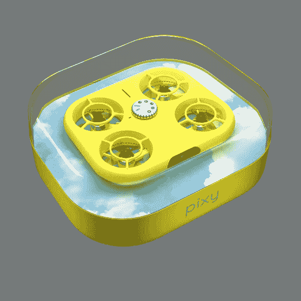

# Snap 的新“Pixy”无人机是为 Snapchat 打造的，售价 250 美元

> 原文：<https://www.xda-developers.com/snap-pixy-drone-snapchat/>

Snapchat 仍然是顶级的社交媒体服务之一，其所有者 Snap 已经不止一次地试图通过有限运行的硬件配件来利用这一点。多年来，Snap 一直在销售与 Snapchat 集成的“眼镜”( Spectacles ),现在一款新产品即将推出:Pixy。如果你还记得的话，这就是我们今年早些时候发现的同一个[“Cheerios”自拍无人机。](https://www.xda-developers.com/snapchat-beta-reveals-cheerios-selfie-drone/)

Snap 在新闻稿中透露，“我们正在介绍 Pixy，您友好的飞行相机。这是一个口袋大小，自由飞行的伙伴，适合大大小小的冒险。[...]只需轻轻一按按钮，Pixy 就能在四条预设的飞行路线上飞行。它可以漂浮、环绕，并跟随你到任何地方，无需控制器或任何设置。而且，Pixy 在你的手中找到了它的家，在飞行结束时轻轻地着陆。”

 <picture></picture> 

Credit: Snap

Snap 表示，航班上的视频会被发送到你的 Snapchat 内存中，你可以通过智能编辑(如 Hyperspeed 或 Jump Cut)进行编辑，并根据智能手机屏幕进行裁剪。之后，您可以通过 Chat、Stories 或 Spotlight 分享它们，或者将它们导出到 Snapchat 之外进行分享。无人机上有一个 12MP 的传感器，在其集成的 16GB 驱动器上可以存储多达 100 个视频或 1000 部手机。

Pixy 的定价为 249.99 美元，这使它能够与许多其他小型轻型无人机竞争，如 300 美元的 DJI 迷你 SE。值得注意的是，250 美元的套餐似乎只包含一块电池，所以你必须在航班之间等待电池充电。您可以以每块 19.99 美元的价格购买额外的电池。

 <picture></picture> 

Snap Pixy

##### Snap Pixy

Snap 的新无人机起价 249.99 美元，旨在与 Snapchat 集成。目前只在美国和法国有售。

*The Verge* 对无人机进行了有限的实际操作，其中提到充满电将进行大约 5-8 次飞行，每次 10-20 秒不等。这肯定是为了快速拍摄，而不是为更昂贵的无人机设计的长达几分钟的冒险。 *The Verge* 还与首席执行官埃文·斯皮格尔进行了交谈，他提到 Snap 至少从 2016 年起就对无人机感兴趣。他说，“我们的目标就是把它拿到人们手中，让他们玩玩，如果人们喜欢原来的产品，也许我们会用第二版做更多。"

**来源:** [中计](https://newsroom.snap.com/sps2022close)[濒临绝境](https://www.theverge.com/2022/4/28/23043011/snapchat-pixy-drone-hands-on)