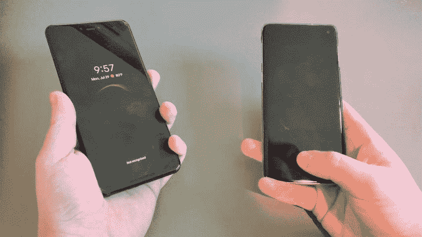

# 一些屏幕内指纹传感器很容易被骗

> 原文：<https://www.xda-developers.com/some-in-screen-fingerprint-sensors-are-easily-fooled/>

对于智能手机来说，安全性极其重要。如今，普通智能手机包含一个人的银行信息、社交媒体账户、个人照片，甚至健康信息。一旦绕过锁屏，你就可以接触到一个人私生活的很多方面。这就是为什么与锁屏相关的新安全功能必须高度安全的原因。锁屏技术的最新发展是显示指纹识别器。除了 PIN、密码或图案，你还可以在手机上设置指纹解锁(如果有硬件的话)；除了锁屏之外，指纹还可以用来解锁许多应用程序和支付系统。不幸的是，一些内置指纹扫描仪并不像你想象的那样安全，如果它们是一种特殊类型的话。

### 显示屏内指纹传感器旁路演示

上面的视频显示了一种方法的镜头，该方法用于绕过几种不同手机上常见的典型光学显示指纹扫描仪的认证。这种利用是通过举起在透明塑料片上捕获的受害者的墨水指纹来进行的(类似于用于保存食物的塑料包装)。视频演示了将捕捉到的指纹按向传感器会立即解锁设备。这个过程对任何决心访问您的数据的人来说都很容易:

1.  在一块透明的塑料板上采集受害者的指纹
2.  将指纹放在显示屏传感器上
3.  将手指按在拇指指纹上，解锁手机

### 为什么会这样？

由于显示器中光学传感器的工作方式，这种利用是可能的。它对你在智能手机的下巴、背部或侧面找到的旧传统传感器不起作用。原因是传统传感器使用电容技术(如 OnePlus 5/5T/6、S10 之前的大多数三星 Galaxy 手机以及所有 Pixel/Nexus 手机上的传感器)，而大多数新的显示传感器使用安全性较低的光学扫描仪。光学扫描仪本质上是使用显示器下的微型摄像头来捕捉你的指纹图像。如果图像与您存储的指纹匹配，屏幕将解锁。由于光学传感器只依赖于它捕获的图像，因此可以通过在显示器上放置指纹图像来击败它。

一种更安全但速度较慢的显示指纹传感器是基于超声波技术的。这种方法更难欺骗，因为它使用声波来测量指纹的脊和谷。这是更难愚弄的图像，因为它需要指纹的实际深度，但[仍然有可能击败](https://threatpost.com/samsung-galaxy-s10-fingerprint-sensor-duped-with-3d-print/143624/)。

### 如果您重视安全性，请避免使用光学传感器

虽然光学传感器的目的是将指纹扫描仪重新定位到一个侵入性较小的位置，但有一种替代方法可以做到这一点。一些旗舰手机仍然坚持使用电容传感器，而是将它们转移到手机的电源按钮上。这张图片展示了 Honor 20 上的电源按钮，它兼作电容式指纹传感器。

 <picture></picture> 

Honor 20 with Side Sensor

这种传感器可以识别多达五个不同的手指，即使手机正面朝上，也很容易用左手或右手操作(不像背面安装的电容扫描仪那样将传感器放在触手可及的地方)。这种类型的侧装传感器可以在许多新手机中找到，如 Honor 20、Honor 20 Pro、索尼 Xperia 1 和三星 Galaxy S10e。电容解决方案不仅更安全，而且光学传感器也被批评速度太慢。对于习惯了光学扫描仪的快速和安全性能的许多用户来说，这可能是令人沮丧的经历。

我们在 Honor 20 和 Honor 20 Pro 上改进传感器位置的经验证明，目前最好的方法是电容式，直到光学和超声波显示解决方案分别变得更安全和更快。该解决方案将扫描仪移出了不方便的位置，同时保持了指纹扫描仪应有的安全性和速度。Honor 集成了在接触或按下电源按钮时触发传感器的功能。这使您可以根据自己的喜好定制体验。

 <picture></picture> 

Capacitive Sensor [Left] Compared to Ultrasonic Sensor [Right]

电容式传感器有几个好处。上面的 GIF 展示了左边的手机如何比右边的超声波传感器反应快得多。它不仅更快，而且位置更方便。当指纹传感器位于显示屏下方时，除非你将手机平放在手中并保持平衡，否则你不会解锁手机。由于传统的传感器不需要你将拇指从手机上拿开，你可以在拿起手机的任何位置解锁手机。在这种情况下，即使是位于手机背面的传感器(如 Honor 20 Lite 上所见)，也仍然优于超声波替代品。

在未来，我们可能会看到改进的光学传感器安全性。与此同时，想要避免这种漏洞的用户应该确保他们的下一部手机有一个电容(或至少是超声波显示)传感器。

###### 我们感谢 Honor 赞助了这篇文章。我们的赞助商帮助我们支付与运行 XDA 相关的许多费用，包括服务器成本、全职开发人员、新闻撰稿人等等。虽然您可能会在门户内容旁边看到赞助内容(这些内容将始终被标记为赞助内容),但门户团队对这些帖子不承担任何责任。赞助内容、广告和 XDA 仓库完全由一个独立的团队管理。XDA 绝不会通过接受金钱来赞扬一家公司，或以任何方式改变我们的观点或看法，从而损害其新闻诚信。我们的意见不能被收买。