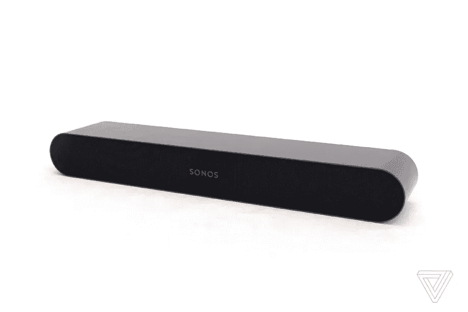

# 即将推出的 Sonos 平价条形音箱 leaks，预计售价 249 美元

> 原文：<https://www.xda-developers.com/sonos-affordable-soundbar-leak/>

如果你很久以前就很喜欢 Sonos，并且想让它的声音充满你的耳朵，那么这篇文章就是为你准备的。众所周知，Sonos 有多好，但这种质量是有代价的。然而，由*[《The Verge》](https://www.theverge.com/2022/4/21/23035569/sonos-new-soundbar-2022-s36-fury-specs-price-release-date)*泄露的一款即将发布的产品看起来会改变这一点。

它现在还没有一个正式的名字，但它被称为 S36，或其代号，“愤怒。”S36 是 Sonos 即将推出的条形音箱，预计售价 249 美元。这仍然是一个不错的花费，但它很容易成为最实惠的 Sonos 条形音箱。

 <picture></picture> 

The upcoming Sonos soundbar, rendered by The Verge

根据他们对现场产品图片的第一手体验，The Verge 已经将 S36 的一些 3D 效果图放在了一起。它看起来是该公司最紧凑的条形音箱，也是最实惠的，比 Sonos Beam(第二代)窄 100 毫米。随之而来的是更低的价格和更少的硬件，以及更少的驱动程序。但它也似乎省略了远场麦克风，所以这款智能扬声器没有语音助手支持。

预计它也不会与杜比 Atmos 一起发货，Sonos 将 S36 定位为纯粹用于家庭娱乐的条形音箱。泄漏继续详细说明 S36 上似乎也没有 HDMI 连接，只有光学音频，这将限制它的环绕声。据报道，Sonos 还预计其客户会希望将一对这种支架与 Sonos Arc 配合使用，因此也将出售垂直支架。

至于我们什么时候可以看到这一点，报告建议 6 月 7 日。Sonos 拒绝置评，也没有透露任何官方信息，所以通常的泄漏警告适用。虽然它可能不是专门为智能音箱的粉丝设计的，但 249 美元的价格肯定会很受欢迎，也是进入 Sonos 生态系统的更实惠的方式之一。

**来源:** [濒临](https://www.theverge.com/2022/4/21/23035569/sonos-new-soundbar-2022-s36-fury-specs-price-release-date)