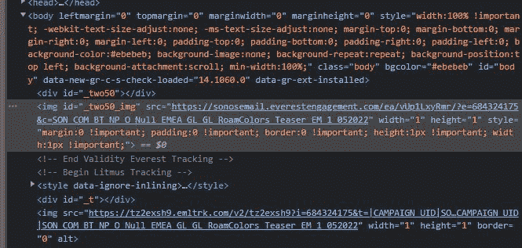
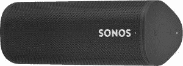

# Sonos Roam 看起来很快就会有一些新的颜色

> 原文：<https://www.xda-developers.com/sonos-roam-colors-leak/>

Sonos 泄漏继续，最新的特点是漫游便携式扬声器。在最近出现了明显的 [Sonos Ray soundbar](https://www.xda-developers.com/sonos-affordable-soundbar-leak/) 和 [Sonos Voice AI assistant](https://www.xda-developers.com/sonos-voice-reportedly-launching-june/) 之后，它可能看起来有点乏味。但是，对于 Sonos Roam 的粉丝来说，看起来你很快就会有新的颜色可以购买了。

这不是真正的泄露，尽管有一些泄露的图片来自 Reddit。南美的一家零售商似乎已经推出了最新款，有红色、橄榄色和浅蓝色。在此之前，一封电子邮件被发送到 Sonos 的邮件列表订阅者——包括你真正的——见上图。措辞是暗示性的，但并不明确，但当你深入细节一点，它似乎是钉在。

当你打开那封电子邮件的网页版本，在浏览器的开发者设置中稍微浏览一下，就可以清楚地看到“Roamcolors_Teaser”。那就这样吧。

 <picture></picture> 

References to Sonos Roam colors in the email being sent to subscribers.

目前，Sonos Roam 只有白色和黑色，因此任何其他颜色都是最受欢迎的。没有迹象表明这些即将到来的版本有任何新的东西，但我们听说的即将到来的 Sonos 产品的所有其他东西，并不是所有东西都可以成为头条新闻。还有一个价格的问题，因为“特殊”的颜色有时会比普通型号的价格高。

不管实际情况如何，我们都等不了多久了。根据我自己电子邮件中的倒计时，看起来一切都将在 5 月 11 日太平洋时间上午 10 点左右在 Sonos 的网站上揭晓。Sonos Roam 是一款小巧的智能音箱。它不仅是无线的，非常便携，而且还很坚固，适合户外使用，支持苹果的 AirPlay 2，内置 Alexa 和谷歌助手，电池寿命相当长。如果你一直想要一辆，但黑色或白色不适合你，请继续关注。

 <picture></picture> 

Sonos Roam

##### Sonos 漫游

这是一款便携式 Sonos 智能扬声器，内置 Alexa、谷歌助手和 AirPlay 功能，坚固、紧凑。

**途经**濒临