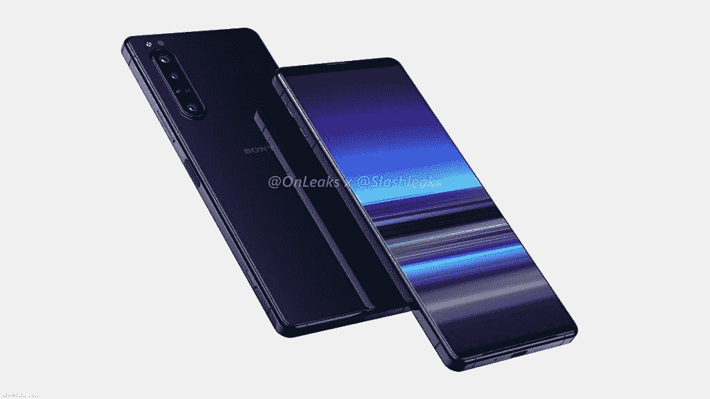

# 索尼发出了 MWC 2020 会议的媒体邀请

> 原文：<https://www.xda-developers.com/sony-mwc-2020-invites/>

2020 年国际消费电子展已经正式结束，这意味着大多数智能手机制造商已经将目光投向了 2020 年的 MWC。正是在这个时间框架内，我们期待三星( [Galaxy S20 阵容](https://www.xda-developers.com/exclusive-leaked-samsung-galaxy-s20-hands-on-confirms-120hz-display-ultrasonic-under-display-fingerprint-scanner-and-no-headphone-jack/))、LG ( [LG G9](https://www.xda-developers.com/lg-g9-renders-leaked/) 和 [LG V60](https://www.xda-developers.com/lg-v60-thinq-dual-screen-5g-possible-launch-mwc-2020/) )和小米([小米 Mi 10](https://www.xda-developers.com/xiaomi-mi-10-qualcomm-snapdragon-865/) 和 Mi 10 Pro)等公司发布几款设备，尤其是旗舰产品。一家公司也将宣布新的旗舰设备阵容是索尼，该公司真的很期待。他们已经开始向在巴塞罗纳举办的 MWC 2020 新闻发布会发出邀请。

我们预计在本次大会上看到的设备包括传闻中的 Xperia 5 Plus，它将保持 2019 年我们在索尼设备中看到的 21:9 的纵横比，并将尺寸扩大到 6.6 英寸，具有更薄的边框、侧装指纹传感器等。预计还将发布一款由高通骁龙 765 驱动的中档设备。这两款设备都将使用支持 5G 的 SOC([骁龙 865](https://www.xda-developers.com/qualcomm-snapdragon-865-benchmarks-cpu-gpu-performance-vs-kirin-990-snapdragon-855-snapdragon-845/) 和骁龙 765)，因此这两款芯片组都将支持 5G 连接是理所当然的。

 <picture></picture> 

Xperia 5 Plus leaked render

传闻中的 Xperia 5 Plus [在一段时间前](https://www.xda-developers.com/sony-xperia-5-plus-leak-headphone-jack-triple-cameras/)泄露，向我们展示了一款与普通 Xperia 5 几乎没有任何区别的设备。角落里的相机设置被保留下来，从它的大部分外观来看，唯一的物理差异是大小，这将被抬高，以及挡板的大小。不过，鉴于它将在 2020 年 MWC 大会上与其他公司的其他几款旗舰智能手机一起发布，内部结构可能会在 2020 年规格中得到更新。

不过，截至目前，索尼计划宣布的大部分内容仍然是个谜，所以一定要对泄露的信息持保留态度。索尼的 MWC 发布会将于 2 月 24 日举行。

* * *

**Via:[GSMArena](https://www.gsmarena.com/sony_will_announce_its_new_xperia_smartphones_at_this_years_mwc_on_february_24-news-41046.php)**