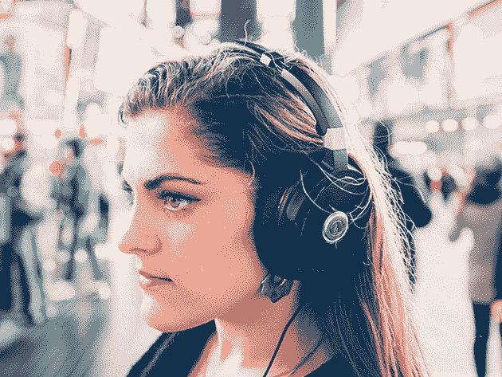
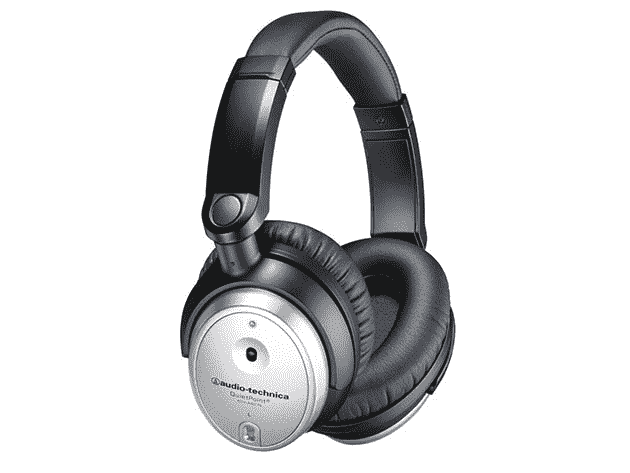
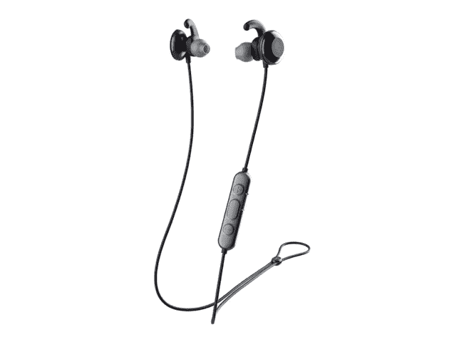
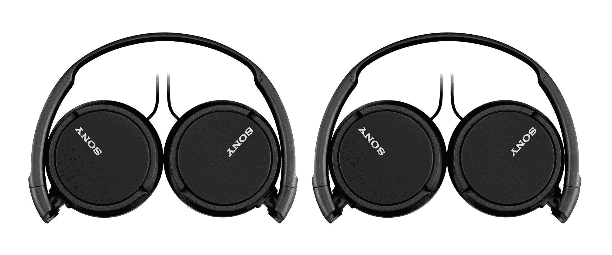

# 索尼到 SkullCandy:现在就享受大品牌耳机高达 68%的优惠

> 原文：<https://www.xda-developers.com/sony-to-skullcandy-save-up-to-68-off-big-brand-headphones-today/>

无论你是喜欢在锁定状态下狂听播客，还是在健身时听音乐，一副好耳机都是明智的选择。如果你正在考虑音频升级，看看大品牌耳机的这些优惠。现在，您可以在 XDA Developers Depot 节省高达 68%的建议零售价。

****

配备双 1.18 英寸驱动器和低音增强技术，这些 [时尚的索尼耳机](https://depot.xda-developers.com/sales/sony-mdrxb450ap-b-extra-bass-on-ear-headphones-with-acoustic-bass-booster-30mm-drivers-extra-comfort-ear-pads-mic-and-remote-for-apple-and-android-smartphones-black-new-open-box?utm_source=xda-developers.com&utm_medium=referral&utm_campaign=sony-mdrxb450ap-b-extra-bass-on-ear-headphones-with-acoustic-bass-booster-30mm-drivers-extra-comfort-ear-pads-mic-and-remote-for-apple-and-android-smartphones-black-new-open-box&utm_term=scsf-422123&utm_content=a0x1P000004XqTkQAK&scsonar=1) 提供一些音频冲击。它们可以与 iOS 和 Android 设备同步，带有舒适的耳塞，可以全天收听。价值 80 美元的 new， [他们现在的价格是 24.95 美元](https://depot.xda-developers.com/sales/sony-mdrxb450ap-b-extra-bass-on-ear-headphones-with-acoustic-bass-booster-30mm-drivers-extra-comfort-ear-pads-mic-and-remote-for-apple-and-android-smartphones-black-new-open-box?utm_source=xda-developers.com&utm_medium=referral&utm_campaign=sony-mdrxb450ap-b-extra-bass-on-ear-headphones-with-acoustic-bass-booster-30mm-drivers-extra-comfort-ear-pads-mic-and-remote-for-apple-and-android-smartphones-black-new-open-box&utm_term=scsf-422123&utm_content=a0x1P000004XqTkQAK&scsonar=1) 。

## **ATH 音频技术公司-ANC70 静音有源降噪耳机(经认证翻新)**

****

这些来自 Audio-Technica 的 [无线耳机在充满电的情况下可提供 25 小时的电池续航时间，40 毫米驱动器可提供出色的声音。QuietPoint 主动噪音消除功能有助于阻挡外界干扰，并且它们有触摸控制，便于跳过。原来 60 美元，](https://depot.xda-developers.com/sales/audio-technica-ath-anc70-rb-noise-cancel-headphones-active-quietpoint-certified-refurbished?utm_source=xda-developers.com&utm_medium=referral&utm_campaign=audio-technica-ath-anc70-rb-noise-cancel-headphones-active-quietpoint-certified-refurbished&utm_term=scsf-422126&utm_content=a0x1P000004XqTkQAK&scsonar=1) [认证加油机现在 49.99 美元](https://depot.xda-developers.com/sales/audio-technica-ath-anc70-rb-noise-cancel-headphones-active-quietpoint-certified-refurbished?utm_source=xda-developers.com&utm_medium=referral&utm_campaign=audio-technica-ath-anc70-rb-noise-cancel-headphones-active-quietpoint-certified-refurbished&utm_term=scsf-422126&utm_content=a0x1P000004XqTkQAK&scsonar=1) 。

## **森海塞尔 MOMENTUM 3 无线 ANC 耳机**

****

正如你对森海塞尔的期望， [MOMENTUM 3 耳机](https://depot.xda-developers.com/sales/sennheiser-momentum-3-wireless-anc-headphones-with-auto-on-off-smart-pause-functionality-and-smart-control-app?utm_source=xda-developers.com&utm_medium=referral&utm_campaign=sennheiser-momentum-3-wireless-anc-headphones-with-auto-on-off-smart-pause-functionality-and-smart-control-app&utm_term=scsf-422127&utm_content=a0x1P000004XqTkQAK&scsonar=1) 传递录音棚品质的声音。被 WhatHiFi 评为 5 星？，它们还具有强大的噪音消除、透明听觉和智能瓷砖跟踪技术。你现在就可以用 399.99 美元 买到它们。

## **Skullcandy 墨水+有源无线运动耳塞**

****

作为锻炼的理想选择， [Ink'd+ sport 耳塞](https://depot.xda-developers.com/sales/skullcandy-ink-d-active-wireless-bt-earbuds-black?utm_source=xda-developers.com&utm_medium=referral&utm_campaign=skullcandy-ink-d-active-wireless-bt-earbuds-black&utm_term=scsf-422128&utm_content=a0x1P000004XqTkQAK&scsonar=1) 利用最新的蓝牙技术实现卓越的无线音效。充满电后，电池续航时间可达 15 小时，而且整个耳机防汗防水。你可以只花 58.99 美元 就能 [拿起它们。](https://depot.xda-developers.com/sales/skullcandy-ink-d-active-wireless-bt-earbuds-black?utm_source=xda-developers.com&utm_medium=referral&utm_campaign=skullcandy-ink-d-active-wireless-bt-earbuds-black&utm_term=scsf-422128&utm_content=a0x1P000004XqTkQAK&scsonar=1)

## **Skullcandy Venue 主动降噪无线耳机**

****

这些 [时尚的 Skullcandy 耳机](https://depot.xda-developers.com/sales/skullcandy-venue-active-noise-canceling-wireless-bt-headphone-black?utm_source=xda-developers.com&utm_medium=referral&utm_campaign=skullcandy-venue-active-noise-canceling-wireless-bt-headphone-black&utm_term=scsf-422129&utm_content=a0x1P000004XqTkQAK&scsonar=1) 结合了出色的音质、主动噪音消除和 24 小时电池续航时间。另外，他们有快速充电技术；充电 10 分钟就可以播放 5 个小时。眼下，你可以以 178.99 美元 的价格 [抢走它们。](https://depot.xda-developers.com/sales/skullcandy-venue-active-noise-canceling-wireless-bt-headphone-black?utm_source=xda-developers.com&utm_medium=referral&utm_campaign=skullcandy-venue-active-noise-canceling-wireless-bt-headphone-black&utm_term=scsf-422129&utm_content=a0x1P000004XqTkQAK&scsonar=1)

## **ATH 音频技术公司-ANC7bSV 静音点耳机(经认证翻新)**

****

这些 [音频技术耳机](https://depot.xda-developers.com/sales/audio-technica-ath-anc7bsv-rb-quietpoint-active-noise-cancelling-closed-back-headphones-silver-certified-refurbished?utm_source=xda-developers.com&utm_medium=referral&utm_campaign=audio-technica-ath-anc7bsv-rb-quietpoint-active-noise-cancelling-closed-back-headphones-silver-certified-refurbished&utm_term=scsf-422130&utm_content=a0x1P000004XqTkQAK&scsonar=1) 轻便可折叠，具有静音消除功能，非常适合旅行。他们有 40 毫米钕驱动器，提供高保真的声音和舒适的大量填充。正常情况下是 199 美元，现在是 69.99 美元[比建议零售价低 65%。](https://depot.xda-developers.com/sales/audio-technica-ath-anc7bsv-rb-quietpoint-active-noise-cancelling-closed-back-headphones-silver-certified-refurbished?utm_source=xda-developers.com&utm_medium=referral&utm_campaign=audio-technica-ath-anc7bsv-rb-quietpoint-active-noise-cancelling-closed-back-headphones-silver-certified-refurbished&utm_term=scsf-422130&utm_content=a0x1P000004XqTkQAK&scsonar=1)

## **Urbanears Jakan 蓝牙入耳式耳机**

****

用 L & B Tech 点评的话说， [Urbanears Jakan 耳机](https://depot.xda-developers.com/sales/urbanears-jakan-bluetooth-in-ear-headphones-black?utm_source=xda-developers.com&utm_medium=referral&utm_campaign=urbanears-jakan-bluetooth-in-ear-headphones-black&utm_term=scsf-422131&utm_content=a0x1P000004XqTkQAK&scsonar=1) 提供了“设计、价格和音质之间的良好平衡”您可以获得 12 小时的电池续航时间，以及直观的控制和符合人体工程学的贴合感。平时 79 美元，他们目前 [五折 39.95 美元](https://depot.xda-developers.com/sales/urbanears-jakan-bluetooth-in-ear-headphones-black?utm_source=xda-developers.com&utm_medium=referral&utm_campaign=urbanears-jakan-bluetooth-in-ear-headphones-black&utm_term=scsf-422131&utm_content=a0x1P000004XqTkQAK&scsonar=1) 。

## **Skullcandy 法有源无线运动耳塞**

采用无领设计和软凝胶耳翼， [防汗 Skullcandy 法耳塞](https://depot.xda-developers.com/sales/skullcandy-method-active-wireless-bt-earbuds-black?utm_source=xda-developers.com&utm_medium=referral&utm_campaign=skullcandy-method-active-wireless-bt-earbuds-black&utm_term=scsf-422132&utm_content=a0x1P000004XqTkQAK&scsonar=1) 非常适合运动和健身。他们通过蓝牙 5.0 提供 10 小时的无线游戏时间，并采用快速充电技术，以实现快速周转。您可以今天花 58.99 美元 就可以 [取货了。](https://depot.xda-developers.com/sales/skullcandy-method-active-wireless-bt-earbuds-black?utm_source=xda-developers.com&utm_medium=referral&utm_campaign=skullcandy-method-active-wireless-bt-earbuds-black&utm_term=scsf-422132&utm_content=a0x1P000004XqTkQAK&scsonar=1)

## **Audio-Technica 无线耳挂式高分辨率耳机**

****

这些 [多功能无线耳机](https://depot.xda-developers.com/sales/audio-technica-ath-sr6btbk-bluetooth-wireless-over-ear-high-resolution-headphones-with-mic-control-black?utm_source=xda-developers.com&utm_medium=referral&utm_campaign=audio-technica-ath-sr6btbk-bluetooth-wireless-over-ear-high-resolution-headphones-with-mic-control-black&utm_term=scsf-422133&utm_content=a0x1P000004XqTkQAK&scsonar=1) 支持 aptX、AAC 和 SBC 编解码器，提供无可挑剔的无线音频。你可以通过蓝牙获得令人难以置信的 30 小时收听时间，或者你可以通过 NFC 将耳机连接到手机。同时，耳挂设计有助于隔离声音。现在订购 [$101.99 可在零售价上节省 40%](https://depot.xda-developers.com/sales/audio-technica-ath-sr6btbk-bluetooth-wireless-over-ear-high-resolution-headphones-with-mic-control-black?utm_source=xda-developers.com&utm_medium=referral&utm_campaign=audio-technica-ath-sr6btbk-bluetooth-wireless-over-ear-high-resolution-headphones-with-mic-control-black&utm_term=scsf-422133&utm_content=a0x1P000004XqTkQAK&scsonar=1) 。

****

这些 [价格实惠的索尼耳机](https://depot.xda-developers.com/sales/sony-mdr-zx110ap-extra-bass-wired-headphones-with-microphone-smartphone-headset-for-iphone-android-with-in-line-remote-microphone-30mm-drivers-2-pack-black-refurbished?utm_source=xda-developers.com&utm_medium=referral&utm_campaign=sony-mdr-zx110ap-extra-bass-wired-headphones-with-microphone-smartphone-headset-for-iphone-android-with-in-line-remote-microphone-30mm-drivers-2-pack-black-refurbished&utm_term=scsf-422134&utm_content=a0x1P000004XqTkQAK&scsonar=1) 有 30 毫米的驱动器，可以产生平衡的声音，用声学低音增强器来填充低端。耳机可以整齐地折叠起来存放，防缠绕电缆可以延伸到 1.2 米。价值 30 美元，这款 [一包两个的开盒耳机现在是 18.95 美元](https://depot.xda-developers.com/sales/sony-mdr-zx110ap-extra-bass-wired-headphones-with-microphone-smartphone-headset-for-iphone-android-with-in-line-remote-microphone-30mm-drivers-2-pack-black-refurbished?utm_source=xda-developers.com&utm_medium=referral&utm_campaign=sony-mdr-zx110ap-extra-bass-wired-headphones-with-microphone-smartphone-headset-for-iphone-android-with-in-line-remote-microphone-30mm-drivers-2-pack-black-refurbished&utm_term=scsf-422134&utm_content=a0x1P000004XqTkQAK&scsonar=1) 。

*价格随时变化*